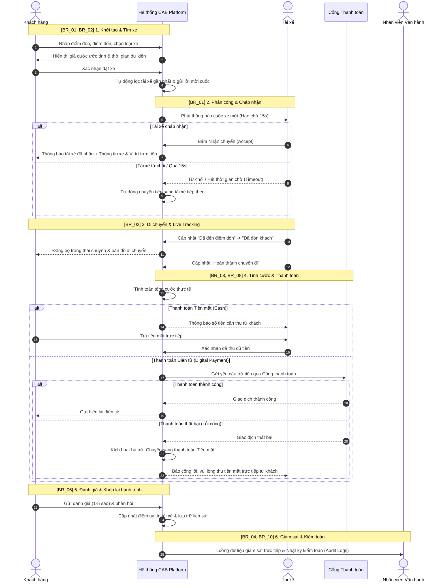
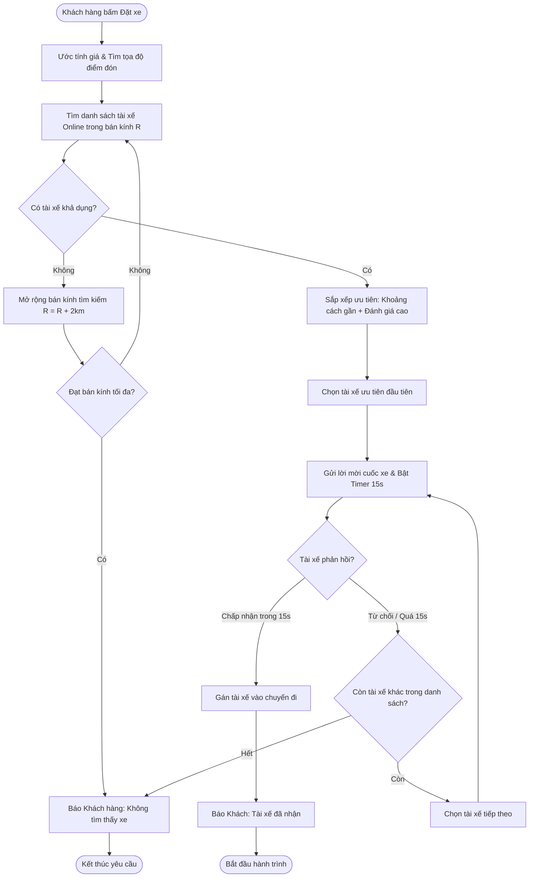
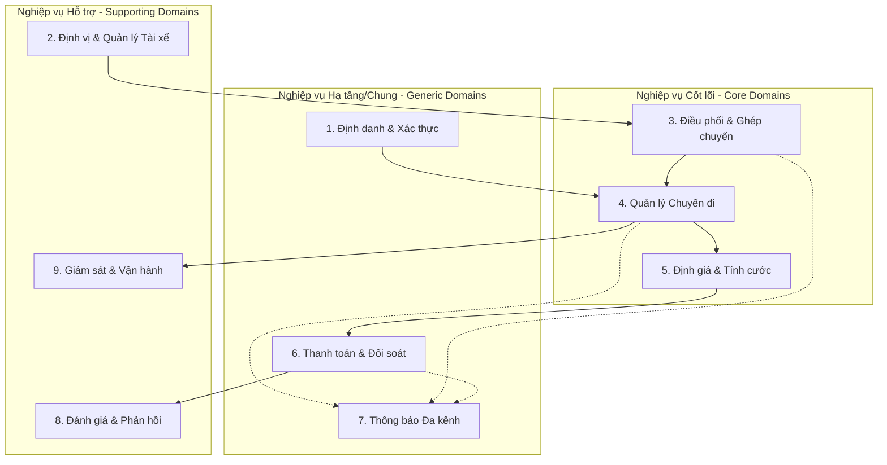
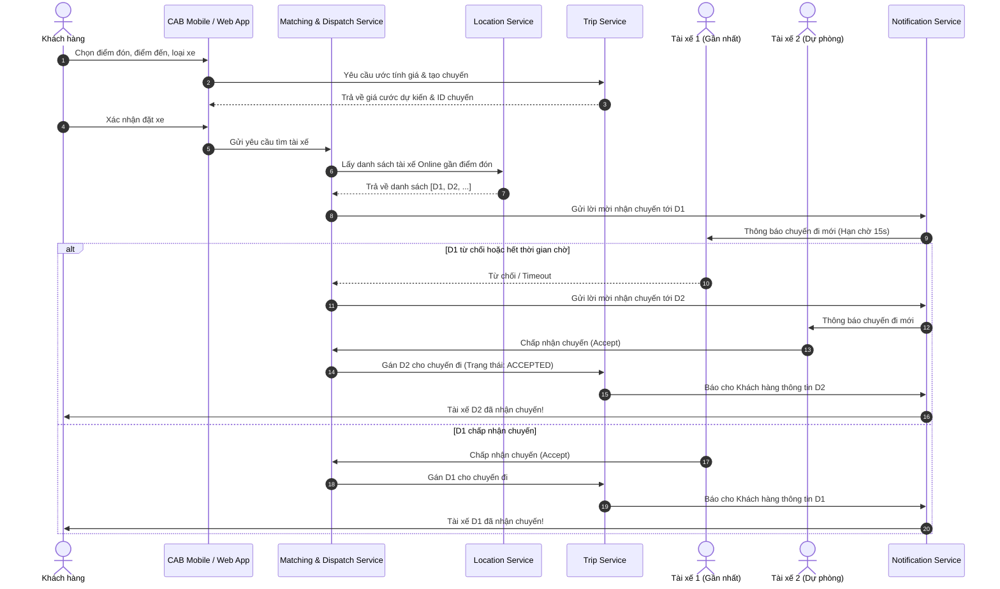
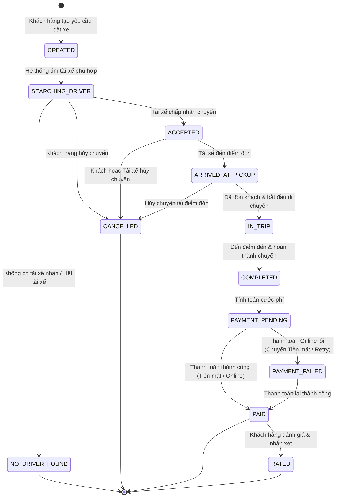
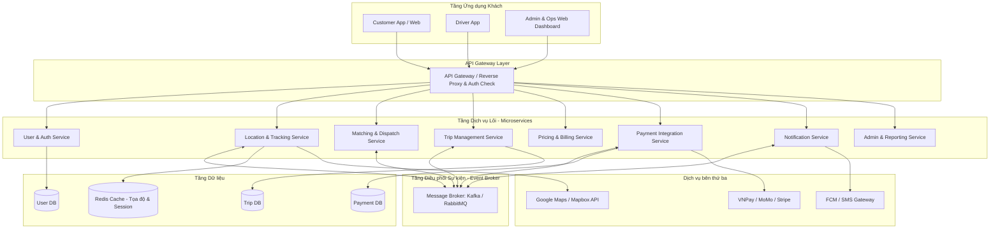
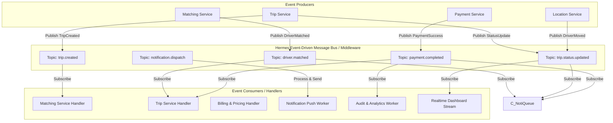
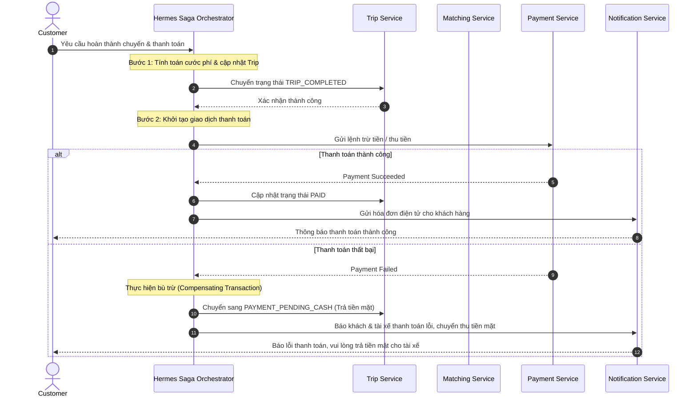

```mermaid
graph TD
    %% Actors
    Customer((Khách hàng))
    Driver((Tài xế))
    Operator((Nhân viên vận hành))
    Admin((Quản trị viên))
    PaymentGW[Cổng thanh toán]
    NotiService[Dịch vụ thông báo]

    %% Use cases Customer
    subgraph Customer_UC [Phân hệ Khách hàng]
        UC_RegCust[Đăng ký / Đăng nhập]
        UC_BookTrip[Đặt chuyến & Xem giá dự kiến]
        UC_TrackTrip[Theo dõi hành trình & Tài xế]
        UC_CancelTrip[Hủy chuyến]
        UC_Pay[Thanh toán Tiền mặt / Online]
        UC_Rate[Đánh giá tài xế]
    end

    %% Use cases Driver
    subgraph Driver_UC [Phân hệ Tài xế]
        UC_UpdateStatus[Bật / Tắt trạng thái Online]
        UC_UpdateLoc[Cập nhật vị trí GPS]
        UC_AcceptTrip[Nhận / Từ chối chuyến]
        UC_UpdateTripStatus[Cập nhật trạng thái chuyến]
        UC_ConfirmCash[Xác nhận thu tiền mặt]
    end

    %% Use cases Operations & Admin
    subgraph Admin_UC [Phân hệ Vận hành & Quản trị]
        UC_LiveMonitor[Giám sát chuyến đi trực tiếp]
        UC_ResolveIncident[Xử lý sự cố chuyến đi]
        UC_ManageUsers[Quản lý Người dùng & Phương tiện]
        UC_ViewReport[Xem Báo cáo Doanh thu & Vận hành]
    end

    %% Customer Connections
    Customer --> UC_RegCust
    Customer --> UC_BookTrip
    Customer --> UC_TrackTrip
    Customer --> UC_CancelTrip
    Customer --> UC_Pay
    Customer --> UC_Rate

    %% Driver Connections
    Driver --> UC_UpdateStatus
    Driver --> UC_UpdateLoc
    Driver --> UC_AcceptTrip
    Driver --> UC_UpdateTripStatus
    Driver --> UC_ConfirmCash

    %% Admin & Operator Connections
    Operator --> UC_LiveMonitor
    Operator --> UC_ResolveIncident
    Admin --> UC_ManageUsers
    Admin --> UC_ViewReport
    Admin --> UC_ResolveIncident

    %% External Connections
    UC_Pay -.-> PaymentGW
    UC_BookTrip -.-> NotiService
    UC_UpdateTripStatus -.-> NotiService
```

# BẢN ĐẶC TẢ YÊU CẦU PHẦN MỀM (SRS)
## HỆ THỐNG ĐẶT XE TRỰC TUYẾN - CAB SYSTEM

---

## 1. TỔNG QUAN DỰ ÁN (PROJECT OVERVIEW)

- **Tên dự án:** CAB System – Nền tảng đặt xe trực tuyến hướng dịch vụ (Service-Oriented Architecture).
- **Mục tiêu:** Xây dựng hệ thống đặt xe quy mô lớn, linh hoạt, giải quyết các hạn chế của hệ thống cũ (phân công thủ công, khó theo dõi chuyến, thanh toán phân tán, khó mở rộng).
- **Thời gian triển khai:** 7 tuần.
- **Đối tượng sử dụng chính:** Khách hàng (Customer), Tài xế (Driver), Nhân viên vận hành & Quản trị viên (Operator / Admin).

---

## 2. CÁC TÁC NHÂN TRONG HỆ THỐNG (ACTORS)

| Tác nhân (Actor) | Mô tả vai trò |
| :--- | :--- |
| **Khách hàng (Customer)** | Đăng ký, đăng nhập, tìm chuyến, xem cước phí, theo dõi tài xế thời gian thực, thanh toán và đánh giá chuyến đi. |
| **Tài xế (Driver)** | Bật/tắt trạng thái làm việc, gửi vị trí GPS, nhận/từ chối chuyến xe, cập nhật trạng thái đón và trả khách. |
| **Nhân viên vận hành (Operator)** | Giám sát các chuyến đi đang hoạt động, can thiệp xử lý sự cố, hỗ trợ điều phối và hỗ trợ khách hàng/tài xế. |
| **Quản trị viên (Admin)** | Quản lý người dùng, duyệt hồ sơ tài xế/phương tiện, phân quyền hệ thống, xem báo cáo doanh thu & hiệu suất. |
| **Hệ thống bên thứ ba (External Services)** | Cổng thanh toán (Payment Gateway), Dịch vụ bản đồ (Map API), Dịch vụ thông báo (Push/SMS Notification Provider). |

---

## 3. YÊU CẦU NGHIỆP VỤ CỦA DOANH NGHIỆP (BUSINESS REQUIREMENTS - BR)

Bản yêu cầu nghiệp vụ thể hiện **Mục tiêu, Nỗi đau (Pain Points) và Mong muốn cốt lõi của Ban lãnh đạo Doanh nghiệp** đối với nền tảng CAB System mới:

| Mã BR | Tên Yêu cầu Nghiệp vụ | Nỗi đau hiện tại (Current Pain Points) | Doanh nghiệp MUỐN GÌ? (Business Expectations & Goals) | Tiêu chí Đo lường Thành công (Success Metrics) |
| :--- | :--- | :--- | :--- | :--- |
| **BR_01** | **Tự động hóa hoàn toàn quy trình Điều phối & Ghép xe** | Phân công tài xế thủ công qua tổng đài, chậm trễ, dễ sai sót, phụ thuộc con người. | Hệ thống **tự động phân tích vị trí GPS** và trạng thái rảnh để điều phối xe đến tài xế gần nhất; tự động chuyển tiếp sang tài xế khác nếu tài xế đầu từ chối/timeout mà không bắt khách tạo lại yêu cầu. | Thời gian ghép xe < 30s; Tỷ lệ ghép chuyến thành công > 90%; Loại bỏ 100% can thiệp thủ công ở luồng chuẩn. |
| **BR_02** | **Minh bạch hóa lộ trình & Trải nghiệm chuyến đi thời gian thực** | Khách hàng khó theo dõi trạng thái chuyến đi, không biết tài xế đang ở đâu và khi nào tới đón. | Khách hàng phải được cập nhật chính xác: trạng thái tìm xe, thông tin tài xế, thời gian dự kiến đến (ETA), vị trí xe trực quan trên bản đồ theo thời gian thực (Live Tracking). | Điểm hài lòng khách hàng (CSAT) > 4.5/5; Giảm 80% cuộc gọi hỏi tổng đài "Xe đang ở đâu". |
| **BR_03** | **Quản lý tập trung tài chính & Tích hợp thanh toán số an toàn** | Thông tin thanh toán phân tán, phụ thuộc tiền mặt dễ thất thoát, đối soát thủ công khó khăn. | Tự động tính cước minh bạch; hỗ trợ cả Tiền mặt (Cash) và Cổng thanh toán điện tử (Momo, VNPay, Thẻ); **tuyệt đối không lưu dữ liệu thẻ nhạy cảm**; tự động chuyển đổi sang tiền mặt nếu thanh toán điện tử lỗi. | 100% doanh thu được kiểm soát tự động; Tỷ lệ thanh toán không tiền mặt > 50%; Giảm 0% rủi ro thất thoát. |
| **BR_04** | **Nâng cao năng lực giám sát & Vận hành tập trung** | Bộ phận vận hành thiếu công cụ giám sát trực tiếp các chuyến đang chạy, gặp khó khăn khi hệ thống mở rộng. | Cung cấp Cổng điều hành (Operations Portal) cho phép theo dõi toàn bộ chuyến xe trực tiếp trên bản đồ, can thiệp xử lý sự cố kịp thời, phân quyền chặt chẽ và trích xuất báo cáo doanh thu/năng suất. | Thời gian xử lý sự cố/khiếu nại < 5 phút; Cung cấp báo cáo Dashboard theo thời gian thực cho Ban giám đốc. |
| **BR_05** | **Hỗ trợ đa nhóm người dùng với cơ chế phân quyền chặt chẽ** | Thiếu cơ chế quản lý hồ sơ và xác thực thống nhất giữa Khách hàng, Tài xế và Quản trị viên. | Phục vụ linh hoạt ít nhất 3 nhóm: Khách hàng, Tài xế, Nhân viên vận hành/Admin. Phân quyền theo vai trò (RBAC) để nhân viên thông thường không thể thực hiện các thao tác nhạy cảm. | Quản lý an toàn hàng chục nghìn tài khoản; Ngăn chặn 100% truy cập trái phép vượt quyền. |
| **BR_06** | **Nâng cao chất lượng dịch vụ qua Đánh giá & Phản hồi** | Không có kênh thu thập ý kiến khách hàng sau chuyến để đánh giá thái độ phục vụ của tài xế. | Cho phép khách hàng chấm 1–5 sao và viết nhận xét sau chuyến đi; tự động tính điểm uy tín tài xế để sàng lọc tài xế kém và ưu tiên phân cuốc cho tài xế 5 sao. | Tỷ lệ chuyến đi được đánh giá > 70%; Tăng tỷ lệ tài xế đạt chuẩn chất lượng lên > 95%. |
| **BR_07** | **Hệ thống thông báo đa kênh theo thời gian thực** | Thiếu kênh truyền tải thông tin tức thời dẫn đến khách/tài xế bị lỡ thông tin chuyến đi. | Gửi thông báo tức thì cho khách (có tài xế nhận, xe đến, hóa đơn) và tài xế (cuốc mới, khách hủy); kiến trúc mở cho phép cắm thêm kênh mới (Push FCM, SMS, Email) mà không sửa mã nguồn lõi. | Tỷ lệ gửi thông báo thành công > 99%; Độ trễ thông báo < 2 giây. |
| **BR_08** | **Đảm bảo Tính sẵn sàng cao & Cô lập lỗi hệ thống (Fault Isolation)** | Hệ thống cũ dễ quá tải vào giờ cao điểm; lỗi một chức năng làm sập toàn bộ ứng dụng. | Hệ thống hoạt động ổn định khi tải tăng cao; **lỗi ở chức năng thanh toán hoặc thông báo KHÔNG ĐƯỢC LÀM DỪNG luồng đặt xe chính**; các dịch vụ có thể mở rộng độc lập. | Cam kết SLA hoạt động 99.9%; Không có điểm lỗi đơn (No Single Point of Failure). |
| **BR_09** | **Kiến trúc linh hoạt, dễ mở rộng tính năng trong tương lai** | Kiến trúc cũ nguyên khối (Monolithic), khó bảo trì và tốn kém khi muốn bổ sung nghiệp vụ mới. | Xây dựng theo **Kiến trúc Hướng Dịch Vụ (SOA/Microservices)** để dễ dàng bổ sung loại dịch vụ mới (giao hàng, xe điện), thêm cổng thanh toán và triển khai nâng cấp từng phần (Zero-downtime). | Giảm thời gian phát triển và triển khai tính năng mới (Time-to-Market) xuống 70%. |
| **BR_10** | **Bảo mật toàn diện, bảo vệ quyền riêng tư & Nhật ký kiểm toán** | Dữ liệu vị trí, phương tiện và giao dịch chưa có cơ chế kiểm soát bảo mật và lưu vết truy vết. | Xác thực an toàn đa lớp; bảo vệ thông tin cá nhân, dữ liệu định vị và lịch sử giao dịch; **lưu vết kiểm toán (Audit Logs)** mọi thao tác quản trị nhạy cảm để phục vụ đối soát khi có tranh chấp. | Tuân thủ 100% quy định bảo vệ dữ liệu cá nhân; Lưu vết 100% thao tác can thiệp của nhân viên quản trị. |

---

## 4. MÔ HÌNH HÓA NGHIỆP VỤ DOANH NGHIỆP (BUSINESS PROCESS MODELING)

Dựa trên 10 Yêu cầu Nghiệp vụ (`BR_01` đến `BR_10`), dưới đây là các mô hình hóa quy trình nghiệp vụ chi tiết của hệ thống CAB System theo chuẩn **BPMN / Activity Workflow**:

---

### 4.1. Sơ đồ Quy trình Nghiệp vụ Tổng thể (End-to-End Business Process Flow)
Mô hình hóa toàn bộ vòng đời từ lúc khách hàng yêu cầu đến khi hoàn tất chuyến đi, thanh toán, đánh giá và giám sát vận hành:



---

### 4.2. Mô hình hóa Quy trình Điều phối & Chuyển tiếp Chuyến đi Tự động (`BR_01`)
Quy trình nghiệp vụ xử lý logic tự động ghép xe, đếm ngược và chuyển tiếp:



---

### 4.3. Mô hình hóa Quy trình Thanh toán & Cơ chế Bù trừ Giao dịch (`BR_03`, `BR_08`)
Đảm bảo tính sẵn sàng cao, xử lý độc lập giữa cổng thanh toán bên thứ ba và hệ thống lõi:


---

### 4.4. Mô hình hóa Quy trình Giám sát Vận hành & Xử lý Sự cố (`BR_04`, `BR_10`)
Đảm bảo khả năng can thiệp của bộ phận vận hành khi xảy ra ngoại lệ:


---

### 4.5. Ma trận Ánh xạ Nghiệp vụ (Traceability Matrix: BR ➔ Business Process ➔ SOA Services)

| Mã BR | Tên Nghiệp vụ Doanh nghiệp | Quy trình Nghiệp vụ tương ứng | Dịch vụ SOA / Microservice thực thi |
| :---: | :--- | :--- | :--- |
| **BR_01** | Tự động hóa Điều phối & Ghép xe | Quy trình ghép xe đa tài xế & vòng lặp timeout 15s | `Matching & Dispatch Service`, `Location Service` |
| **BR_02** | Minh bạch lộ trình & Theo dõi trực tiếp | Quy trình cập nhật trạng thái & Live Tracking | `Trip Service`, `Location Service`, `Map API` |
| **BR_03** | Quản lý tài chính & Thanh toán an toàn | Quy trình tính cước & tích hợp cổng thanh toán Sandbox | `Pricing Service`, `Payment Service`, `Saga Orchestrator` |
| **BR_04** | Giám sát & Điều hành vận hành tập trung | Quy trình cảnh báo sự cố & điều hành bản đồ trực tiếp | `Admin Portal`, `Live Stream Service`, `Trip Service` |
| **BR_05** | Hỗ trợ đa nhóm người dùng & RBAC | Quy trình xác thực JWT & phân quyền vai trò | `User & Auth Service`, `API Gateway` |
| **BR_06** | Quản lý chất lượng qua Đánh giá | Quy trình đánh giá 1-5 sao sau chuyến đi | `Rating Service`, `Driver Profile Service` |
| **BR_07** | Hệ thống thông báo đa kênh | Quy trình đẩy thông báo sự kiện (Push/SMS/WebSocket) | `Hermes Event Bus`, `Notification Service` |
| **BR_08** | Tính sẵn sàng cao & Cô lập lỗi | Cơ chế bù trừ giao dịch (Saga Fallback sang Tiền mặt) | `Hermes Saga Orchestrator`, `Payment Service` |
| **BR_09** | Kiến trúc linh hoạt, dễ mở rộng | Mô hình phân tách độc lập các Domain dịch vụ | Toàn bộ hệ thống Microservices & `API Gateway` |
| **BR_10** | Bảo mật, riêng tư & Nhật ký kiểm toán | Quy trình ghi log kiểm toán (Audit Logging) | `Audit Service`, `Security Middleware` |

---

---

## 5. DANH MỤC CHỨC NĂNG DỊCH VỤ NGHIỆP VỤ (SERVICE REQUIREMENTS - SR)

Dựa trên Quy trình Nghiệp vụ (BPM) và Yêu cầu Doanh nghiệp (`BR_01` - `BR_10`), toàn bộ hệ thống được phân rã thành **25 Chức năng Dịch vụ Nghiệp vụ (Service Requirements - SR)** chuẩn hóa:

### 5.1. Nhóm Dịch vụ Định danh & Quản lý Người dùng (Identity & Access Services)
* **`SR_01` (Đăng ký tài khoản & Nộp hồ sơ):**
  * *Tác nhân:* Khách hàng, Tài xế.
  * *Mô tả:* Khách hàng tự đăng ký qua số điện thoại/email/OTP. Tài xế nộp hồ sơ lý lịch, ảnh CCCD, bằng lái xe để chờ xét duyệt.
  * *Ánh xạ:* `BR_05` | *Dịch vụ phụ trách:* `User & Auth Service`.
* **`SR_02` (Xác thực tập trung & Cấp quyền JWT):**
  * *Tác nhân:* Khách hàng, Tài xế, Quản trị viên (Admin), Nhân viên (Operator).
  * *Mô tả:* Xác thực tài khoản, mã hóa mật khẩu (BCrypt), cấp cặp Token (Access Token JWT + Refresh Token) chứa vai trò (Role-Based Access Control) để truy cập API.
  * *Ánh xạ:* `BR_05`, `BR_10` | *Dịch vụ phụ trách:* `User & Auth Service`, `API Gateway`.
* **`SR_03` (Quản lý Hồ sơ & Thông tin Phương tiện):**
  * *Tác nhân:* Tài xế, Quản trị viên.
  * *Mô tả:* Lưu trữ và cập nhật thông tin cá nhân, bằng lái, biển số xe, dòng xe, màu sắc và phân loại dịch vụ (Xe máy, Xe 4 chỗ, Xe 7 chỗ).
  * *Ánh xạ:* `BR_05` | *Dịch vụ phụ trách:* `User & Auth Service`.

---

### 5.2. Nhóm Dịch vụ Vị trí & Giám sát Trạng thái Đội xe (Location & Telemetry Services)
* **`SR_04` (Chuyển đổi Trạng thái Hoạt động Tài xế):**
  * *Tác nhân:* Tài xế.
  * *Mô tả:* Tài xế bật/tắt chuyển đổi giữa các trạng thái: *Sẵn sàng nhận chuyến (Online)*, *Đang bận chuyến (Busy)*, *Nghỉ ngơi (Offline)*.
  * *Ánh xạ:* `BR_01` | *Dịch vụ phụ trách:* `Driver State Service`.
* **`SR_05` (Thu thập & Phát sóng Tọa độ GPS Thời gian thực):**
  * *Tác nhân:* Thiết bị Tài xế (Driver App).
  * *Mô tả:* Định kỳ mỗi 1–3 giây gửi tọa độ GPS lên hệ thống khi ở trạng thái Online; lưu vết vào Redis Geospatial Index để truy vấn với độ trễ cực thấp.
  * *Ánh xạ:* `BR_01`, `BR_02` | *Dịch vụ phụ trách:* `Location & Telemetry Service`.
* **`SR_06` (Tìm kiếm Tài xế Khả dụng theo Bán kính Điểm đón):**
  * *Tác nhân:* Hệ thống Điều phối (Matching Service).
  * *Mô tả:* Truy vấn danh sách tài xế đang Online, không bận, đúng loại xe yêu cầu trong bán kính `R` km quanh tọa độ điểm đón của khách hàng.
  * *Ánh xạ:* `BR_01` | *Dịch vụ phụ trách:* `Location & Telemetry Service`.

---

### 5.3. Nhóm Dịch vụ Đặt xe & Điều phối Ghép chuyến (Booking & Dispatching Services)
* **`SR_07` (Ước tính Giá cước & Thời gian Đón xe ETA):**
  * *Tác nhân:* Khách hàng.
  * *Mô tả:* Tiếp nhận điểm đón và điểm đến; tính khoảng cách, thời gian dự kiến (thông qua Map API) và áp dụng công thức giá để hiển thị cước phí tạm tính cho khách xem trước.
  * *Ánh xạ:* `BR_02`, `BR_03` | *Dịch vụ phụ trách:* `Pricing Service`, `Map Service`.
* **`SR_08` (Khởi tạo Yêu cầu Đặt chuyến):**
  * *Tác nhân:* Khách hàng.
  * *Mô tả:* Khách hàng bấm xác nhận đặt xe; hệ thống tạo bản ghi chuyến đi với trạng thái `CREATED` và phát sự kiện `trip.created` lên Hermes Event Bus.
  * *Ánh xạ:* `BR_01` | *Dịch vụ phụ trách:* `Trip Management Service`.
* **`SR_09` (Thuật toán Ghép xe Tối ưu & Gửi Lời mời Cuốc):**
  * *Tác nhân:* Hệ thống (Matching Service).
  * *Mô tả:* Sắp xếp danh sách tài xế tiềm năng theo thứ tự ưu tiên (khoảng cách gần nhất + điểm đánh giá cao); gửi thông báo mời nhận chuyến tới tài xế ưu tiên đầu tiên và kích hoạt bộ đếm ngược 15 giây.
  * *Ánh xạ:* `BR_01`, `BR_06` | *Dịch vụ phụ trách:* `Matching & Dispatch Service`.
* **`SR_10` (Xử lý Phản hồi Mời cuốc & Tự động Chuyển tiếp):**
  * *Tác nhân:* Tài xế, Hệ thống Timer.
  * *Mô tả:*
    - Nếu tài xế bấm **Chấp nhận (Accept)**: Gán tài xế vào chuyến đi, chuyển trạng thái `ACCEPTED`.
    - Nếu tài xế bấm **Từ chối (Reject)** hoặc **Hết 15 giây (Timeout)**: Hệ thống tự động chuyển tiếp lời mời sang tài xế tiếp theo trong danh sách mà không bắt khách tạo lại yêu cầu.
    - Nếu hết danh sách tài xế: Thông báo "Không tìm thấy tài xế" cho khách hàng.
  * *Ánh xạ:* `BR_01` | *Dịch vụ phụ trách:* `Matching & Dispatch Service`, `Trip Management Service`.
* **`SR_11` (Xử lý Hủy chuyến & Áp dụng Chính sách Hủy):**
  * *Tác nhân:* Khách hàng, Tài xế.
  * *Mô tả:* Cho phép hủy chuyến kèm lý do; hệ thống giải phóng trạng thái bận của tài xế và tính phí phạt (nếu hủy sau khi tài xế đã đến điểm đón).
  * *Ánh xạ:* `BR_01`, `BR_04` | *Dịch vụ phụ trách:* `Trip Management Service`.

---

### 5.4. Nhóm Dịch vụ Quản lý Hành trình & Theo dõi Trực tiếp (Trip Execution & Tracking Services)
* **`SR_12` (Cập nhật Tiến trình Chuyến đi):**
  * *Tác nhân:* Tài xế.
  * *Mô tả:* Tài xế cập nhật tuần tự các mốc trạng thái: `ARRIVED_AT_PICKUP` (Đã đến điểm đón) ➔ `IN_TRIP` (Đã đón khách & Bắt đầu đi) ➔ `COMPLETED` (Đã đến nơi & Hoàn thành).
  * *Ánh xạ:* `BR_02` | *Dịch vụ phụ trách:* `Trip Management Service`.
* **`SR_13` (Truyền phát Lộ trình & Live Tracking Trực tuyến):**
  * *Tác nhân:* Khách hàng.
  * *Mô tả:* Đồng bộ liên tục tọa độ di chuyển của tài xế lên giao diện bản đồ của khách hàng thông qua WebSocket / Polling; cập nhật lại thời gian đến dự kiến (ETA) theo tình trạng giao thông.
  * *Ánh xạ:* `BR_02` | *Dịch vụ phụ trách:* `Location Service`, `Trip Management Service`.
* **`SR_14` (Tra cứu Lịch sử Chuyến đi):**
  * *Tác nhân:* Khách hàng, Tài xế, Nhân viên vận hành.
  * *Mô tả:* Cung cấp danh sách chi tiết các chuyến đi trong quá khứ: lộ trình, thời gian, cước phí, hình thức thanh toán, thông tin đối tác và hóa đơn điện tử.
  * *Ánh xạ:* `BR_02`, `BR_04` | *Dịch vụ phụ trách:* `Trip Management Service`.

---

### 5.5. Nhóm Dịch vụ Định giá & Quyết toán Thanh toán (Pricing & Settlement Services)
* **`SR_15` (Tính toán & Quyết toán Cước phí Thực tế):**
  * *Tác nhân:* Hệ thống.
  * *Mô tả:* Sau khi tài xế bấm Hoàn thành chuyến; tự động chốt cước dựa trên quãng đường GPS thực tế, thời gian di chuyển thực tế, loại phương tiện và phụ phí phát sinh.
  * *Ánh xạ:* `BR_03` | *Dịch vụ phụ trách:* `Pricing & Billing Service`.
* **`SR_16` (Xử lý Thanh toán Tiền mặt):**
  * *Tác nhân:* Khách hàng, Tài xế.
  * *Mô tả:* Hiển thị số tiền cần trả; khách đưa tiền mặt cho tài xế; tài xế bấm xác nhận "Đã thu đủ tiền" trên ứng dụng để chuyển trạng thái sang `PAID`.
  * *Ánh xạ:* `BR_03` | *Dịch vụ phụ trách:* `Payment Service`.
* **`SR_17` (Tích hợp Thanh toán Điện tử qua Cổng bên thứ ba):**
  * *Tác nhân:* Khách hàng, Cổng thanh toán (VNPay / MoMo / Thẻ ngân hàng).
  * *Mô tả:* Gửi lệnh trừ tiền qua Cổng thanh toán bên thứ ba; bảo đảm không lưu thông tin thẻ nhạy cảm trên máy chủ CAB; tiếp nhận Webhook kết quả giao dịch và xuất biên lai.
  * *Ánh xạ:* `BR_03`, `BR_10` | *Dịch vụ phụ trách:* `Payment Integration Service`.
* **`SR_18` (Điều phối Giao dịch Bù trừ khi Thanh toán Lỗi):**
  * *Tác nhân:* Hệ thống (Hermes Saga Orchestrator).
  * *Mô tả:* Khi cổng thanh toán điện tử bị lỗi/timeout; hệ thống kích hoạt giao dịch bù trừ (Compensating Transaction): tự động chuyển phương thức thanh toán sang Tiền mặt và gửi cảnh báo thu tiền cho tài xế.
  * *Ánh xạ:* `BR_03`, `BR_08` | *Dịch vụ phụ trách:* `Hermes Saga Orchestrator`, `Payment Service`.

---

### 5.6. Nhóm Dịch vụ Đánh giá & Quản lý Chất lượng (Rating & Quality Services)
* **`SR_19` (Tiếp nhận Đánh giá & Phản hồi Khách hàng):**
  * *Tác nhân:* Khách hàng.
  * *Mô tả:* Cho phép khách hàng chấm từ 1 đến 5 sao và viết nhận xét về thái độ phục vụ/phương tiện của tài xế sau khi chuyến đi đã thanh toán thành công.
  * *Ánh xạ:* `BR_06` | *Dịch vụ phụ trách:* `Rating & Feedback Service`.
* **`SR_20` (Tổng hợp Điểm Uy tín & Hiệu suất Tài xế):**
  * *Tác nhân:* Hệ thống.
  * *Mô tả:* Tự động tính điểm trung bình sao và tỷ lệ nhận chuyến của từng tài xế; cung cấp dữ liệu đầu vào làm tiêu chí ưu tiên phân phối cuốc xe.
  * *Ánh xạ:* `BR_01`, `BR_06` | *Dịch vụ phụ trách:* `Rating & Feedback Service`, `Matching Service`.

---

### 5.7. Nhóm Dịch vụ Thông báo Sự kiện Đa kênh (Notification Services)
* **`SR_21` (Phát Thông báo Đẩy Thời gian thực cho Khách hàng):**
  * *Tác nhân:* Hệ thống.
  * *Mô tả:* Tiêu thụ sự kiện từ Hermes Bus và gửi thông báo đẩy (Push Notification / SMS) tới khách hàng: Đã tìm thấy tài xế, Tài xế đã đến điểm đón, Bắt đầu di chuyển, Hóa đơn thanh toán.
  * *Ánh xạ:* `BR_02`, `BR_07` | *Dịch vụ phụ trách:* `Notification Service`.
* **`SR_22` (Phát Thông báo Điều phối & Cảnh báo cho Tài xế):**
  * *Tác nhân:* Hệ thống.
  * *Mô tả:* Gửi âm thanh/thông báo cuốc xe mới, thông báo khách hàng hủy chuyến, cảnh báo thay đổi lộ trình tới thiết bị tài xế.
  * *Ánh xạ:* `BR_01`, `BR_07` | *Dịch vụ phụ trách:* `Notification Service`.

---

### 5.8. Nhóm Dịch vụ Vận hành, Giám sát & Kiểm toán (Operations & Audit Services)
* **`SR_23` (Giám sát Luồng Chuyến đi Trực tiếp trên Bản đồ):**
  * *Tác nhân:* Nhân viên vận hành (Operator).
  * *Mô tả:* Hiển thị toàn bộ các chuyến đi đang hoạt động, vị trí các xe Online trên giao diện bản đồ điều hành trực tiếp (Live Operations Map).
  * *Ánh xạ:* `BR_04` | *Dịch vụ phụ trách:* `Admin & Operations Portal`.
* **`SR_24` (Cảnh báo & Can thiệp Xử lý Sự cố Chuyến đi):**
  * *Tác nhân:* Nhân viên vận hành.
  * *Mô tả:* Tự động phát hiện và cảnh báo chuyến xe bị đứng yên bất thường / mất GPS; cho phép nhân viên vận hành can thiệp: Hủy chuyến cưỡng bức, điều phối thủ công xe cứu hộ hoặc gọi hỗ trợ.
  * *Ánh xạ:* `BR_04`, `BR_08` | *Dịch vụ phụ trách:* `Incident & Operations Service`.
* **`SR_25` (Ghi Nhật ký Kiểm toán & Báo cáo Thống kê Doanh thu):**
  * *Tác nhân:* Quản trị viên (Admin), Hệ thống.
  * *Mô tả:* Lưu vết toàn bộ các thao tác can thiệp quản trị (Audit Trail); tự động tổng hợp Dashboard báo cáo: Tổng số cuốc xe, doanh thu theo ngày/tháng, tỷ lệ hủy chuyến và hiệu suất tài xế.
  * *Ánh xạ:* `BR_04`, `BR_10` | *Dịch vụ phụ trách:* `Audit & Analytics Service`.

---

## 6. PHÂN RÃ CÁC NGHIỆP VỤ CON (SUB-BUSINESSES) & MA TRẬN PHÂN TÍCH ẢNH HƯỞNG (IMPACT ANALYSIS)

Theo mô hình thiết kế hướng miền (Domain-Driven Design - DDD) và Kiến trúc Hướng dịch vụ (SOA), hệ thống CAB System được phân rã thành **9 nghiệp vụ con (Sub-businesses / Sub-domains)**. Dưới đây là chi tiết chức năng, vai trò và phân tích tác động của từng nghiệp vụ con:



---

### Bảng Chi tiết Phân rã Nghiệp vụ con & Đánh giá Tác động

| STT | Nghiệp vụ con (Sub-business) | Phân loại Miền (Domain Type) | Trách nhiệm cốt lõi (Core Responsibility) | Tác động khi Hoạt động bình thường (Positive Impact) | Tác động khi Xảy ra Sự cố (Failure & Ripple Effect) |
| :--- | :--- | :--- | :--- | :--- | :--- |
| **1** | **Quản lý Định danh & Xác thực (Identity & Access)** | Generic Sub-domain | Đăng ký, đăng nhập (JWT), phân quyền (RBAC), quản lý hồ sơ cá nhân và kiểm duyệt phương tiện. | Cung cấp định danh tin cậy và cơ chế bảo mật cho mọi yêu cầu gọi dịch vụ trong toàn hệ thống. | **Nghiêm trọng (High):** Người dùng không thể đăng nhập phiên mới. Tuy nhiên, nếu áp dụng JWT Stateless, các phiên đang hoạt động với token hợp lệ vẫn tiếp tục chuyến bình thường. |
| **2** | **Định vị & Theo dõi Tài xế (Location & Telemetry)** | Supporting Sub-domain | Thu thập tọa độ GPS theo thời gian thực (1-3s), quản lý Geo-Spatial Index trên Redis Cache, tìm tài xế gần điểm đón. | Cung cấp dữ liệu vị trí tức thời cho thuật toán điều phối và hỗ trợ tính năng Live Tracking hành trình cho khách hàng. | **Trung bình - Cao (Medium-High):** Khách hàng không xem được xe di chuyển trên bản đồ; Điều phối phải dùng tọa độ gần nhất (Fallback Cache) hoặc mở rộng bán kính tìm kiếm. |
| **3** | **Điều phối & Ghép chuyến (Matching & Dispatching)** | **Core Domain (Cốt lõi)** | Tìm kiếm tài xế tối ưu theo vị trí/tiêu chí, quản lý hàng đợi mời cuốc (15s timeout), tự động chuyển tiếp tài xế khi bị từ chối. | Rút ngắn thời gian chờ xe của khách hàng, tối ưu hóa tỷ lệ nhận chuyến và quãng đường di chuyển rỗng của tài xế. | **Nghiêm trọng (Critical):** Chuyến xe bị treo, khách hàng chờ lâu và hủy app. Cần cơ chế tự động báo "Không tìm thấy xe" hoặc chuyển sang nhân viên điều phối thủ công. |
| **4** | **Quản lý Vòng đời Chuyến đi (Trip Lifecycle Management)** | **Core Domain (Cốt lõi)** | Quản lý máy trạng thái chuyến (`CREATED` ➔ `ACCEPTED` ➔ `ARRIVED` ➔ `IN_TRIP` ➔ `COMPLETED` ➔ `PAID`), lưu vết lộ trình. | Giữ vai trò nhạc trưởng đồng bộ trạng thái giữa Khách hàng, Tài xế và phát sự kiện sang các dịch vụ khác. | **Nghiêm trọng (Critical):** Trạng thái chuyến đi bị lệch giữa khách và tài xế, không thể chuyển tiếp hành trình. Cần cơ chế lưu trạng thái bền vững (State Machine Persistence). |
| **5** | **Định giá & Tính cước (Pricing & Billing)** | Supporting / Core | Ước tính giá trước chuyến (Fare Estimate) và tính toán tổng cước phí chính xác sau chuyến đi dựa trên quãng đường/thời gian/phụ phí. | Tạo sự minh bạch chi phí cho khách hàng, bảo đảm tính đúng doanh thu và hoa hồng tài xế. | **Cao (High):** Không ước tính được giá -> Khách không bấm đặt xe được. Nếu lỗi lúc kết thúc chuyến -> Áp dụng công thức cước cơ bản Fallback (Default Base Fare) dựa trên GPS đã ghi nhận. |
| **6** | **Thanh toán & Đối soát (Payment & Settlement)** | Generic Sub-domain | Tích hợp cổng thanh toán trực tuyến (Momo, VNPay, Thẻ) và thanh toán Tiền mặt (Cash), quản lý giao dịch và đối soát ví. | Xử lý thanh toán nhanh chóng, an toàn không lưu thẻ nhạy cảm, tự động hạch toán doanh thu. | **Trung bình (Medium):** Khi cổng thanh toán bên thứ ba bị sập/chậm, hệ thống **không bị tê liệt** nhờ kiến trúc phân tán; tự động kích hoạt chuyển sang thanh toán **Tiền mặt (Cash)** cho tài xế. |
| **7** | **Thông báo Đa kênh (Notification Service)** | Supporting Sub-domain | Tiếp nhận sự kiện bất đồng bộ từ Event Bus và đẩy thông báo Push (FCM), SMS (Twilio) hoặc In-app notification. | Cung cấp thông tin kịp thời (tài xế đến, trạng thái thanh toán), nâng cao trải nghiệm người dùng. | **Thấp (Low):** Dịch vụ thông báo lỗi không làm gián đoạn luồng đặt xe hay thanh toán chính (Loose Coupling). Khách vẫn xem được trạng thái trên giao diện chính nhờ WebSocket/Polling. |
| **8** | **Đánh giá & Phản hồi (Rating & Quality Control)** | Supporting Sub-domain | Tiếp nhận điểm sao (1-5 sao) và nhận xét của khách, tính điểm trung bình uy tín của tài xế. | Sàng lọc và nâng cao chất lượng dịch vụ; cung cấp chỉ số đánh giá làm đầu vào ưu tiên cho thuật toán điều phối xe. | **Rất thấp (Very Low):** Hoàn toàn không chặn luồng nghiệp vụ di chuyển hay thanh toán của hệ thống. |
| **9** | **Giám sát & Vận hành (Operations & Incident Portal)** | Supporting Sub-domain | Cung cấp Dashboard theo dõi chuyến đi trực tiếp, can thiệp xử lý sự cố (hủy cưỡng bức, gán lại xe), báo cáo doanh thu & kiểm toán. | Cho phép nhân viên vận hành kiểm soát toàn cục, can thiệp các ca sự cố ngoại lệ và hỗ trợ khách hàng kịp thời. | **Trung bình (Medium):** Không ảnh hưởng đến các chuyến xe tự động đang chạy giữa khách và tài xế, nhưng làm chậm khả năng xử lý khiếu nại và giám sát sự cố phát sinh. |

---

## 7. KHOANH VÙNG PHẠM VI DỰ ÁN & GIỚI HẠN MODULE PHÁT TRIỂN (PROJECT SCOPE & BOUNDARIES)

Do thời gian thực hiện đồ án giới hạn trong **7 tuần** theo chuẩn môn học Kiến trúc Hướng Dịch Vụ (SOA), hệ thống được phân định rõ ràng các giới hạn phát triển theo mô hình **MoSCoW**:

```mermaid
quadrantChart
    title Ma trận Ưu tiên Phát triển Module (Khung 7 Tuần)
    x-axis Độ phức tạp Thấp --> Độ phức tạp Cao
    y-axis Giá trị Cốt lõi Thấp --> Giá trị Cốt lõi Cao
    quadrant-1 Bắt buộc làm & Tập trung kiến trúc (Must-Have Core)
    quadrant-2 Làm nhanh & Đơn giản hóa (Quick Wins)
    quadrant-3 Cắt giảm / Bỏ qua (Out of Scope)
    quadrant-4 Giả lập / Mocking (Simulated)
    
    "Trip Management Service": [0.65, 0.95]
    "Matching & Dispatching": [0.75, 0.90]
    "API Gateway & Event Bus": [0.70, 0.85]
    "User & Auth Service": [0.35, 0.80]
    "Pricing & Billing": [0.40, 0.75]
    "Location Tracking": [0.55, 0.70]
    "Payment Service (Sandbox)": [0.70, 0.40]
    "Notification (WebSocket/FCM)": [0.45, 0.50]
    "Rating Service": [0.20, 0.35]
    "Admin Dashboard": [0.40, 0.30]
    "Hệ thống Bản đồ riêng": [0.95, 0.15]
    "AI Định giá thời tiết": [0.90, 0.20]
    "Tổng đài gọi điện VoIP": [0.85, 0.10]
```

### 7.1. Các Module BẮT BUỘC Phát triển (In-Scope: Must-Have)
*Đây là các module tạo nên "xương sống" và quy trình cốt lõi mà đề bài yêu cầu:*
1. **API Gateway & Event Bus (Hermes Message Bus - Hạ tầng SOA):**
   - Routing API tập trung, kiểm tra JWT Token.
   - Cấu hình Message Broker (Kafka/RabbitMQ) để các microservice giao tiếp phi đồng bộ và tách rời phụ thuộc.
2. **Module Quản lý Định danh & Xác thực (User & Auth Service):**
   - Đăng ký, đăng nhập JWT cho 3 roles: Khách hàng, Tài xế, Quản trị viên (RBAC).
3. **Module Quản lý Vị trí & Trạng thái Tài xế (Location & Driver Service):**
   - Bật/tắt trạng thái Online/Offline, lưu tọa độ GPS của tài xế vào Redis Cache, API tìm tài xế gần điểm đón.
   - *Hỗ trợ demo:* Có công cụ/script **giả lập di chuyển GPS** của tài xế trên bản đồ.
4. **Module Điều phối & Ghép xe (Matching & Dispatching Service):**
   - Thuật toán tìm tài xế gần nhất, gửi lời mời nhận chuyến, quản lý đếm ngược (15s Timeout) và **tự động chuyển tiếp sang tài xế tiếp theo** khi bị từ chối.
5. **Module Quản lý Vòng đời Chuyến đi (Trip Management Service):**
   - Quản lý máy trạng thái chuyến (`CREATED` ➔ `ACCEPTED` ➔ `ARRIVED` ➔ `IN_TRIP` ➔ `COMPLETED` ➔ `PAID`), đồng bộ hành trình Khách - Tài xế.
6. **Module Định giá & Tính cước (Pricing & Billing Service):**
   - Ước tính cước ban đầu và tính cước chính thức sau chuyến đi theo công thức cố định: `Giá mở cửa + (Số km × Đơn giá) + Phụ phí giờ cao điểm`.

### 7.2. Các Module Đơn giản hóa (In-Scope: Should-Have / Simplified)
*Tối ưu hóa thời gian thực hiện nhưng vẫn đáp ứng đầy đủ kịch bản demo kiến trúc:*
1. **Module Thanh toán (Payment Integration Service):**
   - Hỗ trợ thanh toán **Tiền mặt (Cash)** có xác nhận của tài xế.
   - Hỗ trợ thanh toán **Điện tử**: Tích hợp Cổng **Sandbox / Mock Payment Gateway** (VNPay Sandbox hoặc Mock Service giả lập thành công/thất bại) để demo kịch bản **Saga bù trừ giao dịch** khi cổng thanh toán lỗi.
2. **Module Thông báo (Notification Service):**
   - Đẩy thông báo thời gian thực qua **WebSocket (In-app)** hoặc **Firebase Cloud Messaging (FCM)**.
3. **Module Đánh giá & Phản hồi (Rating Service):**
   - Form chấm 1–5 sao và nhận xét cơ bản sau chuyến đi, tính điểm trung bình cho tài xế.
4. **Module Quản trị Vận hành (Admin & Ops Portal):**
   - Giao diện Web đơn giản để xem danh sách chuyến đang hoạt động, tài xế online và doanh thu cơ bản.

### 7.3. Các Tính năng LOẠI BỎ khỏi phạm vi (Out-of-Scope: Won't-Have)
*Không triển khai trong khung 7 tuần để tránh quá tải và không đúng trọng tâm kiến trúc dịch vụ:*

| Tính năng ngoài phạm vi | Lý do loại bỏ / Giải pháp thay thế cho đồ án |
| :--- | :--- |
| ❌ **Tự xây dựng bản đồ số riêng (Map Engine)** | Tốn kém tài nguyên. **Giải pháp:** Sử dụng API có sẵn (Google Maps, OpenStreetMap/Leaflet, Mapbox). |
| ❌ **Thuật toán AI dự đoán giá động thời tiết phức tạp** | Không thuộc trọng tâm môn học. **Giải pháp:** Áp dụng bảng phụ phí Surge Pricing cố định theo khung giờ. |
| ❌ **Tổng đài thoại VoIP / Gọi trực tiếp qua SIM** | Khó khăn hạ tầng viễn thông. **Giải pháp:** Sử dụng Chat trong ứng dụng hoặc hiển thị SĐT. |
| ❌ **Xử lý mất kết nối mạng kéo dài nhiều ngày (Offline Mesh)** | Đặt xe cần xử lý thời gian thực. **Giải pháp:** Timeout 30s tự hủy tìm kiếm hoặc hỗ trợ gửi lại lệnh (Retry). |
| ❌ **Hệ thống Ví điện tử / Nạp - Rút ngân hàng đa tầng** | Rủi ro bảo mật tài chính. **Giải pháp:** Thanh toán chuyến nào quyết toán chuyến đó qua Cổng trung gian. |

---

## 8. SƠ ĐỒ THIẾT KẾ MERMAID (MERMAID DIAGRAMS)

### 8.1. Sơ đồ Use Case Tổng thể (Use Case Diagram)



---

### 8.2. Sơ đồ Tuần tự Luồng Đặt xe & Điều phối Tài xế (Sequence Diagram)



---

### 8.3. Sơ đồ Trạng thái Vòng đời Chuyến đi (Trip State Machine Diagram)



---

### 8.4. Sơ đồ Kiến trúc Tổng quan Hệ thống Hướng Dịch Vụ (Service-Oriented Architecture - SOA)



---

## 9. MÔ HÌNH KIẾN TRÚC & QUY TRÌNH HERMES CHO ĐỒ ÁN (HERMES MODEL)

### 9.1. Mô hình Kiến trúc Hướng sự kiện Hermes (Hermes Event-Driven SOA Architecture)
Trong kiến trúc hướng dịch vụ hiện đại của CAB System, **Hermes Event-Driven Architecture** đóng vai trò là xương sống trung gian (Event Middleware / Service Bus) đảm bảo các dịch vụ hoạt động phi đồng bộ (asynchronous), chịu tải cao và tách biệt phụ thuộc (loose coupling):



---

### 9.2. Sơ đồ Điều phối Giao dịch Phân tán Hermes Saga (Hermes Saga Orchestration)
Xử lý giao dịch phân tán giữa Trip Service, Matching Service, Payment Service và Notification Service để tránh lỗi dữ liệu khi có dịch vụ bên thứ ba bị gián đoạn:



---

### 9.3. Mô hình Quản lý Vòng đời Đồ án theo Phương pháp luận HERMES (7 Tuần)
Áp dụng tiêu chuẩn quản lý dự án **HERMES Project Lifecycle** (4 giai đoạn - Milestones) để phát triển và triển khai hệ thống trong khung thời gian 7 tuần:


---

## 10. YÊU CẦU PHI CHỨC NĂNG (NON-FUNCTIONAL REQUIREMENTS)

1. **Khả năng mở rộng & Tính sẵn sàng (Scalability & Availability):**
   - Kiến trúc hướng dịch vụ (SOA/Microservices) cho phép các dịch vụ (Payment, Notification, Matching) mở rộng độc lập khi lưu lượng tăng đột biến vào giờ cao điểm.
   - Tránh điểm lỗi đơn (Single Point of Failure): Lỗi ở phân hệ thanh toán hay thông báo không làm gián đoạn luồng đặt xe chính.
2. **Bảo mật & An toàn thông tin (Security & Privacy):**
   - Xác thực người dùng qua JWT/OAuth2. Phân quyền chặt chẽ theo vai trò (RBAC).
   - Mã hóa dữ liệu nhạy cảm trên đường truyền (HTTPS/TLS) và lưu trữ.
   - Tuân thủ tiêu chuẩn bảo mật thanh toán: Tuyệt đối không lưu trữ thông tin thẻ thanh toán nhạy cảm (CVV, Số thẻ đầy đủ) trên hệ thống nội bộ.
3. **Hiệu năng & Độ trễ (Performance & Latency):**
   - Định vị và phản hồi điều phối tài xế xử lý trong thời gian thực (độ trễ dưới 2 giây).
4. **Khả năng mở rộng trong tương lai (Extensibility):**
   - Dễ dàng tích hợp thêm loại hình dịch vụ mới (giao hàng, xe điện), thêm cổng thanh toán hoặc nhà cung cấp thông báo mới.

---

## 11. CÁC VẤN ĐỀ NGHIỆP VỤ CẦN LÀM RÕ VỚI KHÁCH HÀNG (OPEN QUESTIONS)

1. **Công thức tính cước chi tiết:** Giá mở cửa, cước phí mỗi km tiếp theo, phụ phí thời gian chờ, hệ số nhân theo thời tiết và giờ cao điểm.
2. **Thuật toán điều phối:** Tiêu chí ưu tiên tài xế ngoài khoảng cách (Điểm đánh giá sao, tỷ lệ nhận chuyến, thời gian tài xế chờ cuốc).
3. **Thời gian chờ tài xế phản hồi:** Thời gian Timeout tối đa để tài xế bấm nhận chuyến trước khi chuyển cho tài xế khác (ví dụ: 15 giây).
4. **Chính sách hủy chuyến & Phí phạt:** Điều kiện hủy miễn phí và mức phí phạt nếu hủy sau khi tài xế đã di chuyển tới điểm đón.
5. **Cơ chế xử lý mất kết nối (Offline Handling):** Phương án xử lý lưu tạm và đồng bộ lại tọa độ khi tài xế/khách hàng bị rớt mạng giữa đường.
6. **Thời gian lưu trữ dữ liệu (Data Retention):** Quy định thời gian lưu trữ lịch sử GPS và nhật ký kiểm toán trước khi lưu trữ định kỳ (Archiving).

---

## 12. BẢNG TỔNG HỢP CHI TIẾT CHỨC NĂNG DỊCH VỤ NGHIỆP VỤ (SERVICE REQUIREMENTS - SR)

Dưới đây là bảng tổng hợp toàn bộ **25 Chức năng Dịch vụ Nghiệp vụ (Service Requirements - từ `SR_01` đến `SR_25`)** được phân rã từ Quy trình Nghiệp vụ (BPM) và đáp ứng 10 Yêu cầu Doanh nghiệp (`BR_01` - `BR_10`):

### 12.1. Ma trận Tra cứu Nhanh Danh mục SR

| Mã SR | Tên Chức năng Dịch vụ Nghiệp vụ | Tác nhân | Đầu vào (Input Data) | Đầu ra (Output / Event) | Ánh xạ BR | Microservice phụ trách |
| :---: | :--- | :--- | :--- | :--- | :---: | :--- |
| **`SR_01`** | **Đăng ký Tài khoản & Hồ sơ** | Khách hàng, Tài xế | SĐT, Email, Mật khẩu, Hồ sơ bằng lái, CCCD | Tài khoản kích hoạt, Hồ sơ chờ duyệt | `BR_05` | `User & Auth Service` |
| **`SR_02`** | **Xác thực & Cấp quyền JWT** | Khách, Tài xế, Admin | Thông tin đăng nhập, Credentials | JWT Access Token, Refresh Token, Role RBAC | `BR_05`, `BR_10` | `User & Auth Service`, `API Gateway` |
| **`SR_03`** | **Quản lý Hồ sơ & Phương tiện** | Tài xế, Admin | Biển số xe, Loại xe (4/7 chỗ, xe máy), Giấy tờ | Hồ sơ xe phê duyệt, Trạng thái phương tiện | `BR_05` | `User & Auth Service` |
| **`SR_04`** | **Chuyển đổi Trạng thái Hoạt động** | Tài xế | Lệnh bật/tắt Online / Busy / Offline | Cập nhật trạng thái Driver State trên Redis | `BR_01` | `Driver State Service` |
| **`SR_05`** | **Thu thập & Phát sóng GPS** | Driver App | Tọa độ (Lat, Long, Speed, Bearing) mỗi 1–3s | Cập nhật vị trí trên Redis Geospatial Index | `BR_01`, `BR_02` | `Location & Telemetry Service` |
| **`SR_06`** | **Tìm Tài xế theo Bán kính** | Matching Service | Tọa độ điểm đón, Bán kính R, Loại xe | Danh sách [DriverID_1, DriverID_2, ...] | `BR_01` | `Location & Telemetry Service` |
| **`SR_07`** | **Ước tính Giá cước & ETA** | Khách hàng | Điểm đón, Điểm đến, Loại xe | Cước phí tạm tính, Thời gian đón xe dự kiến | `BR_02`, `BR_03` | `Pricing Service`, `Map API` |
| **`SR_08`** | **Khởi tạo Yêu cầu Đặt chuyến** | Khách hàng | Điểm đón/đến, Loại xe, Mã khách hàng | Bản ghi Trip (`CREATED`), Event `trip.created` | `BR_01` | `Trip Management Service` |
| **`SR_09`** | **Ghép xe Tối ưu & Mời cuốc** | Matching Service | Danh sách tài xế gần, Điểm uy tín | Gửi thông báo mời nhận cuốc + Bật Timer 15s | `BR_01`, `BR_06` | `Matching & Dispatch Service` |
| **`SR_10`** | **Xử lý Mời cuốc & Chuyển tiếp** | Tài xế, Timer | Phản hồi Accept / Reject / Quá 15s | Gán tài xế (`ACCEPTED`) HOẶC Chuyển tiếp D_next | `BR_01` | `Matching Service`, `Trip Service` |
| **`SR_11`** | **Hủy chuyến & Phạt hủy** | Khách hàng, Tài xế | Lệnh hủy chuyến, Lý do hủy | Bản ghi Trip (`CANCELLED`), Phí phạt (nếu có) | `BR_01`, `BR_04` | `Trip Management Service` |
| **`SR_12`** | **Cập nhật Tiến trình Chuyến** | Tài xế | Lệnh chuyển mốc trạng thái từ App tài xế | Chuyển `ARRIVED` ➔ `IN_TRIP` ➔ `COMPLETED` | `BR_02` | `Trip Management Service` |
| **`SR_13`** | **Live Tracking & Lộ trình** | Khách hàng | Mã chuyến đi (Trip ID) | Luồng WebSocket tọa độ xe & Lộ trình trực tiếp | `BR_02` | `Location Service`, `Trip Service` |
| **`SR_14`** | **Tra cứu Lịch sử Chuyến đi** | Khách, Tài xế, Admin | Bộ lọc thời gian, Mã người dùng | Danh sách chi tiết các chuyến đi, Biên lai | `BR_02`, `BR_04` | `Trip Management Service` |
| **`SR_15`** | **Quyết toán Cước phí Thực tế** | Hệ thống Pricing | Lộ trình GPS thực tế, Thời gian thực tế, Phụ phí | Tổng cước phí cuối cùng cần thanh toán | `BR_03` | `Pricing & Billing Service` |
| **`SR_16`** | **Xử lý Thanh toán Tiền mặt** | Khách hàng, Tài xế | Số tiền cước, Lệnh xác nhận thu tiền từ tài xế | Bản ghi Chuyến đi (`PAID`), Hóa đơn Tiền mặt | `BR_03` | `Payment Service` |
| **`SR_17`** | **Thanh toán Cổng Điện tử** | Khách, Payment GW | Yêu cầu trừ tiền (VNPay/MoMo/Thẻ ngân hàng) | Webhook giao dịch thành công, Biên lai số | `BR_03`, `BR_10` | `Payment Integration Service` |
| **`SR_18`** | **Điều phối Bù trừ khi Lỗi Cổng** | Hermes Saga Orchestrator | Sự kiện `payment.failed` hoặc Gateway Timeout | Chuyển sang Tiền mặt, Cảnh báo thu tiền | `BR_03`, `BR_08` | `Hermes Saga`, `Payment Service` |
| **`SR_19`** | **Tiếp nhận Đánh giá & Góp ý** | Khách hàng | Điểm sao (1–5 sao), Nội dung nhận xét | Bản ghi Feedback, Đánh giá chất lượng | `BR_06` | `Rating & Feedback Service` |
| **`SR_20`** | **Tổng hợp Điểm Uy tín Tài xế** | Hệ thống Rating | Lịch sử sao và tỷ lệ nhận/hủy chuyến | Điểm tín nhiệm trung bình, Hạng tài xế | `BR_01`, `BR_06` | `Rating Service`, `Matching Service` |
| **`SR_21`** | **Phát Thông báo cho Khách hàng** | Hermes Event Bus | Sự kiện Chuyến đi, Tài xế đến, Hóa đơn | Push Notification (FCM), WebSocket, SMS | `BR_02`, `BR_07` | `Notification Service` |
| **`SR_22`** | **Phát Thông báo cho Tài xế** | Hermes Event Bus | Sự kiện Cuốc xe mới, Khách hủy chuyến | Chuông báo cuốc xe, Alert In-App tài xế | `BR_01`, `BR_07` | `Notification Service` |
| **`SR_23`** | **Giám sát Bản đồ Vận hành** | Operator | Bộ lọc khu vực, Trạng thái chuyến đi | Bản đồ trực tiếp toàn bộ xe & chuyến đang chạy | `BR_04` | `Admin & Operations Portal` |
| **`SR_24`** | **Xử lý Sự cố Chuyến đi** | Operator | Cảnh báo xe đứng yên > 5 phút / Mất GPS | Lệnh Hủy cưỡng bức / Điều xe cứu hộ thủ công | `BR_04`, `BR_08` | `Incident & Operations Service` |
| **`SR_25`** | **Kiểm toán & Báo cáo Thống kê** | Admin, Quản trị | Thao tác can thiệp, Dữ liệu giao dịch | Nhật ký Audit Log, Dashboard Báo cáo Doanh thu | `BR_04`, `BR_10` | `Audit & Analytics Service` |

---

### 12.2. Chi tiết Quy cách Nghiệp vụ của 25 SR

#### 1. Nhóm Định danh & Quản lý Người dùng
* **`SR_01` (Đăng ký Tài khoản & Hồ sơ):** Xác minh số điện thoại qua OTP SMS. Tài xế bắt buộc đính kèm ảnh bằng lái xe B2/C/A1 và giấy đăng kiểm xe.
* **`SR_02` (Xác thực & Cấp quyền JWT):** Cung cấp Token JWT chứa `userId`, `role` (`CUSTOMER`, `DRIVER`, `OPERATOR`, `ADMIN`). Thời hạn Access Token 15 phút, Refresh Token 7 ngày.
* **`SR_03` (Quản lý Hồ sơ & Phương tiện):** Phân loại phương tiện thành các nhóm: `BIKE` (Xe máy), `CAR_4` (Xe 4 chỗ tiêu chuẩn), `CAR_7` (Xe 7 chỗ rộng rãi).

#### 2. Nhóm Vị trí & Giám sát Đội xe
* **`SR_04` (Chuyển đổi Trạng thái Hoạt động):** Tài xế chỉ được chuyển sang `ONLINE` khi xe đã được Admin duyệt và tài khoản không bị khóa.
* **`SR_05` (Thu thập & Phát sóng GPS):** Dữ liệu GPS bao gồm `latitude`, `longitude`, `speed`, `heading`, `timestamp`. Tọa độ được ghi đè vào khóa Geo-Redis với TTL (Time-to-Live) 10 giây để tránh lưu vết rác khi tắt app.
* **`SR_06` (Tìm Tài xế theo Bán kính):** Sử dụng lệnh `GEOSEARCH` trong Redis để tìm kiếm tài xế trong bán kính từ 2km đến tối đa 10km.

#### 3. Nhóm Đặt xe & Điều phối Ghép chuyến
* **`SR_07` (Ước tính Giá cước & ETA):** Công thức tính: $\text{Giá dự kiến} = \text{Giá mở cửa} + (\text{Khoảng cách km} \times \text{Đơn giá}) \times \text{Hệ số cao điểm}$.
* **`SR_08` (Khởi tạo Yêu cầu Đặt chuyến):** Sinh mã chuyến đi `TripID` duy nhất (UUID) và đặt trạng thái khởi tạo `CREATED`.
* **`SR_09` (Ghép xe Tối ưu & Mời cuốc):** Tính điểm ưu tiên theo công thức: $\text{Score} = \frac{1}{\text{Khoảng cách}} \times 0.7 + \text{Điểm sao trung bình} \times 0.3$.
* **`SR_10` (Xử lý Mời cuốc & Chuyển tiếp):** Nếu tài xế hiện tại không phản hồi trong vòng 15 giây, hệ thống tự động loại tài xế này khỏi lượt mời hiện tại và gửi cuốc cho tài xế tiếp theo.
* **`SR_11` (Hủy chuyến & Phạt hủy):** Miễn phí hủy trong vòng 2 phút đầu sau khi ghép xe. Nếu hủy sau khi tài xế đã di chuyển tới điểm đón, áp dụng phí phạt 15.000 VNĐ vào chuyến đi kế tiếp.

#### 4. Nhóm Quản lý Hành trình & Live Tracking
* **`SR_12` (Cập nhật Tiến trình Chuyến):** Máy trạng thái bắt buộc chuyển theo thứ tự tuần tự: `ACCEPTED` ➔ `ARRIVED_AT_PICKUP` ➔ `IN_TRIP` ➔ `COMPLETED`.
* **`SR_13` (Live Tracking & Lộ trình):** Phát dữ liệu tọa độ tài xế qua WebSocket Topic `/topic/trip/{tripId}` đến thiết bị khách hàng.
* **`SR_14` (Tra cứu Lịch sử Chuyến đi):** Cho phép xuất hóa đơn điện tử (PDF/Email) cho từng chuyến đã thanh toán thành công.

#### 5. Nhóm Định giá & Quyết toán Thanh toán
* **`SR_15` (Quyết toán Cước phí Thực tế):** Dựa trên quãng đường đo đạc thực tế của chuyến đi, thời gian kẹt xe và các chi phí cầu đường (nếu có).
* **`SR_16` (Xử lý Thanh toán Tiền mặt):** Tài xế chịu trách nhiệm thu tiền mặt và bấm xác nhận trên giao diện lái xe.
* **`SR_17` (Thanh toán Cổng Điện tử):** Hỗ trợ cổng thanh toán qua Webhook IPN, xác thực chữ ký bảo mật HMAC-SHA256.
* **`SR_18` (Điều phối Bù trừ khi Lỗi Cổng):** Kích hoạt cơ chế Hermes Saga Compensating để đảm bảo dữ liệu nhất quán phân tán.

#### 6. Nhóm Đánh giá & Quản lý Chất lượng
* **`SR_19` (Tiếp nhận Đánh giá & Góp ý):** Lưu điểm sao (1 đến 5 sao) và các nhãn đánh giá nhanh (Lái xe an toàn, Xe sạch sẽ, Thái độ tốt).
* **`SR_20` (Tổng hợp Điểm Uy tín Tài xế):** Cập nhật lại chỉ số rating trung bình của tài xế vào bảng tổng hợp sau mỗi đánh giá mới.

#### 7. Nhóm Thông báo Sự kiện Đa kênh
* **`SR_21` (Phát Thông báo cho Khách hàng):** Tích hợp Firebase Cloud Messaging (FCM) gửi thông báo nổi trên điện thoại khách.
* **`SR_22` (Phát Thông báo cho Tài xế):** Tích hợp thông báo toàn màn hình và âm thanh chuông báo cuốc xe khẩn cấp.

#### 8. Nhóm Vận hành, Giám sát & Kiểm toán
* **`SR_23` (Giám sát Bản đồ Vận hành):** Giao diện Web Socket hiển thị trực quan các biểu tượng xe di chuyển trên nền OpenStreetMap/Mapbox.
* **`SR_24` (Xử lý Sự cố Chuyến đi):** Cho phép nhân viên điều hành gán đè tài xế khác trong trường hợp xe ban đầu gặp sự cố hỏng hóc giữa đường.
* **`SR_25` (Kiểm toán & Báo cáo Thống kê):** Ghi nhận nhật ký với định dạng: `[Timestamp] [UserID] [Action] [TargetID] [IP_Address] [Details]` và vẽ biểu đồ Dashboard doanh thu.


