# BẢN ĐẶC TẢ YÊU CẦU PHẦN MỀM (SRS)
## HỆ THỐNG ĐẶT XE TRỰC TUYẾN - CAB SYSTEM
**Môn học:** Phát triển Phần mềm Hướng Dịch Vụ (Service-Oriented Software Engineering)  
**Mô hình Kiến trúc:** Service-Oriented Architecture (SOA) & Event-Driven Architecture (EDA)  
**Phương pháp luận Quản lý:** HERMES Project Management (Khung thời gian 7 tuần)  
**Sinh viên thực hiện:** Nguyễn Đình Hảo (MSSV: 22713431)  
**Repository:** https://github.com/NguyenDinhHao1709/22713431_NguyenDinhHao_CABSYSTEM.git  

---

# MỤC LỤC TỔNG QUAN

- [CHƯƠNG 1: GIỚI THIỆU & TỔNG QUAN DỰ ÁN (PROJECT OVERVIEW)](#chương-1-giới-thiệu--tổng-quan-dự-án-project-overview)
  - [1.1. Bối cảnh & Mục tiêu Hệ thống CAB System](#11-bối-cảnh--mục-tiêu-hệ-thống-cab-system)
  - [1.1.2. Danh mục 5 Mục tiêu Nghiệp vụ Doanh nghiệp (Business Goals: BG_01 – BG_05)](#112-danh-mục-5-mục-tiêu-nghiệp-vụ-doanh-nghiệp-business-goals-bg_01--bg_05)
  - [1.2. Phân tích Các Tác nhân Hệ thống (System Actors & Stakeholders)](#12-phân-tích-các-tác-nhân-hệ-thống-system-actors--stakeholders)
  - [1.3. Khung Phương pháp luận Hermes & Kiến trúc SOA (7 Tuần)](#13-khung-phương-pháp-luận-hermes--kiến-trúc-soa-7-tuần)
- [CHƯƠNG 2: YÊU CẦU NGHIỆP VỤ DOANH NGHIỆP (BUSINESS REQUIREMENTS - BR)](#chương-2-yêu-cầu-nghiệp-vụ-doanh-nghiệp-business-requirements---br)
  - [2.1. Danh mục 10 Yêu cầu Nghiệp vụ Cốt lõi (BR_01 – BR_10)](#21-danh-mục-10-yêu-cầu-nghiệp-vụ-cốt-lõi-br_01--br_10)
  - [2.2. Phân rã Miền Nghiệp vụ con (Domain Decomposition)](#22-phân-rã-miền-nghiệp-vụ-con-domain-decomposition)
  - [2.3. Ma trận Đánh giá Mức độ Tác động (Cross-Domain Impact Analysis)](#23-ma-trận-đánh-giá-mức-độ-tác-động-cross-domain-impact-analysis)
  - [2.4. Khoanh vùng Phạm vi & Ma trận MoSCoW (Project Scope & Boundaries)](#24-khoanh-vùng-phạm-vi--ma-trận-moscow-project-scope--boundaries)
- [CHƯƠNG 3: MÔ HÌNH HÓA QUY TRÌNH NGHIỆP VỤ (BUSINESS PROCESS MODELING - BPM)](#chương-3-mô-hình-hóa-quy-trình-nghiệp-vụ-business-process-modeling---bpm)
  - [3.1. Sơ đồ Quy trình Nghiệp vụ Tổng thể (BPMN Swimlane Flow)](#31-sơ-đồ-quy-trình-nghiệp-vụ-tổng-thể-bpmn-swimlane-flow)
  - [3.2. Quy trình Điều phối & Ghép xe Tự động (BR_01)](#32-quy-trình-điều-phối--ghép-xe-tự-động-br_01)
  - [3.3. Quy trình Quyết toán Thanh toán & Bù trừ Giao dịch Saga (BR_03, BR_08)](#33-quy-trình-quyết-toán-thanh-toán--bù-trừ-giao-dịch-saga-br_03-br_08)
  - [3.4. Quy trình Giám sát Vận hành & Xử lý Sự cố (BR_04, BR_10)](#34-quy-trình-giám-sát-vận-hành--xử-lý-sự-cố-br_04-br_10)
  - [3.5. Ma trận Ánh xạ Truy vết Nghiệp vụ (Traceability: BR ➔ BPM ➔ SOA Services)](#35-ma-trận-ánh-xạ-truy-vết-nghiệp-vụ-traceability-br--bpm--soa-services)
- [CHƯƠNG 4: THIẾT LẬP CÁC QUY TẮC & LUẬT NGHIỆP VỤ (BUSINESS RULES: BRULE_01 – BRULE_10)](#chương-4-thiết-lập-các-quy-tắc--luật-nghiệp-vụ-business-rules-brule_01--brule_10)
  - [4.1. Bảng Tổng hợp 10 Luật Nghiệp vụ Chi tiết](#41-bảng-tổng-hợp-10-luật-nghiệp-vụ-chi-tiết)
  - [4.2. Công thức Định giá & Thuật toán Xếp hạng Điều phối](#42-công-thức-định-giá--thuật-toán-xếp-hạng-điều-phối)
- [CHƯƠNG 5: ĐẶC TẢ YÊU CẦU CHỨC NĂNG DỊCH VỤ (SERVICE REQUIREMENTS: SR_01 – SR_25)](#chương-5-đặc-tả-yêu-cầu-chức-năng-dịch-vụ-service-requirements-sr_01--sr_25)
  - [5.1. Ma trận Tra cứu Nhanh 25 Chức năng Dịch vụ (Master SR Matrix)](#51-ma-trận-tra-cứu-nhanh-25-chức-năng-dịch-vụ-master-sr-matrix)
  - [5.2. Đặc tả Chi tiết Quy cách Nghiệp vụ 25 SR theo 8 Nhóm Dịch vụ](#52-đặc-tả-chi-tiết-quy-cách-nghiệp-vụ-25-sr-theo-8-nhóm-dịch-vụ)
- [CHƯƠNG 6: THIẾT KẾ CA SỬ DỤNG (USE CASE SPECIFICATIONS & DIAGRAMS)](#chương-6-thiết-kế-ca-sử-dụng-use-case-specifications--diagrams)
  - [6.1. Sơ đồ Ca Sử dụng Tổng quan (Actor-Based Use Case Diagram)](#61-sơ-đồ-ca-sử-dụng-tổng-quan-actor-based-use-case-diagram)
  - [6.2. Danh mục 13 Ca Sử dụng Hệ thống (UC-01 – UC-13)](#62-danh-mục-13-ca-sử-dụng-hệ-thống-uc-01--uc-13)
  - [6.3. Đặc tả Chi tiết Ca Sử dụng Trọng tâm (UC-01, UC-04)](#63-đặc-tả-chi-tiết-ca-sử-dụng-trọng-tâm-uc-01-uc-04)
- [CHƯƠNG 7: THIẾT KẾ MÔ HÌNH DỮ LIỆU THỰC THỂ (ENTITY-RELATIONSHIP DIAGRAM - ERD)](#chương-7-thiết-kế-mô-hình-dữ-liệu-thực-thể-entity-relationship-diagram---erd)
  - [7.1. Sơ đồ Thực thể Kết hợp Tổng quan (ERD Diagram)](#71-sơ-đồ-thực-thể-kết-hợp-tổng-quan-erd-diagram)
  - [7.2. Từ điển Dữ liệu Chi tiết các Bảng Thực thể (Data Dictionary)](#72-từ-điển-dữ-liệu-chi-tiết-các-bảng-thực-thể-data-dictionary)
- [CHƯƠNG 8: THIẾT KẾ KIẾN TRÚC HỆ THỐNG & ĐIỀU PHỐI DỊCH VỤ (SOA & HERMES ARCHITECTURE)](#chương-8-thiết-kế-kiến-trúc-hệ-thống--điều-phối-dịch-vụ-soa--hermes-architecture)
  - [8.1. Sơ đồ Kiến trúc Hướng Dịch vụ Tổng thể (SOA / Microservices Architecture)](#81-sơ-đồ-kiến-trúc-hướng-dịch-vụ-tổng-thể-soa--microservices-architecture)
  - [8.2. Sơ đồ Tuần tự Luồng Đặt xe & Ghép chuyến (Sequence Diagram)](#82-sơ-đồ-tuần-tự-luồng-đặt-xe--ghép-chuyến-sequence-diagram)
  - [8.3. Sơ đồ Máy Trạng thái Vòng đời Chuyến đi (Trip State Machine Diagram)](#83-sơ-đồ-máy-trạng-thái-vòng-đời-chuyến-đi-trip-state-machine-diagram)
  - [8.4. Mô hình Kiến trúc Hướng Sự kiện Hermes (Hermes Event-Driven Architecture)](#84-mô-hình-kiến-trúc-hướng-sự-kiện-hermes-hermes-event-driven-architecture)
  - [8.5. Cơ chế Điều phối Giao dịch Phân tán Hermes Saga (Hermes Saga Orchestration)](#85-cơ-chế-điều-phối-giao-dịch-phân-tán-hermes-saga-hermes-saga-orchestration)
- [CHƯƠNG 9: YÊU CẦU PHI CHỨC NĂNG (NON-FUNCTIONAL REQUIREMENTS - NFR)](#chương-9-yêu-cầu-phi-chức-năng-non-functional-requirements---nfr)
  - [9.1. Hiệu năng & Độ trễ (NFR-PERF)](#91-hiệu-năng--độ-trễ-nfr-perf)
  - [9.2. Khả năng Mở rộng & Tải trọng (NFR-SCAL)](#92-khả-năng-mở-rộng--tải-trọng-nfr-scal)
  - [9.3. Tính Sẵn sàng & Chịu lỗi (NFR-AVAIL)](#93-tính-sẵn-sàng--chịu-lỗi-nfr-avail)
  - [9.4. Bảo mật & Toàn vẹn Dữ liệu (NFR-SEC)](#94-bảo-mật--toàn-vẹn-dữ-liệu-nfr-sec)
  - [9.5. Khả năng Bảo trì & Vận hành (NFR-MAINT)](#95-khả-năng-bảo-trì--vận-hành-nfr-maint)
- [CHƯƠNG 10: KẾ HOẠCH TRIỂN KHAI DỰ ÁN THEO PHƯƠNG PHÁP HERMES (7 TUẦN)](#chương-10-kế-hoạch-triển-khai-dự-án-theo-phương-pháp-hermes-7-tuần)
  - [10.1. Phân kỳ Giai đoạn & Cột mốc Quyết định (B1 – B4)](#101-phân-kỳ-giai-đoạn--cột-mốc-quyết-định-b1--b4)
  - [10.2. Sơ đồ Tiến độ Thực hiện Đồ án (Gantt Chart)](#102-sơ-đồ-tiến-độ-thực-hiện-đồ-án-gantt-chart)
- [CHƯƠNG 11: TIÊU CHÍ CHẤP NHẬN HOÀN TẤT YÊU CẦU (ACCEPTANCE CRITERIA - AC & DEFINITION OF DONE)](#chương-11-tiêu-chí-chấp-nhận-hoàn-tất-yêu-cầu-acceptance-criteria---ac--definition-of-done)
  - [11.1. Ma trận Tiêu chí Chấp nhận cho 10 Yêu cầu Nghiệp vụ (AC-BR_01 – AC-BR_10)](#111-ma-trận-tiêu-chí-chấp-nhận-cho-10-yêu-cầu-nghiệp-vụ-ac-br_01--ac-br_10)
  - [11.2. Ma trận Tiêu chí Chấp nhận Chi tiết cho 25 Chức năng Dịch vụ (AC-SR_01 – AC-SR_25)](#112-ma-trận-tiêu-chí-chấp-nhận-chi-tiết-cho-25-chức-năng-dịch-vụ-ac-sr_01--ac-sr_25)
  - [11.3. Kịch bản Kiểm thử Chấp nhận BDD / Gherkin cho các Luồng Cốt lõi](#113-kịch-bản-kiểm-thử-chấp-nhận-bdd--gherkin-cho-các-luồng-cốt-lõi)
  - [11.4. Tiêu chuẩn Hoàn tất Kỹ thuật (Definition of Done - DoD)](#114-tiêu-chuẩn-hoàn-tất-kỹ-thuật-definition-of-done---dod)
  - [11.5. Tiêu chí Nghiệm thu theo 4 Cột mốc Quyết định HERMES (B1 – B4)](#115-tiêu-chí-nghiệm-thu-theo-4-cột-mốc-quyết-định-hermes-b1--b4)
  - [11.6. Bảng Truy vết Hợp nhất Toàn diện (End-to-End Master Traceability Matrix: BG ➔ BR ➔ BPMN ➔ SR ➔ UC ➔ AC)](#116-bảng-truy-vết-hợp-nhất-toàn-diện-end-to-end-master-traceability-matrix-bg--br--bpmn--sr--uc--ac)
- [CHƯƠNG 12: CÁC VẤN ĐỀ CẦN LÀM RÕ VỚI KHÁCH HÀNG (OPEN QUESTIONS)](#chương-12-các-vấn-đề-cần-làm-rõ-với-khách-hàng-open-questions)

---

# CHƯƠNG 1: GIỚI THIỆU & TỔNG QUAN DỰ ÁN (PROJECT OVERVIEW)

## 1.1. Bối cảnh & Mục tiêu Hệ thống CAB System
- **Tên dự án:** CAB System – Nền tảng đặt xe trực tuyến hướng dịch vụ (Service-Oriented Architecture).
- **Mục tiêu tổng quát:** Xây dựng hệ thống đặt xe quy mô lớn, linh hoạt, giải quyết các hạn chế của hệ thống cũ (phân công thủ công, khó theo dõi chuyến, thanh toán phân tán, khó mở rộng).
- **Thời gian triển khai:** 7 tuần theo khung phương pháp HERMES.
- **Đối tượng sử dụng chính:** Khách hàng (Customer), Tài xế (Driver), Nhân viên vận hành & Quản trị viên (Operator / Admin).

### 1.1.2. Danh mục 5 Mục tiêu Nghiệp vụ Doanh nghiệp (Business Goals: BG_01 – BG_05)
Dưới đây là 5 Mục tiêu Kinh doanh Chiến lược (**Business Goals - BG**) đóng vai trò là kim chỉ nam và gốc rễ cho toàn bộ phân tầng phân rã nghiệp vụ:

| Mã BG | Tên Mục tiêu Kinh doanh (Business Goal) | Nội dung Định hướng Chiến lược | Chỉ số Đo lường Hiệu quả (Target KPIs) |
| :---: | :--- | :--- | :--- |
| **`BG_01`** | **Tự động hóa Vận hành & Tối ưu Điều phối** | Tự động hóa hoàn toàn chu trình tìm kiếm, xếp hạng và ghép nối tài xế - khách hàng bằng thuật toán vị trí thời gian thực; loại bỏ 100% can thiệp thủ công ở luồng thông thường. | • Thời gian ghép xe trung bình $< 30\text{s}$.<br>• Tỷ lệ ghép chuyến thành công $> 90\%$. |
| **`BG_02`** | **Minh bạch Hóa Thông tin & Trải nghiệm Khách hàng** | Cung cấp trải nghiệm theo dõi hành trình trực quan (Live Tracking), dự báo chính xác thời gian đón (ETA), minh bạch cước phí và tiếp nhận phản hồi đa chiều để cải thiện dịch vụ. | • Điểm hài lòng khách hàng (CSAT) $> 4.5/5$.<br>• Giảm $80\%$ cuộc gọi hỏi vị trí xe tới tổng đài. |
| **`BG_03`** | **Hiện đại hóa Quản lý Tài chính & Thanh toán An toàn** | Tự động hóa tính toán cước phí theo thời gian thực; tích hợp thanh toán số không tiền mặt đa kênh; đảm bảo tính toàn vẹn giao dịch tài chính với cơ chế bù trừ giao dịch phân tán (Saga). | • Tỷ lệ thanh toán không dùng tiền mặt $> 50\%$.<br>• Triệt tiêu $100\%$ rủi ro thất thoát doanh thu cước. |
| **`BG_04`** | **Nâng cao Năng lực Giám sát & Quản trị Vận hành Tập trung** | Trang bị Cổng điều hành số (Operations Portal) cho phép theo dõi toàn bộ chuyến xe trực tiếp trên bản đồ số, phát hiện cảnh báo sớm các bất thường và hỗ trợ can thiệp xử lý sự cố tức thì. | • Thời gian phản hồi & giải quyết sự cố $< 5\text{ phút}$.<br>• Cung cấp Dashboard số liệu trực tiếp cho Ban giám đốc. |
| **`BG_05`** | **Đảm bảo Tính Sẵn sàng Cao, An toàn Bảo mật & Khả năng Mở rộng** | Phát triển nền tảng trên kiến trúc Hướng Dịch Vụ (SOA/Microservices) và Hướng Sự Kiện (EDA), bảo đảm tính sẵn sàng $99.9\%$, cô lập lỗi các phân hệ và tuân thủ tuyệt đối quy định bảo mật dữ liệu. | • SLA cam kết hoạt động $\ge 99.9\%$.<br>• Lưu vết $100\%$ thao tác quản trị nhạy cảm vào Audit Log. |

---

---

## 1.2. Phân tích Các Tác nhân Hệ thống (System Actors & Stakeholders)
| Tác nhân (Actor) | Mô tả vai trò |
| :--- | :--- |
| **Khách hàng (Customer)** | Đăng ký, đăng nhập, tìm chuyến, xem cước phí, theo dõi tài xế thời gian thực, thanh toán và đánh giá chuyến đi. |
| **Tài xế (Driver)** | Bật/tắt trạng thái làm việc, gửi vị trí GPS, nhận/từ chối chuyến xe, cập nhật trạng thái đón và trả khách. |
| **Nhân viên vận hành (Operator)** | Giám sát các chuyến đi đang hoạt động, can thiệp xử lý sự cố, hỗ trợ điều phối và hỗ trợ khách hàng/tài xế. |
| **Quản trị viên (Admin)** | Quản lý người dùng, duyệt hồ sơ tài xế/phương tiện, phân quyền hệ thống, xem báo cáo doanh thu & hiệu suất. |
| **Hệ thống bên thứ ba (External Services)** | Cổng thanh toán (Payment Gateway), Dịch vụ bản đồ (Map API), Dịch vụ thông báo (Push/SMS Notification Provider). |

---

---

## 1.3. Khung Phương pháp luận Hermes & Kiến trúc SOA (7 Tuần)
Hệ thống được phát triển và quản lý theo phương pháp luận tiêu chuẩn **HERMES** với 4 giai đoạn tuần tự trong vòng 7 tuần:
1. **Giai đoạn Khởi tạo (Initiation - Tuần 1):** Khảo sát yêu cầu nghiệp vụ, phân tích stakeholder, xác định phạm vi dự án và lập tài liệu SRS. Cột mốc **B1: Phê duyệt Khởi tạo**.
2. **Giai đoạn Khái niệm & Thiết kế (Concept - Tuần 2):** Thiết kế kiến trúc SOA/Microservices, thiết kế CSDL, đặc tả API Gateway và thiết kế UI/UX. Cột mốc **B2: Phê duyệt Thiết kế Kiến trúc**.
3. **Giai đoạn Thực thi (Implementation - Tuần 3-5):** Phát triển 8 dịch vụ nghiệp vụ, tích hợp Message Bus, xây dựng Web/Mobile App và kiểm thử tích hợp/chịu tải. Cột mốc **B3: Sẵn sàng Triển khai**.
4. **Giai đoạn Triển khai & Nghiệm thu (Deployment - Tuần 6-7):** Triển khai hệ thống lên Cloud/Staging, nghiệm thu UAT, hoàn thiện báo cáo và bảo vệ đồ án. Cột mốc **B4: Nghiệm thu hoàn tất Đồ án**.

---

# CHƯƠNG 2: YÊU CẦU NGHIỆP VỤ DOANH NGHIỆP (BUSINESS REQUIREMENTS - BR)

## 2.1. Danh mục 10 Yêu cầu Nghiệp vụ Cốt lõi (BR_01 – BR_10)
Bản yêu cầu nghiệp vụ thể hiện **Mục tiêu, Nỗi đau (Pain Points) và Mong muốn cốt lõi của Ban lãnh đạo Doanh nghiệp** đối với nền tảng CAB System mới:

| Mã BR | Tên Yêu cầu Nghiệp vụ | Ánh xạ Mục tiêu (BG) | Nỗi đau hiện tại (Current Pain Points) | Doanh nghiệp MUỐN GÌ? (Business Expectations & Goals) | Tiêu chí Đo lường Thành công (Success Metrics) |
| :---: | :--- | :---: | :--- | :--- | :--- |
| **BR_01** | **Tự động hóa hoàn toàn quy trình Điều phối & Ghép xe** | `BG_01` | Phân công tài xế thủ công qua tổng đài, chậm trễ, dễ sai sót, phụ thuộc con người. | Hệ thống **tự động phân tích vị trí GPS** và trạng thái rảnh để điều phối xe đến tài xế gần nhất; tự động chuyển tiếp sang tài xế khác nếu tài xế đầu từ chối/timeout mà không bắt khách tạo lại yêu cầu. | Thời gian ghép xe < 30s; Tỷ lệ ghép chuyến thành công > 90%; Loại bỏ 100% can thiệp thủ công ở luồng chuẩn. |
| **BR_02** | **Minh bạch hóa lộ trình & Trải nghiệm chuyến đi thời gian thực** | `BG_02` | Khách hàng khó theo dõi trạng thái chuyến đi, không biết tài xế đang ở đâu và khi nào tới đón. | Khách hàng phải được cập nhật chính xác: trạng thái tìm xe, thông tin tài xế, thời gian dự kiến đến (ETA), vị trí xe trực quan trên bản đồ theo thời gian thực (Live Tracking). | Điểm hài lòng khách hàng (CSAT) > 4.5/5; Giảm 80% cuộc gọi hỏi tổng đài "Xe đang ở đâu". |
| **BR_03** | **Quản lý tập trung tài chính & Tích hợp thanh toán số an toàn** | `BG_03` | Thông tin thanh toán phân tán, phụ thuộc tiền mặt dễ thất thoát, đối soát thủ công khó khăn. | Tự động tính cước minh bạch; hỗ trợ cả Tiền mặt (Cash) và Cổng thanh toán điện tử (Momo, VNPay, Thẻ); **tuyệt đối không lưu dữ liệu thẻ nhạy cảm**; tự động chuyển đổi sang tiền mặt nếu thanh toán điện tử lỗi. | 100% doanh thu được kiểm soát tự động; Tỷ lệ thanh toán không tiền mặt > 50%; Giảm 0% rủi ro thất thoát. |
| **BR_04** | **Nâng cao năng lực giám sát & Vận hành tập trung** | `BG_04` | Bộ phận vận hành thiếu công cụ giám sát trực tiếp các chuyến đang chạy, gặp khó khăn khi hệ thống mở rộng. | Cung cấp Cổng điều hành (Operations Portal) cho phép theo dõi toàn bộ chuyến xe trực tiếp trên bản đồ, can thiệp xử lý sự cố kịp thời, phân quyền chặt chẽ và trích xuất báo cáo doanh thu/năng suất. | Thời gian xử lý sự cố/khiếu nại < 5 phút; Cung cấp báo cáo Dashboard theo thời gian thực cho Ban giám đốc. |
| **BR_05** | **Hỗ trợ đa nhóm người dùng với cơ chế phân quyền chặt chẽ** | `BG_05` | Thiếu cơ chế quản lý hồ sơ và xác thực thống nhất giữa Khách hàng, Tài xế và Quản trị viên. | Phục vụ linh hoạt ít nhất 3 nhóm: Khách hàng, Tài xế, Nhân viên vận hành/Admin. Phân quyền theo vai trò (RBAC) để nhân viên thông thường không thể thực hiện các thao tác nhạy cảm. | Quản lý an toàn hàng chục nghìn tài khoản; Ngăn chặn 100% truy cập trái phép vượt quyền. |
| **BR_06** | **Nâng cao chất lượng dịch vụ qua Đánh giá & Phản hồi** | `BG_02` | Không có kênh thu thập ý kiến khách hàng sau chuyến để đánh giá thái độ phục vụ của tài xế. | Cho phép khách hàng chấm 1–5 sao và viết nhận xét sau chuyến đi; tự động tính điểm uy tín tài xế để sàng lọc tài xế kém và ưu tiên phân cuốc cho tài xế 5 sao. | Tỷ lệ chuyến đi được đánh giá > 70%; Tăng tỷ lệ tài xế đạt chuẩn chất lượng lên > 95%. |
| **BR_07** | **Hệ thống thông báo đa kênh theo thời gian thực** | `BG_01`, `BG_02` | Thiếu kênh truyền tải thông tin tức thời dẫn đến khách/tài xế bị lỡ thông tin chuyến đi. | Gửi thông báo tức thì cho khách (có tài xế nhận, xe đến, hóa đơn) và tài xế (cuốc mới, khách hủy); kiến trúc mở cho phép cắm thêm kênh mới (Push FCM, SMS, Email) mà không sửa mã nguồn lõi. | Tỷ lệ gửi thông báo thành công > 99%; Độ trễ thông báo < 2 giây. |
| **BR_08** | **Đảm bảo Tính sẵn sàng cao & Cô lập lỗi hệ thống (Fault Isolation)** | `BG_05` | Hệ thống cũ dễ quá tải vào giờ cao điểm; lỗi một chức năng làm sập toàn bộ ứng dụng. | Hệ thống hoạt động ổn định khi tải tăng cao; **lỗi ở chức năng thanh toán hoặc thông báo KHÔNG ĐƯỢC LÀM DỪNG luồng đặt xe chính**; các dịch vụ có thể mở rộng độc lập. | Cam kết SLA hoạt động 99.9%; Không có điểm lỗi đơn (No Single Point of Failure). |
| **BR_09** | **Kiến trúc linh hoạt, dễ mở rộng tính năng trong tương lai** | `BG_05` | Kiến trúc cũ nguyên khối (Monolithic), khó bảo trì và tốn kém khi muốn bổ sung nghiệp vụ mới. | Xây dựng theo **Kiến trúc Hướng Dịch Vụ (SOA/Microservices)** để dễ dàng bổ sung loại dịch vụ mới (giao hàng, xe điện), thêm cổng thanh toán và triển khai nâng cấp từng phần (Zero-downtime). | Giảm thời gian phát triển và triển khai tính năng mới (Time-to-Market) xuống 70%. |
| **BR_10** | **Bảo mật toàn diện, bảo vệ quyền riêng tư & Nhật ký kiểm toán** | `BG_04`, `BG_05` | Dữ liệu vị trí, phương tiện và giao dịch chưa có cơ chế kiểm soát bảo mật và lưu vết truy vết. | Xác thực an toàn đa lớp; bảo vệ thông tin cá nhân, dữ liệu định vị và lịch sử giao dịch; **lưu vết kiểm toán (Audit Logs)** mọi thao tác quản trị nhạy cảm để phục vụ đối soát khi có tranh chấp. | Tuân thủ 100% quy định bảo vệ dữ liệu cá nhân; Lưu vết 100% thao tác can thiệp của nhân viên quản trị. |

---

---

## 2.2. Phân rã Miền Nghiệp vụ con (Domain Decomposition)
Theo mô hình thiết kế hướng miền (Domain-Driven Design - DDD) và Kiến trúc Hướng dịch vụ (SOA), hệ thống CAB System được phân rã thành **9 nghiệp vụ con (Sub-businesses / Sub-domains)**. Dưới đây là chi tiết chức năng, vai trò và phân tích tác động của từng nghiệp vụ con:

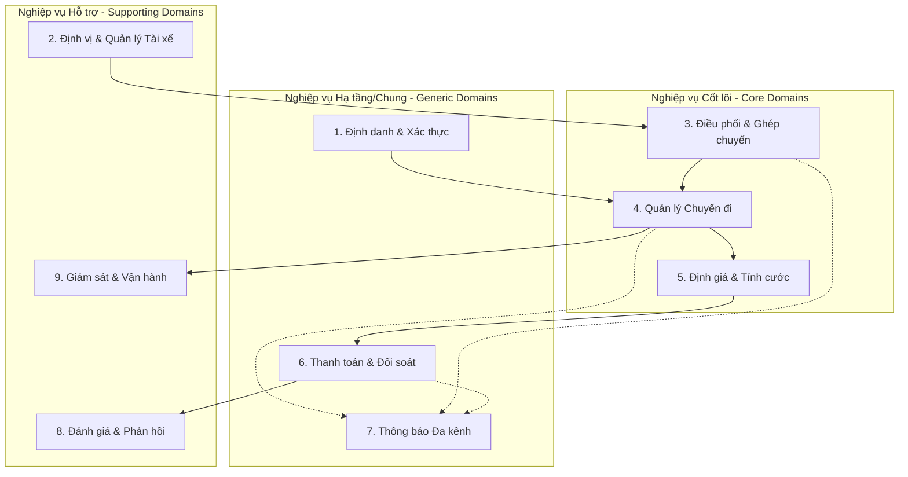

---

### 2.2.1. Bảng Chi tiết Phân rã Nghiệp vụ con & Đánh giá Tác động

| STT | Nghiệp vụ con (Sub-business) | Phân loại Miền (Domain Type) | Trách nhiệm cốt lõi (Core Responsibility) | Tác động khi Hoạt động bình thường (Positive Impact) | Tác động khi Xảy ra Sự cố (Failure & Ripple Effect) |
| :--- | :--- | :--- | :--- | :--- | :--- |
| **1** | **Quản lý Định danh & Xác thực (Identity & Access)** | Generic Sub-domain | Đăng ký, đăng nhập (JWT), phân quyền (RBAC), quản lý hồ sơ cá nhân và kiểm duyệt phương tiện. | Cung cấp định danh tin cậy và cơ chế bảo mật cho mọi yêu cầu gọi dịch vụ trong toàn hệ thống. | **Nghiêm trọng (High):** Người dùng không thể đăng nhập phiên mới. Tuy nhiên, nếu áp dụng JWT Stateless, các phiên đang hoạt động với token hợp lệ vẫn tiếp tục chuyến bình thường. |
| **2** | **Định vị & Theo dõi Tài xế (Location & Telemetry)** | Supporting Sub-domain | Thu thập tọa độ GPS theo thời gian thực (1-3s), quản lý Geo-Spatial Index trên Redis Cache, tìm tài xế gần điểm đón. | Cung cấp dữ liệu vị trí tức thời cho thuật toán điều phối và hỗ trợ tính năng Live Tracking hành trình cho khách hàng. | **Trung bình - Cao (Medium-High):** Khách hàng không xem được xe di chuyển trên bản đồ; Điều phối phải dùng tọa độ gần nhất (Fallback Cache) hoặc mở rộng bán kính tìm kiếm. |
| **3** | **Điều phối & Ghép chuyến (Matching & Dispatching)** | **Core Domain (Cốt lõi)** | Tìm kiếm tài xế tối ưu theo vị trí/tiêu chí, quản lý hàng đợi mời cuốc (15s timeout), tự động chuyển tiếp tài xế khi bị từ chối. | Rút ngắn thời gian chờ xe của khách hàng, tối ưu hóa tỷ lệ nhận chuyến và quãng đường di chuyển rỗng của tài xế. | **Nghiêm trọng (Critical):** Chuyến xe bị treo, khách hàng chờ lâu và hủy app. Cần cơ chế tự động báo "Không tìm thấy xe" hoặc chuyển sang nhân viên điều phối thủ công. |
| **4** | **Quản lý Vòng đời Chuyến đi (Trip Lifecycle Management)** | **Core Domain (Cốt lõi)** | Quản lý máy trạng thái chuyến (`CREATED` ➔ `ACCEPTED` ➔ `ARRIVED` ➔ `IN_TRIP` ➔ `COMPLETED` ➔ `PAID`), lưu vết lộ trình. | Giữ vai trò nhạc trưởng đồng bộ trạng thái giữa Khách hàng, Tài xế và phát sự kiện sang các dịch vụ khác. | **Nghiêm trọng (Critical):** Trạng thái chuyến đi bị lệch giữa khách và tài xế, không thể chuyển tiếp hành trình. Cần cơ chế lưu trạng thái bền vững (State Machine Persistence). |
| **5** | **Định giá & Tính cước (Pricing & Billing)** | Supporting / Core | Ước tính giá trước chuyến (Fare Estimate) và tính toán tổng cước phí chính xác sau chuyến đi dựa trên quãng đường/thời gian/phụ phí. | Tạo sự minh bạch chi phí cho khách hàng, bảo đảm tính đúng doanh thu và hoa hồng tài xế. | **Cao (High):** Không ước tính được giá -> Khách không bấm đặt xe được. Nếu lỗi lúc kết thúc chuyến -> Áp dụng công thức cước cơ bản Fallback (Default Base Fare) dựa trên GPS đã ghi nhận. |
| **6** | **Thanh toán & Đối soát (Payment & Settlement)** | Generic Sub-domain | Tích hợp cổng thanh toán trực tuyến (Momo, VNPay, Thẻ) và thanh toán Tiền mặt (Cash), quản lý giao dịch và đối soát ví. | Xử lý thanh toán nhanh chóng, an toàn không lưu thẻ nhạy cảm, tự động hạch toán doanh thu. | **Trung bình (Medium):** Khi cổng thanh toán bên thứ ba bị sập/chậm, hệ thống **không bị tê liệt** nhờ kiến trúc phân tán; tự động kích hoạt chuyển sang thanh toán **Tiền mặt (Cash)** cho tài xế. |
| **7** | **Thông báo Đa kênh (Notification Service)** | Supporting Sub-domain | Tiếp nhận sự kiện bất đồng bộ từ Event Bus và đẩy thông báo Push (FCM), SMS (Twilio) hoặc In-app notification. | Cung cấp thông tin kịp thời (tài xế đến, trạng thái thanh toán), nâng cao trải nghiệm người dùng. | **Thấp (Low):** Dịch vụ thông báo lỗi không làm gián đoạn luồng đặt xe hay thanh toán chính (Loose Coupling). Khách vẫn xem được trạng thái trên giao diện chính nhờ WebSocket/Polling. |
| **8** | **Đánh giá & Phản hồi (Rating & Quality Control)** | Supporting Sub-domain | Tiếp nhận điểm sao (1-5 sao) và nhận xét của khách, tính điểm trung bình uy tín của tài xế. | Sàng lọc và nâng cao chất lượng dịch vụ; cung cấp chỉ số đánh giá làm đầu vào ưu tiên cho thuật toán điều phối xe. | **Rất thấp (Very Low):** Hoàn toàn không chặn luồng nghiệp vụ di chuyển hay thanh toán của hệ thống. |
| **9** | **Giám sát & Vận hành (Operations & Incident Portal)** | Supporting Sub-domain | Cung cấp Dashboard theo dõi chuyến đi trực tiếp, can thiệp xử lý sự cố (hủy cưỡng bức, gán lại xe), báo cáo doanh thu & kiểm toán. | Cho phép nhân viên vận hành kiểm soát toàn cục, can thiệp các ca sự cố ngoại lệ và hỗ trợ khách hàng kịp thời. | **Trung bình (Medium):** Không ảnh hưởng đến các chuyến xe tự động đang chạy giữa khách và tài xế, nhưng làm chậm khả năng xử lý khiếu nại và giám sát sự cố phát sinh. |

---

---

## 2.3. Khoanh vùng Phạm vi & Ma trận MoSCoW (Project Scope & Boundaries)
Do thời gian thực hiện đồ án giới hạn trong **7 tuần** theo chuẩn môn học Kiến trúc Hướng Dịch Vụ (SOA), hệ thống được phân định rõ ràng các giới hạn phát triển theo mô hình **MoSCoW**:

```mermaid
quadrantChart
    title Ma trận Ưu tiên Phát triển Module (Khung 7 Tuần)
    x-axis Độ phức tạp Thấp --> Độ phức tạp Cao
    y-axis Giá trị Cốt lõi Thấp --> Giá trị Cốt lõi Cao
    quadrant-1 Bắt buộc làm & Tập trung kiến trúc (Must-Have Core)
    quadrant-2 Làm nhanh & Đơn giản hóa (Quick Wins)
    quadrant-3 Cắt giảm / Bỏ qua (Out of Scope)
    quadrant-4 Giả lập / Mocking (Simulated)
    
    "Trip Management Service": [0.65, 0.95]
    "Matching & Dispatching": [0.75, 0.90]
    "API Gateway & Event Bus": [0.70, 0.85]
    "User & Auth Service": [0.35, 0.80]
    "Pricing & Billing": [0.40, 0.75]
    "Location Tracking": [0.55, 0.70]
    "Payment Service (Sandbox)": [0.70, 0.40]
    "Notification (WebSocket/FCM)": [0.45, 0.50]
    "Rating Service": [0.20, 0.35]
    "Admin Dashboard": [0.40, 0.30]
    "Hệ thống Bản đồ riêng": [0.95, 0.15]
    "AI Định giá thời tiết": [0.90, 0.20]
    "Tổng đài gọi điện VoIP": [0.85, 0.10]
```

### 2.3.1. Các Module BẮT BUỘC Phát triển (In-Scope: Must-Have)
*Đây là các module tạo nên "xương sống" và quy trình cốt lõi mà đề bài yêu cầu:*
1. **API Gateway & Event Bus (Hermes Message Bus - Hạ tầng SOA):**
   - Routing API tập trung, kiểm tra JWT Token.
   - Cấu hình Message Broker (Kafka/RabbitMQ) để các microservice giao tiếp phi đồng bộ và tách rời phụ thuộc.
2. **Module Quản lý Định danh & Xác thực (User & Auth Service):**
   - Đăng ký, đăng nhập JWT cho 3 roles: Khách hàng, Tài xế, Quản trị viên (RBAC).
3. **Module Quản lý Vị trí & Trạng thái Tài xế (Location & Driver Service):**
   - Bật/tắt trạng thái Online/Offline, lưu tọa độ GPS của tài xế vào Redis Cache, API tìm tài xế gần điểm đón.
   - *Hỗ trợ demo:* Có công cụ/script **giả lập di chuyển GPS** của tài xế trên bản đồ.
4. **Module Điều phối & Ghép xe (Matching & Dispatching Service):**
   - Thuật toán tìm tài xế gần nhất, gửi lời mời nhận chuyến, quản lý đếm ngược (15s Timeout) và **tự động chuyển tiếp sang tài xế tiếp theo** khi bị từ chối.
5. **Module Quản lý Vòng đời Chuyến đi (Trip Management Service):**
   - Quản lý máy trạng thái chuyến (`CREATED` ➔ `ACCEPTED` ➔ `ARRIVED` ➔ `IN_TRIP` ➔ `COMPLETED` ➔ `PAID`), đồng bộ hành trình Khách - Tài xế.
6. **Module Định giá & Tính cước (Pricing & Billing Service):**
   - Ước tính cước ban đầu và tính cước chính thức sau chuyến đi theo công thức cố định: `Giá mở cửa + (Số km × Đơn giá) + Phụ phí giờ cao điểm`.

### 2.3.2. Các Module Đơn giản hóa (In-Scope: Should-Have / Simplified)
*Tối ưu hóa thời gian thực hiện nhưng vẫn đáp ứng đầy đủ kịch bản demo kiến trúc:*
1. **Module Thanh toán (Payment Integration Service):**
   - Hỗ trợ thanh toán **Tiền mặt (Cash)** có xác nhận của tài xế.
   - Hỗ trợ thanh toán **Điện tử**: Tích hợp Cổng **Sandbox / Mock Payment Gateway** (VNPay Sandbox hoặc Mock Service giả lập thành công/thất bại) để demo kịch bản **Saga bù trừ giao dịch** khi cổng thanh toán lỗi.
2. **Module Thông báo (Notification Service):**
   - Đẩy thông báo thời gian thực qua **WebSocket (In-app)** hoặc **Firebase Cloud Messaging (FCM)**.
3. **Module Đánh giá & Phản hồi (Rating Service):**
   - Form chấm 1–5 sao và nhận xét cơ bản sau chuyến đi, tính điểm trung bình cho tài xế.
4. **Module Quản trị Vận hành (Admin & Ops Portal):**
   - Giao diện Web đơn giản để xem danh sách chuyến đang hoạt động, tài xế online và doanh thu cơ bản.

### 2.3.3. Các Tính năng LOẠI BỎ khỏi phạm vi (Out-of-Scope: Won't-Have)
*Không triển khai trong khung 7 tuần để tránh quá tải và không đúng trọng tâm kiến trúc dịch vụ:*

| Tính năng ngoài phạm vi | Lý do loại bỏ / Giải pháp thay thế cho đồ án |
| :--- | :--- |
| ❌ **Tự xây dựng bản đồ số riêng (Map Engine)** | Tốn kém tài nguyên. **Giải pháp:** Sử dụng API có sẵn (Google Maps, OpenStreetMap/Leaflet, Mapbox). |
| ❌ **Thuật toán AI dự đoán giá động thời tiết phức tạp** | Không thuộc trọng tâm môn học. **Giải pháp:** Áp dụng bảng phụ phí Surge Pricing cố định theo khung giờ. |
| ❌ **Tổng đài thoại VoIP / Gọi trực tiếp qua SIM** | Khó khăn hạ tầng viễn thông. **Giải pháp:** Sử dụng Chat trong ứng dụng hoặc hiển thị SĐT. |
| ❌ **Xử lý mất kết nối mạng kéo dài nhiều ngày (Offline Mesh)** | Đặt xe cần xử lý thời gian thực. **Giải pháp:** Timeout 30s tự hủy tìm kiếm hoặc hỗ trợ gửi lại lệnh (Retry). |
| ❌ **Hệ thống Ví điện tử / Nạp - Rút ngân hàng đa tầng** | Rủi ro bảo mật tài chính. **Giải pháp:** Thanh toán chuyến nào quyết toán chuyến đó qua Cổng trung gian. |

---

---

# CHƯƠNG 3: MÔ HÌNH HÓA QUY TRÌNH NGHIỆP VỤ (BUSINESS PROCESS MODELING - BPM)

Dựa trên các Mục tiêu Kinh doanh (`BG_01` – `BG_05`) và 10 Yêu cầu Nghiệp vụ (`BR_01` – `BR_10`), hệ thống CAB System chuẩn hóa thành **8 Phân hệ Quy trình Nghiệp vụ cốt lõi (BPMN Workflows)**:

| Mã Quy trình | Tên Quy trình Nghiệp vụ (BPMN Workflow) | Mục tiêu Doanh nghiệp (BG) | Yêu cầu Nghiệp vụ (BR) | Tác nhân Tham gia |
| :---: | :--- | :---: | :---: | :--- |
| **`BPMN-01`** | **Khởi tạo Đặt xe & Ước tính Cước** | `BG_01`, `BG_02` | `BR_01`, `BR_02` | Khách hàng, Pricing Service |
| **`BPMN-02`** | **Điều phối, Ghép chuyến & Mời cuốc Tự động** | `BG_01` | `BR_01`, `BR_06` | Hệ thống CAB, Tài xế |
| **`BPMN-03`** | **Theo dõi Hành trình Trực tiếp (Live Tracking)** | `BG_02` | `BR_02` | Khách hàng, Tài xế, Location Svc |
| **`BPMN-04`** | **Quyết toán Cước phí & Thanh toán Đa kênh** | `BG_03`, `BG_05` | `BR_03`, `BR_08` | Khách hàng, Tài xế, Cổng TT, Saga |
| **`BPMN-05`** | **Thu nhận Đánh giá & Phản hồi Chất lượng** | `BG_02` | `BR_06` | Khách hàng, Rating Service |
| **`BPMN-06`** | **Giám sát Bản đồ & Xử lý Sự cố Vận hành** | `BG_04` | `BR_04`, `BR_08` | Operator, Trip Service |
| **`BPMN-07`** | **Đăng ký, Xác thực & Phân quyền RBAC** | `BG_05` | `BR_05`, `BR_10` | Khách hàng, Tài xế, Auth Svc |
| **`BPMN-08`** | **Kiểm duyệt Hồ sơ Phương tiện & Kiểm toán Log** | `BG_04`, `BG_05` | `BR_04`, `BR_10` | Admin, Audit Service |

---

## 3.1. Sơ đồ Quy trình Nghiệp vụ Tổng thể (End-to-End Business Process Flow)
Mô hình hóa toàn bộ vòng đời từ lúc khách hàng yêu cầu đến khi hoàn tất chuyến đi, thanh toán, đánh giá và giám sát vận hành:

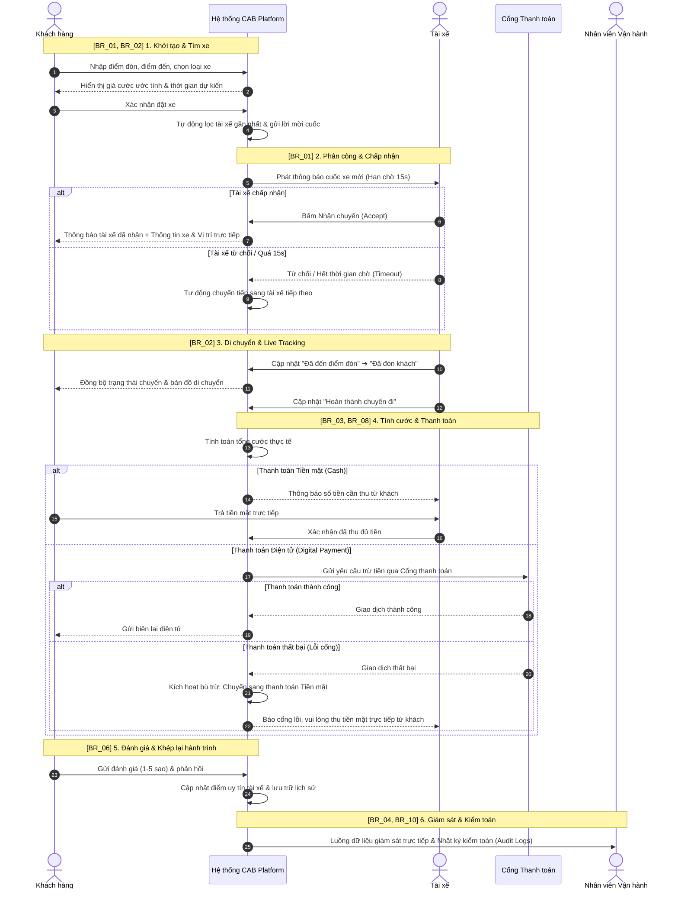

---

## 3.2. Mô hình hóa Quy trình Điều phối & Chuyển tiếp Chuyến đi Tự động (`BR_01`)
Quy trình nghiệp vụ xử lý logic tự động ghép xe, đếm ngược và chuyển tiếp:


---

## 3.3. Mô hình hóa Quy trình Thanh toán & Cơ chế Bù trừ Giao dịch (`BR_03`, `BR_08`)
Đảm bảo tính sẵn sàng cao, xử lý độc lập giữa cổng thanh toán bên thứ ba và hệ thống lõi:

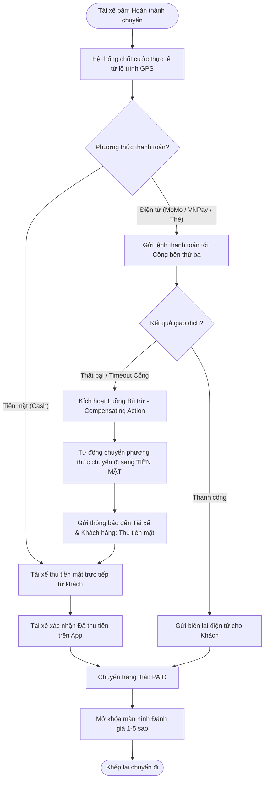

---

## 3.4. Mô hình hóa Quy trình Giám sát Vận hành & Xử lý Sự cố (`BR_04`, `BR_10`)
Đảm bảo khả năng can thiệp của bộ phận vận hành khi xảy ra ngoại lệ:

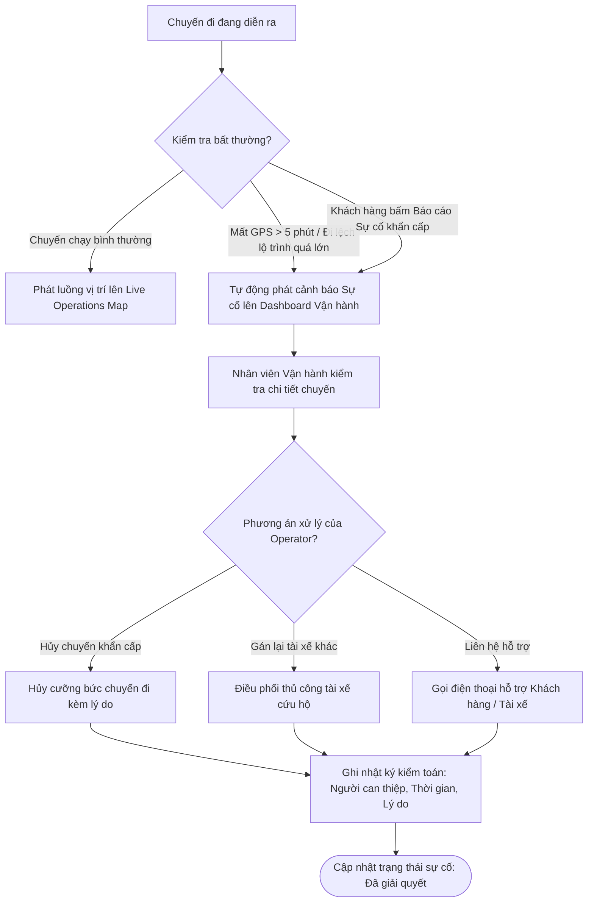

---

## 3.5. Ma trận Ánh xạ Nghiệp vụ (Traceability Matrix: BR ➔ Business Process ➔ SOA Services)

| Mã BR | Tên Nghiệp vụ Doanh nghiệp | Quy trình Nghiệp vụ tương ứng | Dịch vụ SOA / Microservice thực thi |
| :---: | :--- | :--- | :--- |
| **BR_01** | Tự động hóa Điều phối & Ghép xe | Quy trình ghép xe đa tài xế & vòng lặp timeout 15s | `Matching & Dispatch Service`, `Location Service` |
| **BR_02** | Minh bạch lộ trình & Theo dõi trực tiếp | Quy trình cập nhật trạng thái & Live Tracking | `Trip Service`, `Location Service`, `Map API` |
| **BR_03** | Quản lý tài chính & Thanh toán an toàn | Quy trình tính cước & tích hợp cổng thanh toán Sandbox | `Pricing Service`, `Payment Service`, `Saga Orchestrator` |
| **BR_04** | Giám sát & Điều hành vận hành tập trung | Quy trình cảnh báo sự cố & điều hành bản đồ trực tiếp | `Admin Portal`, `Live Stream Service`, `Trip Service` |
| **BR_05** | Hỗ trợ đa nhóm người dùng & RBAC | Quy trình xác thực JWT & phân quyền vai trò | `User & Auth Service`, `API Gateway` |
| **BR_06** | Quản lý chất lượng qua Đánh giá | Quy trình đánh giá 1-5 sao sau chuyến đi | `Rating Service`, `Driver Profile Service` |
| **BR_07** | Hệ thống thông báo đa kênh | Quy trình đẩy thông báo sự kiện (Push/SMS/WebSocket) | `Hermes Event Bus`, `Notification Service` |
| **BR_08** | Tính sẵn sàng cao & Cô lập lỗi | Cơ chế bù trừ giao dịch (Saga Fallback sang Tiền mặt) | `Hermes Saga Orchestrator`, `Payment Service` |
| **BR_09** | Kiến trúc linh hoạt, dễ mở rộng | Mô hình phân tách độc lập các Domain dịch vụ | Toàn bộ hệ thống Microservices & `API Gateway` |
| **BR_10** | Bảo mật, riêng tư & Nhật ký kiểm toán | Quy trình ghi log kiểm toán (Audit Logging) | `Audit Service`, `Security Middleware` |

---

---

---

# CHƯƠNG 4: THIẾT LẬP CÁC QUY TẮC & LUẬT NGHIỆP VỤ (BUSINESS RULES: BRULE_01 – BRULE_10)

Các quy tắc nghiệp vụ (**Business Rules - BRULE**) định nghĩa ràng buộc, công thức tính toán và logic xử lý áp dụng cho các chức năng dịch vụ:

## 4.1. Bảng Tổng hợp 10 Luật Nghiệp vụ Chi tiết (BRULE_01 – BRULE_10)

| Mã Luật | Tên Quy tắc Nghiệp vụ | Nội dung Ràng buộc & Công thức Logic | Áp dụng cho SR |
| :---: | :--- | :--- | :---: |
| **`BRULE_01`** | **Giới hạn Bán kính & Tiêu chí Lọc Xe** | • Bán kính khởi đầu $R = 2\text{ km}$, tự động mở rộng $+2\text{ km}$ sau mỗi lượt tìm kiếm, tối đa $R_{\max} = 10\text{ km}$.<br>• Chỉ tài xế có trạng thái `ONLINE`, `isAvailable = true`, đúng loại phương tiện và không bị khóa mới được đưa vào danh sách lọc. | `SR_06`, `SR_09` |
| **`BRULE_02`** | **Xếp hạng Ưu tiên & Timeout Điều phối** | • Điểm ưu tiên: $\text{Score} = \left(\frac{1}{\text{Khoảng cách}}\right) \times 0.6 + \left(\frac{\text{Rating}}{5.0}\right) \times 0.3 + (\text{Tỷ lệ nhận chuyến}) \times 0.1$.<br>• Thời gian chờ tài xế phản hồi tối đa là **15 giây**. Nếu quá 15s hoặc tài xế từ chối, tự động chuyển sang tài xế tiếp theo (tối đa thử 5 tài xế). | `SR_09`, `SR_10` |
| **`BRULE_03`** | **Công thức Tính Cước Phí Tiêu chuẩn** | • **Xe máy (`BIKE`):** Giá mở cửa (2km đầu) = $14.000\text{ VNĐ}$; mỗi km tiếp theo = $5.000\text{ VNĐ/km}$.<br>• **Xe 4 chỗ (`CAR_4`):** Giá mở cửa (2km đầu) = $25.000\text{ VNĐ}$; mỗi km tiếp theo = $11.500\text{ VNĐ/km}$.<br>• **Xe 7 chỗ (`CAR_7`):** Giá mở cửa (2km đầu) = $32.000\text{ VNĐ}$; mỗi km tiếp theo = $15.000\text{ VNĐ/km}$. | `SR_07`, `SR_15` |
| **`BRULE_04`** | **Hệ số Phụ phí Cao điểm & Ban đêm** | • Giờ cao điểm sáng ($7\text{h}00 - 9\text{h}00$) và chiều ($17\text{h}00 - 19\text{h}00$): Nhân hệ số $\times 1.20$.<br>• Khung giờ đêm ($22\text{h}00 - 05\text{h}00$ sáng hôm sau): Nhân hệ số $\times 1.15$.<br>• Phụ phí thời gian chờ đón khách vượt quá 5 phút: $1.000\text{ VNĐ/phút}$. | `SR_07`, `SR_15` |
| **`BRULE_05`** | **Chính sách Hủy chuyến & Phí phạt** | • Khách hủy chuyến trong vòng $\le 2\text{ phút}$ sau khi tài xế nhận: **Miễn phí**.<br>• Khách hủy sau 2 phút hoặc khi tài xế đã đến điểm đón: **Phạt $15.000\text{ VNĐ}$** (ghi nợ vào cuốc xe kế tiếp).<br>• Tài xế tự ý hủy chuyến $>2\text{ lần/ngày}$ không lý do: Tạm khóa tài khoản 24h và trừ 5% điểm uy tín. | `SR_11` |
| **`BRULE_06`** | **Tiêu chuẩn Duyệt Hồ sơ & Khóa Tài khoản** | • Bằng lái xe phải còn hạn trên 6 tháng, giấy đăng kiểm xe còn hiệu lực.<br>• Tài xế có điểm đánh giá trung bình $< 3.8$ sao trong 30 chuyến gần nhất sẽ nhận cảnh báo; $< 3.5$ sao sẽ bị tạm đình chỉ để đào tạo lại. | `SR_01`, `SR_20` |
| **`BRULE_07`** | **Quy tắc Saga Bù trừ khi Thanh toán Lỗi** | • Cổng thanh toán phản hồi Timeout $> 30\text{s}$ hoặc lỗi giao dịch (`HTTP 5xx`): Hệ thống tự động kích hoạt giao dịch bù trừ (Compensating Transaction) chuyển chuyến đi sang hình thức **Thu Tiền mặt (Cash)** và gửi thông báo cảnh báo tài xế. | `SR_17`, `SR_18` |
| **`BRULE_08`** | **Bảo mật Dữ liệu Thẻ & Quyền Riêng tư** | • Hệ thống **tuyệt đối không lưu trữ** số thẻ đầy đủ, mã CVV/CVC trên cơ sở dữ liệu nội bộ.<br>• Ẩn 4 chữ số giữa của số điện thoại (Data Masking) khi hiển thị giữa Khách hàng và Tài xế. | `SR_02`, `SR_17` |
| **`BRULE_09`** | **Ràng buộc Đánh giá Sau Chuyến** | • Khách hàng chỉ được gửi đánh giá trong vòng **24 giờ** sau khi hoàn tất chuyến đi (`PAID`).<br>• Đánh giá từ 1 đến 2 sao bắt buộc phải chọn lý do phàn nàn để chuyển luồng xử lý CSKH. | `SR_19` |
| **`BRULE_10`** | **Ràng buộc Kiểm toán Thao tác Quản trị** | • Mọi thao tác hủy chuyến cưỡng bức, khóa tài khoản hoặc điều phối thủ công của nhân viên vận hành bắt buộc phải nhập lý do (tối thiểu 10 ký tự) và được ghi vào bảng `AUDIT_LOGS` bất biến. | `SR_24`, `SR_25` |


---

## 4.2. Công thức Định giá & Thuật toán Xếp hạng Điều phối

### 1. Công thức Tính Giá cước Ước tính:
$$\text{EstimatedFare} = \left( \text{BasePrice} + \max(0, \text{Distance} - 2) \times \text{PricePerKm} \right) \times \text{SurgeMultiplier}$$

### 2. Thuật toán Xếp hạng Ưu tiên Tài xế:
$$\text{PriorityScore} = \left(\frac{1}{\text{DistanceToPickup (km)}}\right) \times 0.6 + \left(\frac{\text{Rating}}{5.0}\right) \times 0.3 + (\text{AcceptanceRate}) \times 0.1$$

---

# CHƯƠNG 5: ĐẶC TẢ YÊU CẦU CHỨC NĂNG DỊCH VỤ (SERVICE REQUIREMENTS: SR_01 – SR_25)

## 5.1. Ma trận Tra cứu Nhanh 25 Chức năng Dịch vụ (Master SR Matrix)

Ma trận Tra cứu Nhanh Danh mục SR

| Mã SR | Tên Chức năng Dịch vụ Nghiệp vụ | Tác nhân | Đầu vào (Input Data) | Đầu ra (Output / Event) | Ánh xạ BR | Microservice phụ trách |
| :---: | :--- | :--- | :--- | :--- | :---: | :--- |
| **`SR_01`** | **Đăng ký Tài khoản & Hồ sơ** | Khách hàng, Tài xế | SĐT, Email, Mật khẩu, Hồ sơ bằng lái, CCCD | Tài khoản kích hoạt, Hồ sơ chờ duyệt | `BR_05` | `User & Auth Service` |
| **`SR_02`** | **Xác thực & Cấp quyền JWT** | Khách, Tài xế, Admin | Thông tin đăng nhập, Credentials | JWT Access Token, Refresh Token, Role RBAC | `BR_05`, `BR_10` | `User & Auth Service`, `API Gateway` |
| **`SR_03`** | **Quản lý Hồ sơ & Phương tiện** | Tài xế, Admin | Biển số xe, Loại xe (4/7 chỗ, xe máy), Giấy tờ | Hồ sơ xe phê duyệt, Trạng thái phương tiện | `BR_05` | `User & Auth Service` |
| **`SR_04`** | **Chuyển đổi Trạng thái Hoạt động** | Tài xế | Lệnh bật/tắt Online / Busy / Offline | Cập nhật trạng thái Driver State trên Redis | `BR_01` | `Driver State Service` |
| **`SR_05`** | **Thu thập & Phát sóng GPS** | Driver App | Tọa độ (Lat, Long, Speed, Bearing) mỗi 1–3s | Cập nhật vị trí trên Redis Geospatial Index | `BR_01`, `BR_02` | `Location & Telemetry Service` |
| **`SR_06`** | **Tìm Tài xế theo Bán kính** | Matching Service | Tọa độ điểm đón, Bán kính R, Loại xe | Danh sách [DriverID_1, DriverID_2, ...] | `BR_01` | `Location & Telemetry Service` |
| **`SR_07`** | **Ước tính Giá cước & ETA** | Khách hàng | Điểm đón, Điểm đến, Loại xe | Cước phí tạm tính, Thời gian đón xe dự kiến | `BR_02`, `BR_03` | `Pricing Service`, `Map API` |
| **`SR_08`** | **Khởi tạo Yêu cầu Đặt chuyến** | Khách hàng | Điểm đón/đến, Loại xe, Mã khách hàng | Bản ghi Trip (`CREATED`), Event `trip.created` | `BR_01` | `Trip Management Service` |
| **`SR_09`** | **Ghép xe Tối ưu & Mời cuốc** | Matching Service | Danh sách tài xế gần, Điểm uy tín | Gửi thông báo mời nhận cuốc + Bật Timer 15s | `BR_01`, `BR_06` | `Matching & Dispatch Service` |
| **`SR_10`** | **Xử lý Mời cuốc & Chuyển tiếp** | Tài xế, Timer | Phản hồi Accept / Reject / Quá 15s | Gán tài xế (`ACCEPTED`) HOẶC Chuyển tiếp D_next | `BR_01` | `Matching Service`, `Trip Service` |
| **`SR_11`** | **Hủy chuyến & Phạt hủy** | Khách hàng, Tài xế | Lệnh hủy chuyến, Lý do hủy | Bản ghi Trip (`CANCELLED`), Phí phạt (nếu có) | `BR_01`, `BR_04` | `Trip Management Service` |
| **`SR_12`** | **Cập nhật Tiến trình Chuyến** | Tài xế | Lệnh chuyển mốc trạng thái từ App tài xế | Chuyển `ARRIVED` ➔ `IN_TRIP` ➔ `COMPLETED` | `BR_02` | `Trip Management Service` |
| **`SR_13`** | **Live Tracking & Lộ trình** | Khách hàng | Mã chuyến đi (Trip ID) | Luồng WebSocket tọa độ xe & Lộ trình trực tiếp | `BR_02` | `Location Service`, `Trip Service` |
| **`SR_14`** | **Tra cứu Lịch sử Chuyến đi** | Khách, Tài xế, Admin | Bộ lọc thời gian, Mã người dùng | Danh sách chi tiết các chuyến đi, Biên lai | `BR_02`, `BR_04` | `Trip Management Service` |
| **`SR_15`** | **Quyết toán Cước phí Thực tế** | Hệ thống Pricing | Lộ trình GPS thực tế, Thời gian thực tế, Phụ phí | Tổng cước phí cuối cùng cần thanh toán | `BR_03` | `Pricing & Billing Service` |
| **`SR_16`** | **Xử lý Thanh toán Tiền mặt** | Khách hàng, Tài xế | Số tiền cước, Lệnh xác nhận thu tiền từ tài xế | Bản ghi Chuyến đi (`PAID`), Hóa đơn Tiền mặt | `BR_03` | `Payment Service` |
| **`SR_17`** | **Thanh toán Cổng Điện tử** | Khách, Payment GW | Yêu cầu trừ tiền (VNPay/MoMo/Thẻ ngân hàng) | Webhook giao dịch thành công, Biên lai số | `BR_03`, `BR_10` | `Payment Integration Service` |
| **`SR_18`** | **Điều phối Bù trừ khi Lỗi Cổng** | Hermes Saga Orchestrator | Sự kiện `payment.failed` hoặc Gateway Timeout | Chuyển sang Tiền mặt, Cảnh báo thu tiền | `BR_03`, `BR_08` | `Hermes Saga`, `Payment Service` |
| **`SR_19`** | **Tiếp nhận Đánh giá & Góp ý** | Khách hàng | Điểm sao (1–5 sao), Nội dung nhận xét | Bản ghi Feedback, Đánh giá chất lượng | `BR_06` | `Rating & Feedback Service` |
| **`SR_20`** | **Tổng hợp Điểm Uy tín Tài xế** | Hệ thống Rating | Lịch sử sao và tỷ lệ nhận/hủy chuyến | Điểm tín nhiệm trung bình, Hạng tài xế | `BR_01`, `BR_06` | `Rating Service`, `Matching Service` |
| **`SR_21`** | **Phát Thông báo cho Khách hàng** | Hermes Event Bus | Sự kiện Chuyến đi, Tài xế đến, Hóa đơn | Push Notification (FCM), WebSocket, SMS | `BR_02`, `BR_07` | `Notification Service` |
| **`SR_22`** | **Phát Thông báo cho Tài xế** | Hermes Event Bus | Sự kiện Cuốc xe mới, Khách hủy chuyến | Chuông báo cuốc xe, Alert In-App tài xế | `BR_01`, `BR_07` | `Notification Service` |
| **`SR_23`** | **Giám sát Bản đồ Vận hành** | Operator | Bộ lọc khu vực, Trạng thái chuyến đi | Bản đồ trực tiếp toàn bộ xe & chuyến đang chạy | `BR_04` | `Admin & Operations Portal` |
| **`SR_24`** | **Xử lý Sự cố Chuyến đi** | Operator | Cảnh báo xe đứng yên > 5 phút / Mất GPS | Lệnh Hủy cưỡng bức / Điều xe cứu hộ thủ công | `BR_04`, `BR_08` | `Incident & Operations Service` |
| **`SR_25`** | **Kiểm toán & Báo cáo Thống kê** | Admin, Quản trị | Thao tác can thiệp, Dữ liệu giao dịch | Nhật ký Audit Log, Dashboard Báo cáo Doanh thu | `BR_04`, `BR_10` | `Audit & Analytics Service` |

---

---

## 5.2. Đặc tả Chi tiết Quy cách Nghiệp vụ 25 SR theo 8 Nhóm Dịch vụ

Dựa trên Quy trình Nghiệp vụ (BPM) và Yêu cầu Doanh nghiệp (`BR_01` - `BR_10`), toàn bộ hệ thống được phân rã thành **25 Chức năng Dịch vụ Nghiệp vụ (Service Requirements - SR)** chuẩn hóa:

#### 5.2.1. Nhóm Dịch vụ Định danh & Quản lý Người dùng (Identity & Access Services)
* **`SR_01` (Đăng ký tài khoản & Nộp hồ sơ):**
  * *Tác nhân:* Khách hàng, Tài xế.
  * *Mô tả:* Khách hàng tự đăng ký qua số điện thoại/email/OTP. Tài xế nộp hồ sơ lý lịch, ảnh CCCD, bằng lái xe để chờ xét duyệt.
  * *Ánh xạ:* `BR_05` | *Dịch vụ phụ trách:* `User & Auth Service`.
* **`SR_02` (Xác thực tập trung & Cấp quyền JWT):**
  * *Tác nhân:* Khách hàng, Tài xế, Quản trị viên (Admin), Nhân viên (Operator).
  * *Mô tả:* Xác thực tài khoản, mã hóa mật khẩu (BCrypt), cấp cặp Token (Access Token JWT + Refresh Token) chứa vai trò (Role-Based Access Control) để truy cập API.
  * *Ánh xạ:* `BR_05`, `BR_10` | *Dịch vụ phụ trách:* `User & Auth Service`, `API Gateway`.
* **`SR_03` (Quản lý Hồ sơ & Thông tin Phương tiện):**
  * *Tác nhân:* Tài xế, Quản trị viên.
  * *Mô tả:* Lưu trữ và cập nhật thông tin cá nhân, bằng lái, biển số xe, dòng xe, màu sắc và phân loại dịch vụ (Xe máy, Xe 4 chỗ, Xe 7 chỗ).
  * *Ánh xạ:* `BR_05` | *Dịch vụ phụ trách:* `User & Auth Service`.

---

#### 5.2.2. Nhóm Dịch vụ Vị trí & Giám sát Trạng thái Đội xe (Location & Telemetry Services)
* **`SR_04` (Chuyển đổi Trạng thái Hoạt động Tài xế):**
  * *Tác nhân:* Tài xế.
  * *Mô tả:* Tài xế bật/tắt chuyển đổi giữa các trạng thái: *Sẵn sàng nhận chuyến (Online)*, *Đang bận chuyến (Busy)*, *Nghỉ ngơi (Offline)*.
  * *Ánh xạ:* `BR_01` | *Dịch vụ phụ trách:* `Driver State Service`.
* **`SR_05` (Thu thập & Phát sóng Tọa độ GPS Thời gian thực):**
  * *Tác nhân:* Thiết bị Tài xế (Driver App).
  * *Mô tả:* Định kỳ mỗi 1–3 giây gửi tọa độ GPS lên hệ thống khi ở trạng thái Online; lưu vết vào Redis Geospatial Index để truy vấn với độ trễ cực thấp.
  * *Ánh xạ:* `BR_01`, `BR_02` | *Dịch vụ phụ trách:* `Location & Telemetry Service`.
* **`SR_06` (Tìm kiếm Tài xế Khả dụng theo Bán kính Điểm đón):**
  * *Tác nhân:* Hệ thống Điều phối (Matching Service).
  * *Mô tả:* Truy vấn danh sách tài xế đang Online, không bận, đúng loại xe yêu cầu trong bán kính `R` km quanh tọa độ điểm đón của khách hàng.
  * *Ánh xạ:* `BR_01` | *Dịch vụ phụ trách:* `Location & Telemetry Service`.

---

#### 5.2.3. Nhóm Dịch vụ Đặt xe & Điều phối Ghép chuyến (Booking & Dispatching Services)
* **`SR_07` (Ước tính Giá cước & Thời gian Đón xe ETA):**
  * *Tác nhân:* Khách hàng.
  * *Mô tả:* Tiếp nhận điểm đón và điểm đến; tính khoảng cách, thời gian dự kiến (thông qua Map API) và áp dụng công thức giá để hiển thị cước phí tạm tính cho khách xem trước.
  * *Ánh xạ:* `BR_02`, `BR_03` | *Dịch vụ phụ trách:* `Pricing Service`, `Map Service`.
* **`SR_08` (Khởi tạo Yêu cầu Đặt chuyến):**
  * *Tác nhân:* Khách hàng.
  * *Mô tả:* Khách hàng bấm xác nhận đặt xe; hệ thống tạo bản ghi chuyến đi với trạng thái `CREATED` và phát sự kiện `trip.created` lên Hermes Event Bus.
  * *Ánh xạ:* `BR_01` | *Dịch vụ phụ trách:* `Trip Management Service`.
* **`SR_09` (Thuật toán Ghép xe Tối ưu & Gửi Lời mời Cuốc):**
  * *Tác nhân:* Hệ thống (Matching Service).
  * *Mô tả:* Sắp xếp danh sách tài xế tiềm năng theo thứ tự ưu tiên (khoảng cách gần nhất + điểm đánh giá cao); gửi thông báo mời nhận chuyến tới tài xế ưu tiên đầu tiên và kích hoạt bộ đếm ngược 15 giây.
  * *Ánh xạ:* `BR_01`, `BR_06` | *Dịch vụ phụ trách:* `Matching & Dispatch Service`.
* **`SR_10` (Xử lý Phản hồi Mời cuốc & Tự động Chuyển tiếp):**
  * *Tác nhân:* Tài xế, Hệ thống Timer.
  * *Mô tả:*
    - Nếu tài xế bấm **Chấp nhận (Accept)**: Gán tài xế vào chuyến đi, chuyển trạng thái `ACCEPTED`.
    - Nếu tài xế bấm **Từ chối (Reject)** hoặc **Hết 15 giây (Timeout)**: Hệ thống tự động chuyển tiếp lời mời sang tài xế tiếp theo trong danh sách mà không bắt khách tạo lại yêu cầu.
    - Nếu hết danh sách tài xế: Thông báo "Không tìm thấy tài xế" cho khách hàng.
  * *Ánh xạ:* `BR_01` | *Dịch vụ phụ trách:* `Matching & Dispatch Service`, `Trip Management Service`.
* **`SR_11` (Xử lý Hủy chuyến & Áp dụng Chính sách Hủy):**
  * *Tác nhân:* Khách hàng, Tài xế.
  * *Mô tả:* Cho phép hủy chuyến kèm lý do; hệ thống giải phóng trạng thái bận của tài xế và tính phí phạt (nếu hủy sau khi tài xế đã đến điểm đón).
  * *Ánh xạ:* `BR_01`, `BR_04` | *Dịch vụ phụ trách:* `Trip Management Service`.

---

#### 5.2.4. Nhóm Dịch vụ Quản lý Hành trình & Theo dõi Trực tiếp (Trip Execution & Tracking Services)
* **`SR_12` (Cập nhật Tiến trình Chuyến đi):**
  * *Tác nhân:* Tài xế.
  * *Mô tả:* Tài xế cập nhật tuần tự các mốc trạng thái: `ARRIVED_AT_PICKUP` (Đã đến điểm đón) ➔ `IN_TRIP` (Đã đón khách & Bắt đầu đi) ➔ `COMPLETED` (Đã đến nơi & Hoàn thành).
  * *Ánh xạ:* `BR_02` | *Dịch vụ phụ trách:* `Trip Management Service`.
* **`SR_13` (Truyền phát Lộ trình & Live Tracking Trực tuyến):**
  * *Tác nhân:* Khách hàng.
  * *Mô tả:* Đồng bộ liên tục tọa độ di chuyển của tài xế lên giao diện bản đồ của khách hàng thông qua WebSocket / Polling; cập nhật lại thời gian đến dự kiến (ETA) theo tình trạng giao thông.
  * *Ánh xạ:* `BR_02` | *Dịch vụ phụ trách:* `Location Service`, `Trip Management Service`.
* **`SR_14` (Tra cứu Lịch sử Chuyến đi):**
  * *Tác nhân:* Khách hàng, Tài xế, Nhân viên vận hành.
  * *Mô tả:* Cung cấp danh sách chi tiết các chuyến đi trong quá khứ: lộ trình, thời gian, cước phí, hình thức thanh toán, thông tin đối tác và hóa đơn điện tử.
  * *Ánh xạ:* `BR_02`, `BR_04` | *Dịch vụ phụ trách:* `Trip Management Service`.

---

#### 5.2.5. Nhóm Dịch vụ Định giá & Quyết toán Thanh toán (Pricing & Settlement Services)
* **`SR_15` (Tính toán & Quyết toán Cước phí Thực tế):**
  * *Tác nhân:* Hệ thống.
  * *Mô tả:* Sau khi tài xế bấm Hoàn thành chuyến; tự động chốt cước dựa trên quãng đường GPS thực tế, thời gian di chuyển thực tế, loại phương tiện và phụ phí phát sinh.
  * *Ánh xạ:* `BR_03` | *Dịch vụ phụ trách:* `Pricing & Billing Service`.
* **`SR_16` (Xử lý Thanh toán Tiền mặt):**
  * *Tác nhân:* Khách hàng, Tài xế.
  * *Mô tả:* Hiển thị số tiền cần trả; khách đưa tiền mặt cho tài xế; tài xế bấm xác nhận "Đã thu đủ tiền" trên ứng dụng để chuyển trạng thái sang `PAID`.
  * *Ánh xạ:* `BR_03` | *Dịch vụ phụ trách:* `Payment Service`.
* **`SR_17` (Tích hợp Thanh toán Điện tử qua Cổng bên thứ ba):**
  * *Tác nhân:* Khách hàng, Cổng thanh toán (VNPay / MoMo / Thẻ ngân hàng).
  * *Mô tả:* Gửi lệnh trừ tiền qua Cổng thanh toán bên thứ ba; bảo đảm không lưu thông tin thẻ nhạy cảm trên máy chủ CAB; tiếp nhận Webhook kết quả giao dịch và xuất biên lai.
  * *Ánh xạ:* `BR_03`, `BR_10` | *Dịch vụ phụ trách:* `Payment Integration Service`.
* **`SR_18` (Điều phối Giao dịch Bù trừ khi Thanh toán Lỗi):**
  * *Tác nhân:* Hệ thống (Hermes Saga Orchestrator).
  * *Mô tả:* Khi cổng thanh toán điện tử bị lỗi/timeout; hệ thống kích hoạt giao dịch bù trừ (Compensating Transaction): tự động chuyển phương thức thanh toán sang Tiền mặt và gửi cảnh báo thu tiền cho tài xế.
  * *Ánh xạ:* `BR_03`, `BR_08` | *Dịch vụ phụ trách:* `Hermes Saga Orchestrator`, `Payment Service`.

---

#### 5.2.6. Nhóm Dịch vụ Đánh giá & Quản lý Chất lượng (Rating & Quality Services)
* **`SR_19` (Tiếp nhận Đánh giá & Phản hồi Khách hàng):**
  * *Tác nhân:* Khách hàng.
  * *Mô tả:* Cho phép khách hàng chấm từ 1 đến 5 sao và viết nhận xét về thái độ phục vụ/phương tiện của tài xế sau khi chuyến đi đã thanh toán thành công.
  * *Ánh xạ:* `BR_06` | *Dịch vụ phụ trách:* `Rating & Feedback Service`.
* **`SR_20` (Tổng hợp Điểm Uy tín & Hiệu suất Tài xế):**
  * *Tác nhân:* Hệ thống.
  * *Mô tả:* Tự động tính điểm trung bình sao và tỷ lệ nhận chuyến của từng tài xế; cung cấp dữ liệu đầu vào làm tiêu chí ưu tiên phân phối cuốc xe.
  * *Ánh xạ:* `BR_01`, `BR_06` | *Dịch vụ phụ trách:* `Rating & Feedback Service`, `Matching Service`.

---

#### 5.2.7. Nhóm Dịch vụ Thông báo Sự kiện Đa kênh (Notification Services)
* **`SR_21` (Phát Thông báo Đẩy Thời gian thực cho Khách hàng):**
  * *Tác nhân:* Hệ thống.
  * *Mô tả:* Tiêu thụ sự kiện từ Hermes Bus và gửi thông báo đẩy (Push Notification / SMS) tới khách hàng: Đã tìm thấy tài xế, Tài xế đã đến điểm đón, Bắt đầu di chuyển, Hóa đơn thanh toán.
  * *Ánh xạ:* `BR_02`, `BR_07` | *Dịch vụ phụ trách:* `Notification Service`.
* **`SR_22` (Phát Thông báo Điều phối & Cảnh báo cho Tài xế):**
  * *Tác nhân:* Hệ thống.
  * *Mô tả:* Gửi âm thanh/thông báo cuốc xe mới, thông báo khách hàng hủy chuyến, cảnh báo thay đổi lộ trình tới thiết bị tài xế.
  * *Ánh xạ:* `BR_01`, `BR_07` | *Dịch vụ phụ trách:* `Notification Service`.

---

#### 5.2.8. Nhóm Dịch vụ Vận hành, Giám sát & Kiểm toán (Operations & Audit Services)
* **`SR_23` (Giám sát Luồng Chuyến đi Trực tiếp trên Bản đồ):**
  * *Tác nhân:* Nhân viên vận hành (Operator).
  * *Mô tả:* Hiển thị toàn bộ các chuyến đi đang hoạt động, vị trí các xe Online trên giao diện bản đồ điều hành trực tiếp (Live Operations Map).
  * *Ánh xạ:* `BR_04` | *Dịch vụ phụ trách:* `Admin & Operations Portal`.
* **`SR_24` (Cảnh báo & Can thiệp Xử lý Sự cố Chuyến đi):**
  * *Tác nhân:* Nhân viên vận hành.
  * *Mô tả:* Tự động phát hiện và cảnh báo chuyến xe bị đứng yên bất thường / mất GPS; cho phép nhân viên vận hành can thiệp: Hủy chuyến cưỡng bức, điều phối thủ công xe cứu hộ hoặc gọi hỗ trợ.
  * *Ánh xạ:* `BR_04`, `BR_08` | *Dịch vụ phụ trách:* `Incident & Operations Service`.
* **`SR_25` (Ghi Nhật ký Kiểm toán & Báo cáo Thống kê Doanh thu):**
  * *Tác nhân:* Quản trị viên (Admin), Hệ thống.
  * *Mô tả:* Lưu vết toàn bộ các thao tác can thiệp quản trị (Audit Trail); tự động tổng hợp Dashboard báo cáo: Tổng số cuốc xe, doanh thu theo ngày/tháng, tỷ lệ hủy chuyến và hiệu suất tài xế.
  * *Ánh xạ:* `BR_04`, `BR_10` | *Dịch vụ phụ trách:* `Audit & Analytics Service`.

---

---

# CHƯƠNG 6: THIẾT KẾ CA SỬ DỤNG (USE CASE SPECIFICATIONS & DIAGRAMS)

## 6.1. Sơ đồ Ca Sử dụng Tổng quan (Actor-based Use Case Diagram)

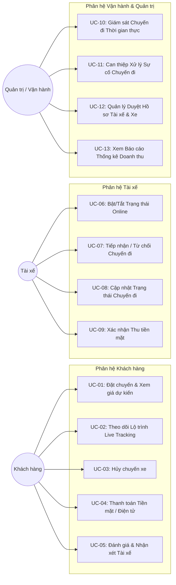

---

## 6.2. Danh mục 13 Ca Sử dụng Hệ thống (UC-01 – UC-13)

| Mã Use Case | Tên Ca Sử Dụng | Tác nhân Chính | Mô tả Tóm tắt |
| :---: | :--- | :--- | :--- |
| **`UC-01`** | **Đặt xe & Ghép chuyến Tự động** | Customer | Nhập điểm đón/đến, xem cước phí, xác nhận và hệ thống tự ghép xe. |
| **`UC-02`** | **Theo dõi Lộ trình Thời gian thực** | Customer | Xem vị trí xe di chuyển trực tiếp trên bản đồ số và ETA đón. |
| **`UC-03`** | **Hủy chuyến đi** | Customer, Driver | Hủy yêu cầu đặt xe trước hoặc sau khi tài xế nhận cuốc. |
| **`UC-04`** | **Thanh toán & Quyết toán Cước phí**| Customer, Driver | Thanh toán cước qua tiền mặt hoặc cổng điện tử (hỗ trợ bù trừ Saga). |
| **`UC-05`** | **Đánh giá & Góp ý sau Chuyến** | Customer | Chấm 1-5 sao và để lại nhận xét chất lượng phục vụ của tài xế. |
| **`UC-06`** | **Bật/Tắt Trạng thái Làm việc** | Driver | Chuyển đổi trạng thái sẵn sàng đón khách (`ONLINE` / `OFFLINE`). |
| **`UC-07`** | **Tiếp nhận / Từ chối Chuyến đi** | Driver | Nhận thông báo mời cuốc và bấm chấp nhận trong vòng 15 giây. |
| **`UC-08`** | **Cập nhật Tiến trình Hành trình** | Driver | Báo "Đã đến điểm đón", "Bắt đầu chuyến", "Hoàn thành chuyến". |
| **`UC-09`** | **Xác nhận Thu tiền mặt** | Driver | Xác nhận đã thu đủ tiền mặt từ khách khi chuyến đi kết thúc. |
| **`UC-10`** | **Giám sát Bản đồ Vận hành** | Operator, Admin | Giám sát toàn bộ các chuyến xe và vị trí tài xế đang chạy. |
| **`UC-11`** | **Can thiệp Xử lý Sự cố Cuốc xe**| Operator, Admin | Gán đè tài xế thay thế hoặc hủy cuốc khẩn cấp khi có sự cố. |
| **`UC-12`** | **Kiểm duyệt Hồ sơ Tài xế & Xe** | Admin | Phê duyệt/từ chối hồ sơ bằng lái và phương tiện của tài xế mới. |
| **`UC-13`** | **Báo cáo Thống kê & Doanh thu** | Admin | Xem biểu đồ doanh thu, số lượng chuyến đi, tỷ lệ hoàn thành cuốc. |

---

## 6.3. Đặc tả Chi tiết các Use Case Trọng tâm

#### 📋 Đặc tả Use Case 1: UC-01 - Đặt xe & Điều phối Ghép chuyến Tự động
* **Mã Use Case:** `UC-01`
* **Tác nhân chính:** Khách hàng (Customer).
* **Tác nhân phụ:** Tài xế (Driver), Hệ thống Điều phối (Matching Service), Hệ thống Bản đồ (Map API).
* **Tiền điều kiện (Pre-conditions):** Khách hàng đã đăng nhập tài khoản hợp lệ trên ứng dụng.
* **Hậu điều kiện (Post-conditions):** Chuyến đi được tạo với trạng thái `ACCEPTED` và gán cho một tài xế cụ thể.
* **Luồng sự kiện chính (Main Flow):**
  1. Khách hàng nhập địa chỉ Điểm đón và Điểm đến, chọn loại xe (`CAR_4`, `CAR_7`, `BIKE`).
  2. Hệ thống gọi Map API tính toán khoảng cách và hiển thị cước phí tạm tính cùng thời gian đón xe dự kiến (ETA) theo `BRULE_03`, `BRULE_04`.
  3. Khách hàng bấm nút **"Xác nhận đặt xe"**.
  4. Hệ thống tạo chuyến đi trạng thái `CREATED` và tìm danh sách tài xế Online gần nhất trong bán kính $2\text{km}$ theo `BRULE_01`.
  5. Hệ thống xếp hạng ưu tiên và gửi thông báo cuốc xe tới tài xế đầu tiên, đếm ngược 15 giây theo `BRULE_02`.
  6. Tài xế bấm **"Chấp nhận"** trong 15 giây.
  7. Hệ thống cập nhật chuyến đi sang `ACCEPTED`, gán ID tài xế và gửi thông báo kèm thông tin xe cho khách hàng.
* **Luồng rẽ nhánh / Ngoại lệ (Alternative / Exception Flows):**
  - *4a. Không tìm thấy tài xế trong 2km:* Hệ thống tự động mở rộng bán kính lên 4km, 6km (tối đa 10km). Nếu vẫn không có xe, thông báo "Hiện không có tài xế quanh bạn, vui lòng thử lại sau" và kết thúc Use Case.
  - *6a. Tài xế từ chối hoặc quá 15 giây:* Hệ thống tự động chuyển tiếp lời mời cuốc xe sang tài xế ưu tiên tiếp theo trong danh sách mà không bắt khách tạo lại yêu cầu.

---

#### 📋 Đặc tả Use Case 2: UC-04 - Hoàn thành Chuyến đi & Quyết toán Thanh toán Bù trừ (Saga)
* **Mã Use Case:** `UC-04`
* **Tác nhân chính:** Tài xế (Driver), Khách hàng (Customer).
* **Tác nhân phụ:** Cổng Thanh toán (Payment Gateway), Hermes Saga Orchestrator.
* **Tiền điều kiện:** Chuyến đi đang ở trạng thái `IN_TRIP`.
* **Hậu điều kiện:** Chuyến đi chuyển trạng thái `PAID`, hóa đơn được ghi nhận và màn hình đánh giá mở khóa.
* **Luồng sự kiện chính (Main Flow):**
  1. Tài xế chở khách đến điểm đến và bấm nút **"Hoàn thành chuyến đi"**.
  2. Hệ thống chốt quãng đường và thời gian thực tế, tính toán tổng tiền cước cuối cùng theo `BRULE_03`, `BRULE_04`.
  3. *Trường hợp khách chọn Tiền mặt:* Hệ thống hiển thị số tiền cần thu trên màn hình tài xế; khách đưa tiền; tài xế bấm "Đã thu tiền" ➔ Hệ thống cập nhật trạng thái `PAID`.
  4. *Trường hợp khách chọn Thanh toán Điện tử:* Hệ thống gửi lệnh trừ tiền sang Cổng thanh toán bên thứ ba qua API/Webhook.
  5. Cổng thanh toán trừ tiền thành công, phản hồi mã giao dịch ➔ Hệ thống cập nhật `PAID` và gửi biên lai điện tử cho khách.
* **Luồng ngoại lệ (Saga Compensating Flow):**
  - *4a. Cổng thanh toán bị lỗi hoặc Timeout > 30s:* Hệ thống kích hoạt giao dịch bù trừ (Compensating Transaction) theo `BRULE_07`, tự động đổi phương thức sang Tiền mặt, gửi cảnh báo cho tài xế thu tiền mặt trực tiếp từ khách.

---

---

# CHƯƠNG 7: THIẾT KẾ MÔ HÌNH DỮ LIỆU THỰC THỂ (ENTITY-RELATIONSHIP DIAGRAM - ERD)

## 7.1. Sơ đồ Thực thể Kết hợp Tổng quan (ERD Diagram)

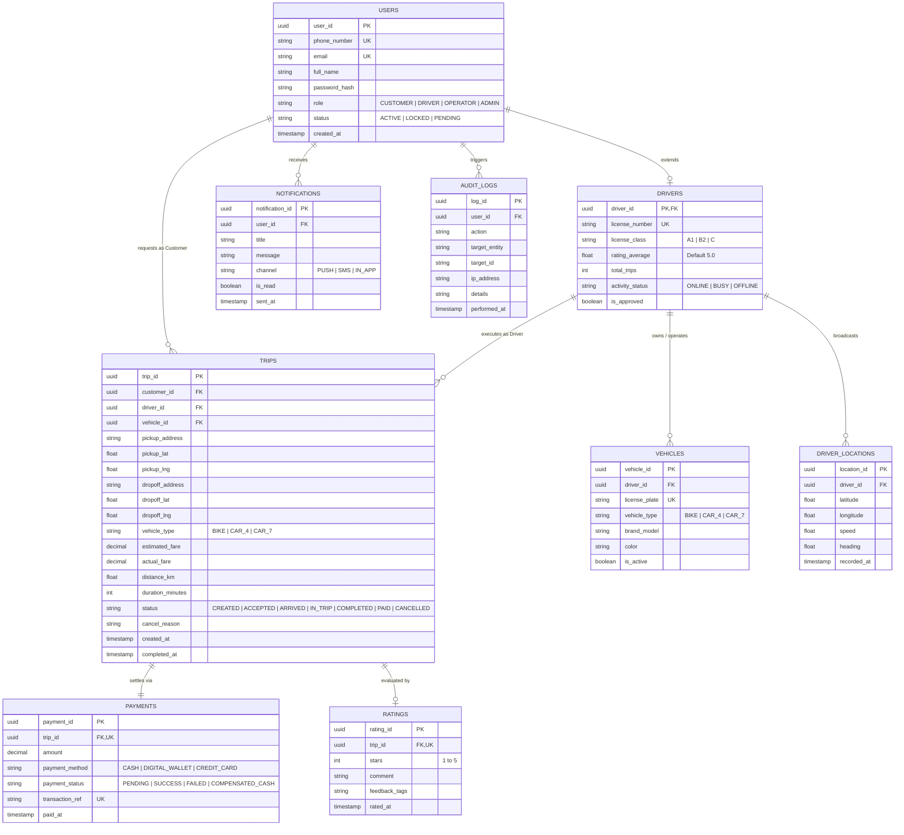

---

## 7.2. Từ điển Dữ liệu Chi tiết các Bảng Thực thể (Data Dictionary)

| Bảng (Entity) | Cột (Field) | Kiểu dữ liệu | Ràng buộc | Mô tả ý nghĩa nghiệp vụ |
| :--- | :--- | :--- | :--- | :--- |
| **`USERS`** | `user_id` | UUID | Primary Key | Khóa chính định danh tài khoản người dùng |
| | `phone_number` | VARCHAR(15) | Unique, Not Null | Số điện thoại dùng để đăng nhập và liên hệ |
| | `email` | VARCHAR(100) | Unique, Nullable | Địa chỉ email nhận hóa đơn điện tử |
| | `full_name` | VARCHAR(100) | Not Null | Họ và tên đầy đủ |
| | `role` | VARCHAR(20) | Enum, Not Null | Vai trò: `CUSTOMER`, `DRIVER`, `OPERATOR`, `ADMIN` |
| | `status` | VARCHAR(20) | Not Null | Trạng thái tài khoản (`ACTIVE`, `LOCKED`, `PENDING`) |
| **`DRIVERS`** | `driver_id` | UUID | PK, FK ➔ `USERS` | Mã định danh tài xế (kế thừa từ `USERS`) |
| | `license_number`| VARCHAR(30) | Unique, Not Null | Số bằng lái xe cơ giới |
| | `rating_average`| FLOAT | Default 5.0 | Điểm sao tín nhiệm trung bình (cập nhật tự động) |
| | `activity_status`| VARCHAR(20)| Not Null | Trạng thái làm việc: `ONLINE`, `BUSY`, `OFFLINE` |
| **`VEHICLES`** | `vehicle_id` | UUID | Primary Key | Khóa chính định danh phương tiện |
| | `driver_id` | UUID | Foreign Key | Tài xế sở hữu / điều khiển phương tiện |
| | `license_plate` | VARCHAR(20) | Unique, Not Null | Biển kiểm soát xe (Ví dụ: 59A-123.45) |
| | `vehicle_type` | VARCHAR(20) | Enum, Not Null | Phân loại xe: `BIKE`, `CAR_4`, `CAR_7` |
| **`TRIPS`** | `trip_id` | UUID | Primary Key | Khóa chính mã định danh chuyến đi |
| | `customer_id` | UUID | FK ➔ `USERS` | Khách hàng tạo yêu cầu đặt xe |
| | `driver_id` | UUID | FK, Nullable | Tài xế nhận cuốc (Null khi đang tìm kiếm) |
| | `estimated_fare`| DECIMAL(12,2)| Not Null | Giá cước ước tính ban đầu trước khi khách đặt |
| | `actual_fare` | DECIMAL(12,2)| Nullable | Tổng cước phí thực tế chốt sau khi hoàn thành |
| | `status` | VARCHAR(25) | Enum, Not Null | Máy trạng thái chuyến đi từ `CREATED` đến `PAID` |
| **`PAYMENTS`** | `payment_id` | UUID | Primary Key | Khóa chính bản ghi giao dịch thanh toán |
| | `trip_id` | UUID | Unique, FK ➔ `TRIPS`| Chuyến đi tương ứng với giao dịch |
| | `payment_method`| VARCHAR(25) | Not Null | Hình thức: `CASH`, `DIGITAL_WALLET`, `CREDIT_CARD` |
| | `payment_status`| VARCHAR(25) | Not Null | `PENDING`, `SUCCESS`, `FAILED`, `COMPENSATED_CASH` |
| **`RATINGS`** | `rating_id` | UUID | Primary Key | Khóa chính bản ghi đánh giá |
| | `trip_id` | UUID | Unique, FK ➔ `TRIPS`| Chuyến đi được đánh giá |
| | `stars` | INT | Check (1-5) | Số sao đánh giá từ 1 đến 5 sao |
| **`AUDIT_LOGS`** | `log_id` | UUID | Primary Key | Khóa chính nhật ký kiểm toán bất biến |
| | `user_id` | UUID | FK ➔ `USERS` | Quản trị viên/Operator thực hiện thao tác can thiệp |
| | `action` | VARCHAR(50) | Not Null | Tên hành động: `FORCE_CANCEL`, `LOCK_USER`, etc. |

---

---

# CHƯƠNG 8: THIẾT KẾ KIẾN TRÚC HỆ THỐNG & ĐIỀU PHỐI DỊCH VỤ (SOA & HERMES ARCHITECTURE)

## 8.1. Sơ đồ Kiến trúc Hướng Dịch Vụ Tổng thể (SOA / Microservices Architecture)

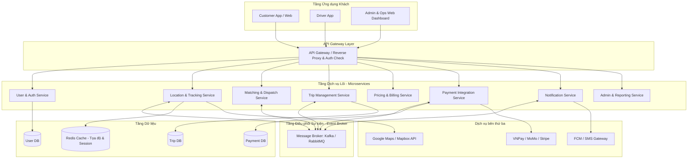

---

## 8.2. Sơ đồ Tuần tự Luồng Đặt xe & Điều phối Tài xế (Sequence Diagram)

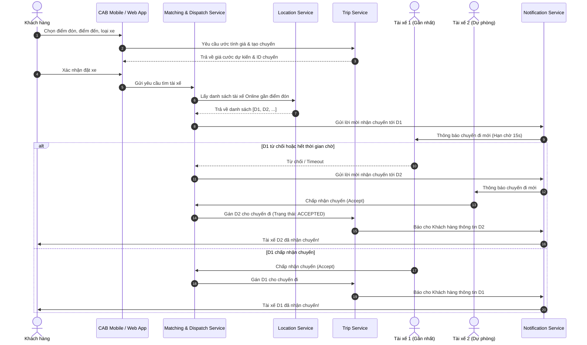

---

## 8.3. Sơ đồ Trạng thái Vòng đời Chuyến đi (Trip State Machine Diagram)

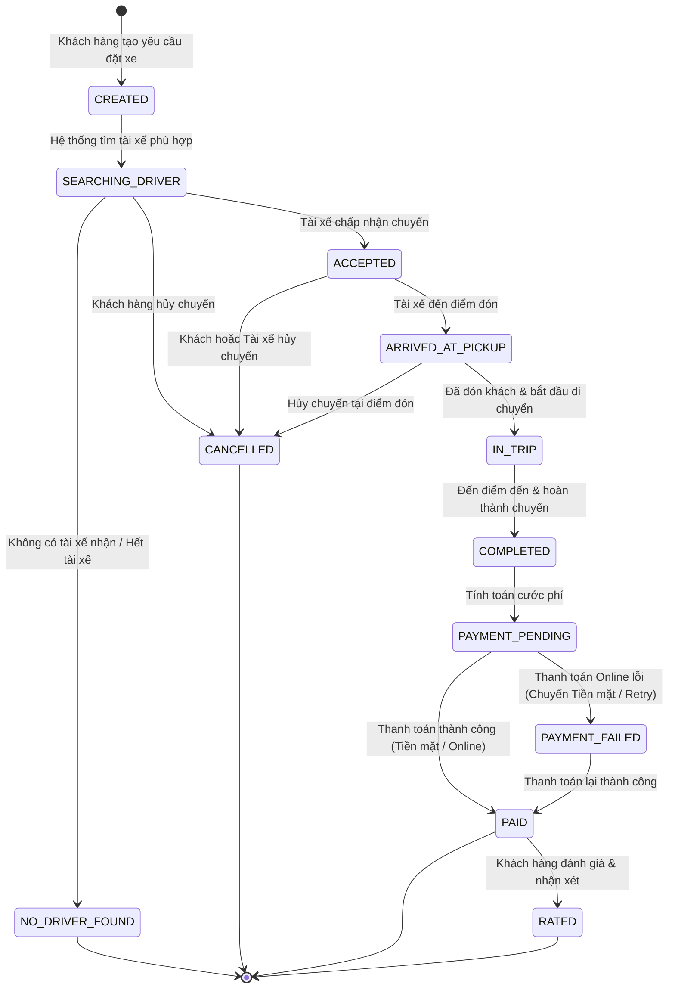

---

---

## 8.4. Mô hình Kiến trúc Hướng sự kiện Hermes (Hermes Event-Driven SOA Architecture)

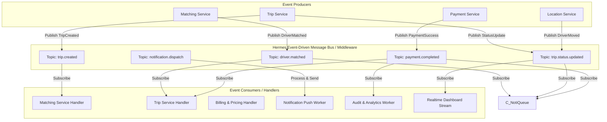

---


---

## 8.5. Sơ đồ Điều phối Giao dịch Phân tán Hermes Saga (Hermes Saga Orchestration)

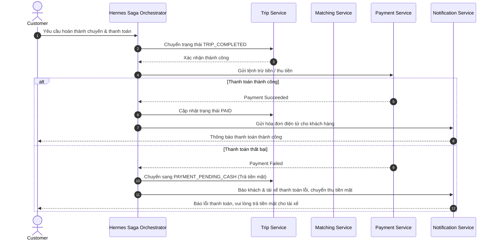

---


---

# CHƯƠNG 9: YÊU CẦU PHI CHỨC NĂNG (NON-FUNCTIONAL REQUIREMENTS - NFR)

## 9.1. Hiệu năng & Độ trễ (Performance & Latency)
* **NFR-PERF-01:** Thời gian phản hồi API Gateway đối với 95% các yêu cầu truy vấn thông thường phải $< 300\text{ms}$.
* **NFR-PERF-02:** Thuật toán tìm kiếm, xếp hạng và gửi lời mời đến tài xế hoàn tất trong vòng $< 1.5\text{s}$ kể từ lúc khách bấm xác nhận.
* **NFR-PERF-03:** Tần suất gửi tọa độ GPS từ ứng dụng tài xế là $2\text{s/lần}$; độ trễ truyền phát Live Tracking qua WebSocket đến khách hàng $< 1\text{s}$.

## 9.2. Khả năng Mở rộng & Tải trọng (Scalability & Concurrency)
* **NFR-SCAL-01:** Hệ thống hỗ trợ tối thiểu $20.000$ người dùng đồng thời (Concurrent Users - CCU) và $2.000$ chuyến đi diễn ra cùng một thời điểm.
* **NFR-SCAL-02:** Kiến trúc Microservices cho phép mở rộng độc lập từng phân hệ (Horizontal Pod Autoscaling - HPA) khi tải tăng đột biến vào giờ cao điểm.

## 9.3. Tính Sẵn sàng & Chịu lỗi (Availability & Fault Tolerance)
* **NFR-AVAIL-01:** Cam kết thời gian hoạt động hệ thống đạt mức $\ge 99.9\%$ (SLA).
* **NFR-AVAIL-02 (Fault Isolation):** Lỗi xảy ra ở phân hệ thanh toán điện tử hoặc dịch vụ thông báo Push tuyệt đối **không làm gián đoạn** luồng nghiệp vụ đặt xe và di chuyển cốt lõi.
* **NFR-AVAIL-03:** Hệ thống hàng đợi tin nhắn (Hermes Event Bus / Kafka) đảm bảo cơ chế phân phát tin cậy At-Least-Once Delivery.

## 9.4. Bảo mật & An toàn Thông tin (Security & Privacy)
* **NFR-SEC-01:** Xác thực người dùng bằng cơ chế Token JWT (HMAC-SHA256); mật khẩu người dùng được băm an toàn bằng thuật toán BCrypt với Salt Rounds $\ge 10$.
* **NFR-SEC-02:** Toàn bộ dữ liệu truyền tải trên mạng giữa Client, API Gateway và các Microservices bắt buộc mã hóa qua giao thức HTTPS / TLS 1.3.
* **NFR-SEC-03:** Tuân thủ tiêu chuẩn an toàn thanh toán (PCI-DSS): Chỉ giao tiếp với cổng thanh toán qua Token hóa (Tokenization), không lưu trữ thông tin thẻ nhạy cảm.

## 9.5. Khả năng Bảo trì & Mở rộng Tương lai (Maintainability & Extensibility)
* **NFR-MAINT-01:** Cung cấp tài liệu đặc tả API chuẩn OpenAPI 3.0 / Swagger UI cho tất cả các dịch vụ.
* **NFR-MAINT-02:** Cho phép tích hợp thêm các phương thức thanh toán mới, nhà cung cấp bản đồ mới hoặc phương tiện mới (giao hàng, xe điện) thông qua mô hình Adapter Pattern mà không cần sửa đổi mã nguồn lõi.

---

---

# CHƯƠNG 10: KẾ HOẠCH TRIỂN KHAI DỰ ÁN THEO PHƯƠNG PHÁP HERMES (7 TUẦN)

## 10.1. Phân kỳ Giai đoạn & Cột mốc Quyết định (B1 – B4)
1. **Giai đoạn 1: Khởi tạo (Initiation - Tuần 1):** Khảo sát yêu cầu, phân tích nghiệp vụ, lập tài liệu SRS. ➔ **Cột mốc B1:** Phê duyệt Khởi tạo.
2. **Giai đoạn 2: Khái niệm & Thiết kế (Concept - Tuần 2):** Thiết kế kiến trúc SOA, CSDL ERD, API Gateway & UI Wireframe. ➔ **Cột mốc B2:** Phê duyệt Thiết kế Kiến trúc.
3. **Giai đoạn 3: Thực thi (Implementation - Tuần 3 - 5):** Lập trình các microservices, tích hợp Kafka/RabbitMQ, Web/Mobile App & Test tải. ➔ **Cột mốc B3:** Sẵn sàng Triển khai.
4. **Giai đoạn 4: Triển khai & Nghiệm thu (Deployment - Tuần 6 - 7):** Triển khai Cloud/Staging, UAT, hoàn thiện báo cáo và bảo vệ đồ án. ➔ **Cột mốc B4:** Nghiệm thu hoàn tất Đồ án.

---

## 10.2. Sơ đồ Tiến độ Thực hiện Đồ án (Gantt Chart)

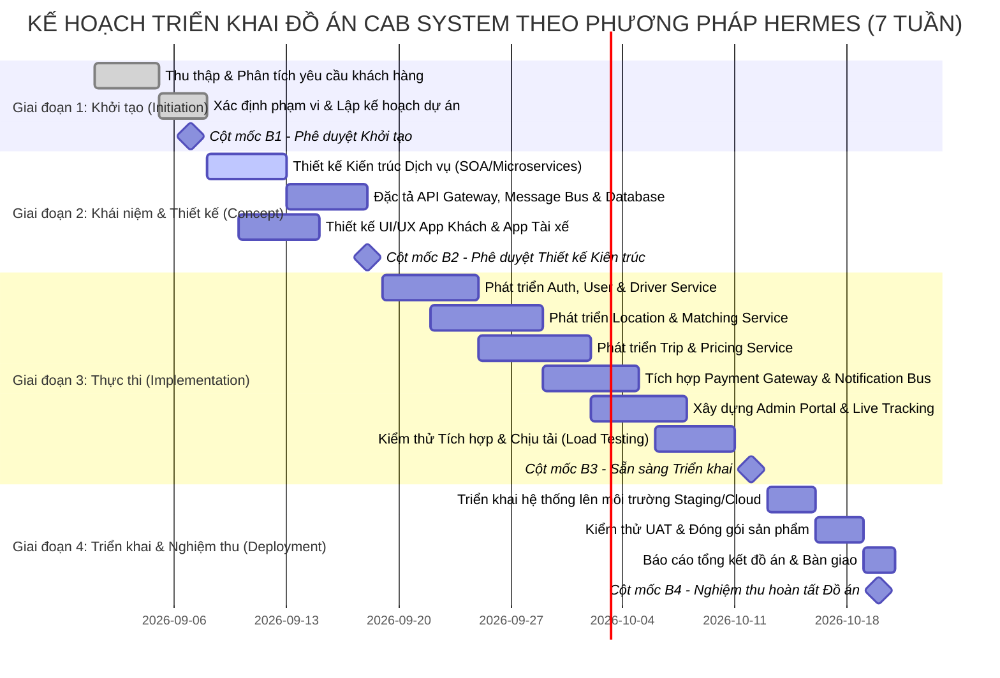

---

# CHƯƠNG 11: TIÊU CHÍ CHẤP NHẬN HOÀN TẤT YÊU CẦU (ACCEPTANCE CRITERIA - AC & DEFINITION OF DONE)

Tiêu chí chấp nhận (**Acceptance Criteria - AC**) là tập hợp các điều kiện và chỉ số kiểm chứng bắt buộc mà từng yêu cầu nghiệp vụ và dịch vụ kỹ thuật phải thỏa mãn để được xác nhận là **Đã hoàn tất** và sẵn sàng nghiệm thu bàn giao.

---

## 11.1. Ma trận Tiêu chí Chấp nhận cho 10 Yêu cầu Nghiệp vụ (AC-BR_01 – AC-BR_10)

| Mã AC | Yêu cầu Nghiệp vụ | Tiêu chí Kiểm chứng Khi nào Hoàn tất (Acceptance Criteria) | Phương pháp Đo lường & Kiểm thử |
| :---: | :--- | :--- | :--- |
| **`AC-BR_01`** | **Tự động hóa Điều phối & Ghép xe** | 1. Hệ thống tự động quét và tìm đúng tài xế `ONLINE` gần nhất trong bán kính $2\text{km} - 10\text{km}$ mà không cần can thiệp thủ công.<br>2. Phát thông báo mời cuốc đến app tài xế trong vòng $\le 2\text{s}$.<br>3. Đồng hồ đếm ngược 15 giây hoạt động chính xác; nếu tài xế từ chối hoặc hết 15s, cuốc xe tự động chuyển tiếp sang tài xế kế tiếp trong danh sách ưu tiên. | Automated E2E Test, Kịch bản Timeout Simulating |
| **`AC-BR_02`** | **Minh bạch Lộ trình & Live Tracking** | 1. Ứng dụng khách hiển thị chính xác lộ trình đề xuất, tên tài xế, biển số xe, loại xe và số điện thoại sau khi ghép xe thành công.<br>2. Tọa độ xe di chuyển hiển thị trực quan trên bản đồ số với độ trễ cập nhật $\le 1\text{s}$ so với tọa độ GPS phát từ app tài xế.<br>3. Thời gian dự kiến đón (ETA) tự động tính toán lại khi tài xế di chuyển. | WebSocket Live Stream Verification, Map UI Test |
| **`AC-BR_03`** | **Tập trung Tài chính & Thanh toán Số** | 1. Cước phí tạm tính và cước phí quyết toán thực tế được tính chính xác theo đúng công thức tại `BRULE_03` và `BRULE_04`.<br>2. Thanh toán điện tử sinh mã giao dịch duy nhất, không lưu trữ thông tin thẻ nhạy cảm (PCI-DSS).<br>3. Khi cổng thanh toán báo lỗi hoặc timeout $> 30\text{s}$, hệ thống kích hoạt bù trừ Saga chuyển sang thu tiền mặt thành công. | Payment Gateway Mock Testing, Chaos Fault Injection |
| **`AC-BR_04`** | **Giám sát Vận hành & Cảnh báo Tập trung** | 1. Cổng điều hành (Operations Dashboard) hiển thị toàn bộ xe đang hoạt động và vị trí thời gian thực trên bản đồ.<br>2. Tự động cảnh báo chuyến đi bất thường (dừng quá 15 phút, lệch lộ trình).<br>3. Cho phép Operator can thiệp gán lại tài xế hoặc hủy chuyến khẩn cấp, lưu vết 100% vào `AUDIT_LOGS`. | Admin UI Integration Test, Security Audit Verification |
| **`AC-BR_05`** | **Quản lý Định danh & Phân quyền RBAC** | 1. Người dùng đăng ký/đăng nhập nhận Token JWT hợp lệ chứa đúng vai trò (`CUSTOMER`, `DRIVER`, `OPERATOR`, `ADMIN`).<br>2. Mọi yêu cầu gọi API vượt quyền bị chặn với mã trạng thái `HTTP 403 Forbidden`.<br>3. Tài xế chưa được duyệt hồ sơ không thể bật trạng thái `ONLINE`. | RBAC Security Penetration Test, JWT Token Validation |
| **`AC-BR_06`** | **Quản lý Chất lượng qua Đánh giá** | 1. Khách hàng chấm điểm 1-5 sao và gắn nhãn phản hồi sau khi chuyến đi chuyển trạng thái `PAID`.<br>2. Điểm sao trung bình của tài xế được tính toán và cập nhật lại ngay lập tức.<br>3. Cảnh báo tự động kích hoạt nếu điểm sao tài xế giảm dưới chuẩn $< 4.0$. | Rating Computation Unit Test, Database Trigger Test |
| **`AC-BR_07`** | **Hệ thống Thông báo Đa kênh Tức thời** | 1. Thông báo đẩy (Push Notification qua FCM/SSE) được gửi tới thiết bị trong vòng $\le 2\text{s}$ kể từ khi phát sinh sự kiện.<br>2. Đảm bảo 100% các sự kiện cốt lõi (Có tài xế nhận, Tài xế đến nơi, Khách hủy chuyến, Thanh toán thành công) đều kích hoạt thông báo. | Push Notification Latency Test, Event Bus Listener Test |
| **`AC-BR_08`** | **Sẵn sàng Cao & Cô lập Lỗi (Fault Isolation)** | 1. Đạt chỉ số SLA $\ge 99.9\%$ trong môi trường kiểm thử tải.<br>2. Khi Payment Service hoặc Notification Service bị ngắt kết nối (Crash/Down), luồng Đặt xe, Ghép xe và Di chuyển vẫn hoạt động bình thường (Graceful Degradation). | Chaos Engineering Test (Killing dependent containers) |
| **`AC-BR_09`** | **Kiến trúc Linh hoạt, Dễ Mở rộng** | 1. Toàn bộ 8 dịch vụ nghiệp vụ được đóng gói thành các Docker Container độc lập, sở hữu Database riêng biệt (Database-per-Service).<br>2. Cung cấp tài liệu OpenAPI 3.0 / Swagger UI đầy đủ cho tất cả các Endpoints API. | Container Deployment Test, Swagger Schema Validation |
| **`AC-BR_10`** | **Bảo mật Dữ liệu & Nhật ký Kiểm toán** | 1. 100% mật khẩu được băm an toàn bằng BCrypt (Cost factor $\ge 12$).<br>2. Bảng `AUDIT_LOGS` lưu trữ bất biến các thông tin: `Timestamp`, `UserID`, `Action`, `TargetID`, `IP_Address`, `Reason`.<br>3. Toàn bộ kết nối HTTP/WebSocket chạy qua giao thức TLS 1.3 (HTTPS / WSS). | SSL Labs Security Scan, Database Immutability Test |

---

## 11.2. Ma trận Tiêu chí Chấp nhận Chi tiết cho 25 Chức năng Dịch vụ (AC-SR_01 – AC-SR_25)

| Mã AC | Chức năng Dịch vụ (SR) | Tiêu chí Chấp nhận Hoàn tất Kỹ thuật (Acceptance Criteria) | Mã BR | Microservice Phụ trách |
| :---: | :--- | :--- | :---: | :--- |
| **`AC-SR_01`** | **Đăng ký Tài khoản & Hồ sơ** | Xác thực số điện thoại bằng OTP SMS thành công trong vòng 60 giây; hồ sơ tài xế bắt buộc upload đủ ảnh CCCD và bằng lái mới được lưu ở trạng thái `PENDING_APPROVAL`. | `BR_05` | User & Auth Service |
| **`AC-SR_02`** | **Xác thực & Cấp quyền JWT** | Đăng nhập trả về JWT Access Token (hạn 15 phút) và Refresh Token (hạn 7 ngày); API Gateway xác thực chữ ký RS256/HS256 và chặn các request không có token. | `BR_05`, `BR_10` | User & Auth Service |
| **`AC-SR_03`** | **Quản lý Hồ sơ & Phương tiện** | Lưu đúng phân loại xe (`BIKE`, `CAR_4`, `CAR_7`) và biển số; Admin có chức năng bấm duyệt (`is_approved = true`) hoặc từ chối hồ sơ xe. | `BR_05` | User & Auth Service |
| **`AC-SR_04`** | **Bật/Tắt Trạng thái Làm việc** | Chỉ tài xế đã được Admin duyệt và không bị khóa mới bật được `ONLINE`; chuyển `ONLINE` tự động đưa tài xế vào Geo-Redis Pool; chuyển `OFFLINE` tự động xóa khỏi Pool. | `BR_01` | Location Service |
| **`AC-SR_05`** | **Thu thập & Phát sóng GPS** | Ứng dụng tài xế gửi tọa độ định kỳ 5s/lần; server lưu đệm Geo-Redis với TTL = 10s; dữ liệu GPS có độ chính xác sai số $\le 10\text{m}$. | `BR_02` | Location Service |
| **`AC-SR_06`** | **Tìm Tài xế theo Bán kính** | Lệnh `GEOSEARCH` trong Redis quét chính xác các tài xế `ONLINE` theo bán kính mở rộng từ 2km đến 10km trong thời gian $\le 200\text{ms}$. | `BR_01` | Location Service |
| **`AC-SR_07`** | **Ước tính Giá cước & ETA** | Tính đúng cước phí theo biểu phí mở cửa + km tiếp theo + hệ số cao điểm $\times 1.2$; trả về ETA đón xe theo khoảng cách đường bộ thực tế. | `BR_03` | Pricing & Fare Engine |
| **`AC-SR_08`** | **Khởi tạo Yêu cầu Đặt chuyến** | Sinh mã UUID duy nhất `TripID`, lưu bản ghi chuyến đi với trạng thái `CREATED` và phát sự kiện `trip.created` lên Message Bus. | `BR_01` | Trip Management Svc |
| **`AC-SR_09`** | **Ghép xe Tối ưu & Xếp hạng** | Tính đúng điểm ưu tiên $\text{PriorityScore}$; sắp xếp danh sách tài xế giảm dần theo điểm và chọn tài xế điểm cao nhất để mời cuốc. | `BR_01` | Matching & Dispatch Svc |
| **`AC-SR_10`** | **Xử lý Mời cuốc & Chuyển tiếp** | Bộ đếm 15s đếm ngược chính xác; tài xế bấm nhận ➔ chuyến sang `ACCEPTED`; tài xế bấm từ chối hoặc hết 15s ➔ tự động chuyển cuốc cho tài xế kế tiếp. | `BR_01` | Matching & Dispatch Svc |
| **`AC-SR_11`** | **Hủy chuyến & Tính phí Phạt** | Hủy $\le 2$ phút không tính phí; hủy sau 2 phút (tài xế đã di chuyển) tự động ghi nhận phí phạt 15.000 VNĐ vào hóa đơn cuốc kế tiếp của khách. | `BR_01` | Trip Management Svc |
| **`AC-SR_12`** | **Cập nhật Tiến trình Chuyến đi**| Chuyển đúng tuần tự máy trạng thái: `ACCEPTED` ➔ `ARRIVED_AT_PICKUP` ➔ `IN_TRIP` ➔ `COMPLETED`; không cho phép nhảy cóc trạng thái. | `BR_02` | Trip Management Svc |
| **`AC-SR_13`** | **Live Tracking & Đồng bộ Vị trí**| Stream tọa độ tài xế thời gian thực qua WebSocket Topic `/topic/trip/{tripId}` đến khách hàng với độ trễ $\le 1\text{s}$. | `BR_02` | Trip & Location Svc |
| **`AC-SR_14`** | **Tra cứu Lịch sử Chuyến đi** | Phân trang danh sách chuyến đi chính xác theo `userId`; hiển thị đầy đủ lộ trình, thời gian, tài xế và xuất biên lai PDF/Email. | `BR_02` | Trip Management Svc |
| **`AC-SR_15`** | **Quyết toán Cước phí Thực tế** | Chốt cước phí thực tế dựa trên quãng đường GPS đã di chuyển và phụ phí thời gian chờ (nếu có); phát sự kiện `trip.completed`. | `BR_03` | Pricing & Billing Svc |
| **`AC-SR_16`** | **Xử lý Thanh toán Tiền mặt** | Tài xế bấm xác nhận "Đã thu đủ tiền mặt" ➔ Chuyến đi cập nhật trạng thái `PAID` và phát sự kiện `payment.completed`. | `BR_03` | Payment Integration Svc |
| **`AC-SR_17`** | **Thanh toán Cổng Điện tử** | Giao tiếp API an toàn với cổng thanh toán (VNPay/MoMo); nhận Webhook IPN, xác thực chữ ký HMAC-SHA256 và cập nhật trạng thái `PAID`. | `BR_03` | Payment Integration Svc |
| **`AC-SR_18`** | **Điều phối Bù trừ khi Cổng Lỗi**| Khi cổng thanh toán timeout $> 30\text{s}$ hoặc lỗi kết nối, Saga Orchestrator tự động hủy trừ thẻ, đổi sang tiền mặt và báo tài xế thu tiền mặt. | `BR_08` | Hermes Saga Orchestrator |
| **`AC-SR_19`** | **Tiếp nhận Đánh giá & Góp ý** | Lưu điểm số 1-5 sao, nhận xét văn bản và nhãn phản hồi vào bảng `RATINGS`; khóa đánh giá sau 24h kể từ khi hoàn tất chuyến. | `BR_06` | Rating & Review Svc |
| **`AC-SR_20`** | **Tổng hợp Điểm Uy tín Tài xế** | Điểm trung bình của tài xế được tính toán lại ngay sau mỗi đánh giá mới: $\text{Rating}_{\text{new}} = \frac{\sum \text{Stars}}{N}$; tự động cảnh báo nếu điểm $< 4.0$. | `BR_06` | Rating & Review Svc |
| **`AC-SR_21`** | **Phát Thông báo Khách hàng** | Gửi thông báo Push Notification qua FCM tới khách trong vòng $\le 2\text{s}$ khi có sự kiện (tài xế nhận, xe đến, hoàn tất chuyến). | `BR_07` | Notification Service |
| **`AC-SR_22`** | **Phát Thông báo Tài xế** | Bắn âm thanh chuông báo và giao diện nhận cuốc nổi toàn màn hình trên app tài xế khi có lời mời cuốc xe mới. | `BR_07` | Notification Service |
| **`AC-SR_23`** | **Giám sát Bản đồ Vận hành** | Giao diện Web Socket hiển thị toàn bộ xe đang `ONLINE` và `BUSY` trên bản đồ số, cập nhật vị trí thời gian thực. | `BR_04` | Admin & Operations Svc |
| **`AC-SR_24`** | **Xử lý Sự cố & Can thiệp Cuốc**| Operator có quyền bấm nút hủy cuốc khẩn cấp hoặc gán đè tài xế thay thế khi xe bị hỏng giữa đường; yêu cầu nhập lý do can thiệp. | `BR_04` | Admin & Operations Svc |
| **`AC-SR_25`** | **Kiểm toán & Báo cáo Thống kê**| Bảng `AUDIT_LOGS` ghi nhận 100% các hành động can thiệp; Dashboard thống kê vẽ đúng biểu đồ doanh thu theo ngày/tuần/tháng. | `BR_10` | Admin & Operations Svc |

---

## 11.3. Kịch bản Kiểm thử Chấp nhận BDD / Gherkin cho các Luồng Cốt lõi

### 🎯 Kịch bản 1: Đặt chuyến & Ghép xe Thành công cho Tài xế Gần nhất (Happy Path)
```gherkin
Feature: Đặt xe và Điều phối Ghép chuyến Tự động
  Scenario: Khách hàng đặt xe thành công và tài xế gần nhất chấp nhận cuốc
    Given Khách hàng đã đăng nhập và đang ở màn hình đặt xe
      And Có tài xế A (loại xe 4 chỗ, Rating 4.9, cách điểm đón 1.2 km) đang ONLINE
      And Có tài xế B (loại xe 4 chỗ, Rating 4.8, cách điểm đón 2.5 km) đang ONLINE
    When Khách hàng chọn điểm đón, điểm đến và bấm "Xác nhận đặt xe 4 chỗ"
    Then Hệ thống tạo chuyến đi với trạng thái "CREATED"
      And Hệ thống tính điểm ưu tiên và gửi lời mời cuốc xe đến Tài xế A trước
      And Ứng dụng Tài xế A hiển thị màn hình nhận chuyến với đồng hồ đếm ngược 15 giây
    When Tài xế A bấm "Chấp nhận" trong vòng 8 giây
    Then Chuyến đi chuyển trạng thái sang "ACCEPTED"
      And Tài xế A chuyển trạng thái làm việc sang "BUSY"
      And Khách hàng nhận được thông báo kèm biển số xe, tên tài xế và vị trí xe của Tài xế A
```

---

### 🎯 Kịch bản 2: Tài xế Thứ nhất Timeout ➔ Tự động Chuyển tiếp sang Tài xế Thứ hai
```gherkin
Feature: Chuyển tiếp Cuốc xe Tự động khi Timeout
  Scenario: Tài xế thứ nhất không phản hồi trong 15 giây
    Given Khách hàng đã gửi yêu cầu đặt xe
      And Hệ thống đã gửi lời mời nhận cuốc đến Tài xế A (Ưu tiên 1)
      And Có Tài xế B (Ưu tiên 2) đang ở trạng thái ONLINE gần điểm đón
    When Tài xế A không bấm chấp nhận và đồng hồ đếm ngược vượt quá 15 giây
    Then Hệ thống ghi nhận lượt mời của Tài xế A là "TIMEOUT"
      And Hệ thống tự động chuyển tiếp lời mời cuốc xe sang Tài xế B
      And Ứng dụng Khách hàng vẫn duy trì màn hình "Đang tìm tài xế gần bạn..." mà không bị hủy
```

---

### 🎯 Kịch bản 3: Quyết toán Thanh toán Điện tử Bị lỗi ➔ Kích hoạt Bù trừ Saga Thu Tiền mặt
```gherkin
Feature: Điều phối Giao dịch Phân tán Hermes Saga
  Scenario: Cổng thanh toán trực tuyến bị Timeout hoặc lỗi kết nối
    Given Chuyến đi đang ở trạng thái "IN_TRIP" với phương thức thanh toán "DIGITAL_WALLET"
    When Tài xế bấm nút "Hoàn thành chuyến đi"
      And Hệ thống gửi yêu cầu trừ tiền sang Cổng thanh toán bên thứ ba
      And Cổng thanh toán phản hồi lỗi HTTP 504 Gateway Timeout sau 30 giây
    Then Hermes Saga Orchestrator kích hoạt Giao dịch bù trừ (Compensating Transaction)
      And Trạng thái thanh toán của chuyến đi chuyển sang "PAYMENT_PENDING_CASH"
      And Ứng dụng Tài xế nhận thông báo: "Cổng thanh toán lỗi. Vui lòng thu tiền mặt trực tiếp từ khách!"
      And Ứng dụng Khách hàng hiển thị số tiền mặt cần thanh toán cho tài xế
```

---

### 🎯 Kịch bản 4: Khách hàng Hủy chuyến sau 2 phút ➔ Áp dụng Phí phạt Hủy
```gherkin
Feature: Xử lý Hủy chuyến và Phạt hủy
  Scenario: Khách hàng hủy chuyến sau khi tài xế đã di chuyển quá 2 phút
    Given Chuyến đi đã được ghép với Tài xế A ở trạng thái "ACCEPTED"
      And Thời gian kể từ lúc ghép xe thành công đã trôi qua 3 phút 30 giây
    When Khách hàng bấm nút "Hủy chuyến đi" và xác nhận lý do
    Then Hệ thống cập nhật trạng thái chuyến đi thành "CANCELLED"
      And Hệ thống áp dụng phí phạt hủy chuyến 15.000 VNĐ vào tài khoản của Khách hàng
      And Tài xế A nhận được thông báo cuốc bị hủy và được chuyển trạng thái về "ONLINE"
```

---

## 11.3. Tiêu chuẩn Hoàn tất Kỹ thuật (Definition of Done - DoD)

Một chức năng dịch vụ hoặc User Story chỉ được xem là **HOÀN THÀNH (DONE)** khi đáp ứng đầy đủ **5 tiêu chí kỹ thuật** sau:
1. **Code Quality & Architecture:** Mã nguồn viết theo cấu trúc phân tầng rõ ràng (Clean Architecture), không có cảnh báo nghiêm trọng từ Linter, tuân thủ SOLID principles.
2. **Automated Testing:** Viết Unit Test và Integration Test đầy đủ; Code Coverage đạt tối thiểu $\ge 70\%$; 100% các Test Cases đều vượt qua (Pass).
3. **API Documentation:** Cập nhật đầy đủ tài liệu API trên Swagger UI / OpenAPI 3.0 với đầy đủ Request Body, Response Code (200, 400, 401, 403, 500) và Schema dữ liệu.
4. **Containerization & Deployment:** Dịch vụ được đóng gói thành Docker Image hợp lệ, khởi chạy thành công qua `docker-compose up` và cấu hình độc lập qua file `.env`.
5. **Peer Review & Version Control:** Code được review thông qua Pull Request trên GitHub, không có xung đột mã nguồn (Merge Conflict) và đã được merge vào nhánh chính.

---

## 11.4. Tiêu chí Nghiệm thu theo 4 Cột mốc Quyết định HERMES (B1 – B4)

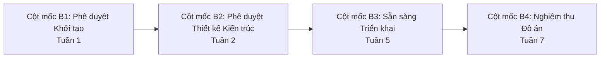

- **Cột mốc B1 (Phê duyệt Khởi tạo - Tuần 1):**
  - [x] Hoàn tất khảo sát yêu cầu khách hàng và xác định 10 Yêu cầu Nghiệp vụ (`BR_01` – `BR_10`).
  - [x] Tài liệu SRS được phê duyệt và lưu trữ trên GitHub.
  - [x] Phạm vi dự án (MoSCoW) và kế hoạch 7 tuần được thống nhất.
- **Cột mốc B2 (Phê duyệt Thiết kế Kiến trúc - Tuần 2):**
  - [x] Hoàn thành thiết kế Kiến trúc Hướng Dịch Vụ SOA và Message Bus.
  - [x] Hoàn thành sơ đồ Thực thể Kết hợp (ERD) và từ điển dữ liệu (Data Dictionary).
  - [x] Đặc tả danh mục 25 Chức năng Dịch vụ (`SR_01` – `SR_25`) và thiết kế Wireframe UI.
- **Cột mốc B3 (Sẵn sàng Triển khai - Tuần 5):**
  - [ ] Hoàn thành lập trình 8 microservices độc lập và tích hợp API Gateway.
  - [ ] Tích hợp thành công Message Broker (Kafka/RabbitMQ) và cơ chế bù trừ Saga.
  - [ ] Hoàn thành giao diện Customer App, Driver App và Operations Web Portal.
  - [ ] Vượt qua các bài kiểm tra tải (Load Testing) và kiểm tra bảo mật cơ bản.
- **Cột mốc B4 (Nghiệm thu Đồ án - Tuần 7):**
  - [ ] Triển khai hệ thống thành công lên môi trường Cloud/Staging.
  - [ ] Vượt qua 100% các kịch bản kiểm thử chấp nhận người dùng (UAT).
  - [ ] Hoàn tất báo cáo tổng kết đồ án, video demo vận hành và bảo vệ trước Hội đồng.

---

## 11.6. Bảng Truy vết Hợp nhất Toàn diện (End-to-End Master Traceability Matrix: BG ➔ BR ➔ BPMN ➔ SR ➔ UC ➔ AC)

> Ma trận truy vết xuyên suốt liên kết toàn bộ 6 tầng kiến trúc yêu cầu hệ thống:  
> **`BG (Business Goal) ➔ BR (Business Requirement) ➔ BPMN (Business Process) ➔ SR (Service Requirement) ➔ UC (Use Case) ➔ AC (Acceptance Criteria)`**

### 11.6.1. Bảng Truy vết Chi tiết theo 25 Chức năng Dịch vụ (Master SR Traceability Table)

| **BG (Mục tiêu Doanh nghiệp)** | **BR (Yêu cầu Nghiệp vụ)** | **BPMN (Quy trình Nghiệp vụ)** | **SR (Chức năng Dịch vụ)** | **UC (Ca Sử dụng)** | **AC (Tiêu chí Nghiệm thu)** |
|:---:|:---:|:---|:---|:---:|:---|
| `BG_05` | `BR_05` | `BPMN-07`: Đăng ký, Xác thực & Cấp quyền | `SR_01`: Đăng ký Tài khoản & Hồ sơ | `UC-12` | `AC-SR_01`, `AC-BR_05` |
| `BG_05` | `BR_05`, `BR_10` | `BPMN-07`: Xác thực JWT & Phân quyền RBAC | `SR_02`: Xác thực & Cấp quyền JWT | `UC-01`, `UC-06` | `AC-SR_02`, `AC-BR_05`, `AC-BR_10` |
| `BG_04`, `BG_05` | `BR_04`, `BR_05` | `BPMN-08`: Kiểm duyệt Phương tiện Đối tác | `SR_03`: Quản lý Hồ sơ & Phương tiện | `UC-12` | `AC-SR_03`, `AC-BR_04` |
| `BG_01` | `BR_01` | `BPMN-02`: Trạng thái Sẵn sàng Điều phối | `SR_04`: Chuyển đổi Trạng thái Hoạt động | `UC-06` | `AC-SR_04`, `AC-BR_01` |
| `BG_01`, `BG_02` | `BR_01`, `BR_02` | `BPMN-03`: Phát sóng GPS & Live Tracking | `SR_05`: Thu thập & Phát sóng GPS | `UC-02`, `UC-08` | `AC-SR_05`, `AC-BR_02` |
| `BG_01` | `BR_01` | `BPMN-02`: Quét Bán kính Tài xế 2km–10km | `SR_06`: Tìm Tài xế theo Bán kính | `UC-01` | `AC-SR_06`, `AC-BR_01` |
| `BG_02`, `BG_03` | `BR_02`, `BR_03` | `BPMN-01`: Ước tính Cước tạm tính & ETA | `SR_07`: Ước tính Giá cước & ETA | `UC-01` | `AC-SR_07`, `AC-BR_03` |
| `BG_01` | `BR_01` | `BPMN-01`: Khởi tạo Yêu cầu Đặt xe Mới | `SR_08`: Khởi tạo Yêu cầu Đặt chuyến | `UC-01` | `AC-SR_08`, `AC-BR_01` |
| `BG_01`, `BG_02` | `BR_01`, `BR_06` | `BPMN-02`: Điều phối theo PriorityScore | `SR_09`: Ghép xe Tối ưu & Mời cuốc | `UC-01`, `UC-07` | `AC-SR_09`, `AC-BR_01`, `AC-BR_06` |
| `BG_01` | `BR_01` | `BPMN-02`: Vòng lặp Đếm ngược 15s & Dispatch | `SR_10`: Xử lý Mời cuốc & Chuyển tiếp | `UC-07` | `AC-SR_10`, `AC-BR_01` |
| `BG_01`, `BG_04` | `BR_01`, `BR_04` | `BPMN-01`, `BPMN-06`: Hủy chuyến & Phạt hủy | `SR_11`: Hủy chuyến & Phạt hủy | `UC-03` | `AC-SR_11`, `AC-BR_01` |
| `BG_02` | `BR_02` | `BPMN-03`: Cập nhật Mốc Trạng thái Hành trình | `SR_12`: Cập nhật Tiến trình Chuyến | `UC-08` | `AC-SR_12`, `AC-BR_02` |
| `BG_02` | `BR_02` | `BPMN-03`: Stream WebSocket Vị trí Xe Realtime | `SR_13`: Live Tracking & Lộ trình | `UC-02` | `AC-SR_13`, `AC-BR_02` |
| `BG_02`, `BG_04` | `BR_02`, `BR_04` | `BPMN-03`: Tra cứu Lịch sử & Xuất Hóa đơn | `SR_14`: Tra cứu Lịch sử Chuyến đi | `UC-02`, `UC-10` | `AC-SR_14`, `AC-BR_02` |
| `BG_03` | `BR_03` | `BPMN-04`: Quyết toán Cước phí Thực tế Cuối | `SR_15`: Quyết toán Cước phí Thực tế | `UC-04` | `AC-SR_15`, `AC-BR_03` |
| `BG_03` | `BR_03` | `BPMN-04`: Thu Tiền mặt Trực tiếp | `SR_16`: Xử lý Thanh toán Tiền mặt | `UC-04`, `UC-09` | `AC-SR_16`, `AC-BR_03` |
| `BG_03`, `BG_05` | `BR_03`, `BR_10` | `BPMN-04`: Thanh toán Cổng Trực tuyến (VNPay/MoMo) | `SR_17`: Thanh toán Cổng Điện tử | `UC-04` | `AC-SR_17`, `AC-BR_03`, `AC-BR_10` |
| `BG_03`, `BG_05` | `BR_03`, `BR_08` | `BPMN-04`: Bù trừ Giao dịch Phân tán Hermes Saga | `SR_18`: Điều phối Bù trừ khi Lỗi Cổng | `UC-04` | `AC-SR_18`, `AC-BR_08` |
| `BG_02` | `BR_06` | `BPMN-05`: Thu nhận Đánh giá & Phản hồi 1-5 Sao | `SR_19`: Tiếp nhận Đánh giá & Góp ý | `UC-05` | `AC-SR_19`, `AC-BR_06` |
| `BG_01`, `BG_02` | `BR_01`, `BR_06` | `BPMN-05`: Cập nhật Điểm Đánh giá Tín nhiệm | `SR_20`: Tổng hợp Điểm Uy tín Tài xế | `UC-05`, `UC-12` | `AC-SR_20`, `AC-BR_06` |
| `BG_02` | `BR_02`, `BR_07` | `BPMN-03`, `BPMN-04`: Bắn Push Notification Khách | `SR_21`: Phát Thông báo cho Khách hàng | `UC-01`, `UC-02` | `AC-SR_21`, `AC-BR_07` |
| `BG_01` | `BR_01`, `BR_07` | `BPMN-02`: Phát Chuông & Alert App Tài xế | `SR_22`: Phát Thông báo cho Tài xế | `UC-07` | `AC-SR_22`, `AC-BR_07` |
| `BG_04` | `BR_04` | `BPMN-06`: Giám sát Đội xe trên Bản đồ Số | `SR_23`: Giám sát Bản đồ Vận hành | `UC-10` | `AC-SR_23`, `AC-BR_04` |
| `BG_04`, `BG_05` | `BR_04`, `BR_08` | `BPMN-06`: Điều xe Cứu hộ / Hủy Cuốc Khẩn cấp | `SR_24`: Xử lý Sự cố Chuyến đi | `UC-11` | `AC-SR_24`, `AC-BR_04`, `AC-BR_08` |
| `BG_04`, `BG_05` | `BR_04`, `BR_10` | `BPMN-08`: Ghi Audit Log & Dashboard Báo cáo | `SR_25`: Kiểm toán & Báo cáo Thống kê | `UC-13` | `AC-SR_25`, `AC-BR_10` |

### 11.6.2. Bảng Truy vết Tổng hợp theo 10 Yêu cầu Nghiệp vụ (Master BR Traceability Table)

| **BG (Mục tiêu)** | **BR (Yêu cầu Nghiệp vụ)** | **BPMN (Quy trình liên quan)** | **SR (Chức năng Dịch vụ)** | **UC (Ca Sử dụng)** | **AC (Tiêu chí Nghiệm thu)** |
|:---:|:---|:---|:---|:---|:---|
| `BG_01` | **BR_01: Tự động hóa Điều phối & Ghép xe** | `BPMN-01`, `BPMN-02` | `SR_04`, `SR_06`, `SR_08`, `SR_09`, `SR_10`, `SR_11`, `SR_22` | `UC-01`, `UC-03`, `UC-06`, `UC-07` | `AC-BR_01`, `AC-SR_04,06,08,09,10,11,22` |
| `BG_02` | **BR_02: Minh bạch Lộ trình & Live Tracking** | `BPMN-01`, `BPMN-03` | `SR_05`, `SR_07`, `SR_12`, `SR_13`, `SR_14`, `SR_21` | `UC-01`, `UC-02`, `UC-08` | `AC-BR_02`, `AC-SR_05,07,12,13,14,21` |
| `BG_03` | **BR_03: Quản lý Tài chính & Thanh toán Số** | `BPMN-01`, `BPMN-04` | `SR_07`, `SR_15`, `SR_16`, `SR_17`, `SR_18` | `UC-01`, `UC-04`, `UC-09` | `AC-BR_03`, `AC-SR_07,15,16,17,18` |
| `BG_04` | **BR_04: Giám sát Vận hành & Xử lý Sự cố** | `BPMN-06`, `BPMN-08` | `SR_03`, `SR_11`, `SR_14`, `SR_23`, `SR_24`, `SR_25` | `UC-10`, `UC-11`, `UC-12`, `UC-13` | `AC-BR_04`, `AC-SR_03,11,14,23,24,25` |
| `BG_05` | **BR_05: Quản lý Người dùng & Phân quyền RBAC** | `BPMN-07`, `BPMN-08` | `SR_01`, `SR_02`, `SR_03` | `UC-01`, `UC-06`, `UC-12` | `AC-BR_05`, `AC-SR_01,02,03` |
| `BG_02` | **BR_06: Quản lý Chất lượng qua Đánh giá** | `BPMN-02`, `BPMN-05` | `SR_09`, `SR_19`, `SR_20` | `UC-05`, `UC-07`, `UC-12` | `AC-BR_06`, `AC-SR_09,19,20` |
| `BG_01`, `BG_02` | **BR_07: Hệ thống Thông báo Đa kênh** | `BPMN-02`, `BPMN-03`, `BPMN-04` | `SR_21`, `SR_22` | `UC-01`, `UC-02`, `UC-07` | `AC-BR_07`, `AC-SR_21,22` |
| `BG_05` | **BR_08: Sẵn sàng Cao & Cô lập Lỗi (Saga)** | `BPMN-04`, `BPMN-06` | `SR_18`, `SR_24` | `UC-04`, `UC-11` | `AC-BR_08`, `AC-SR_18,24` |
| `BG_05` | **BR_09: Kiến trúc SOA Linh hoạt, Dễ Mở rộng** | Toàn bộ `BPMN-01`–`08` | `SR_01`–`SR_25` (Toàn bộ 25 dịch vụ) | `UC-01`–`UC-13` (Toàn bộ 13 Ca sử dụng) | `AC-BR_09`, Toàn bộ `AC-SR` |
| `BG_04`, `BG_05` | **BR_10: Bảo mật, Riêng tư & Nhật ký Kiểm toán** | `BPMN-07`, `BPMN-08` | `SR_02`, `SR_17`, `SR_25` | `UC-04`, `UC-13` | `AC-BR_10`, `AC-SR_02,17,25` |

### 11.6.3. Sơ đồ Chuỗi Phân rã & Truy vết Nghiệp vụ (Traceability Flow)

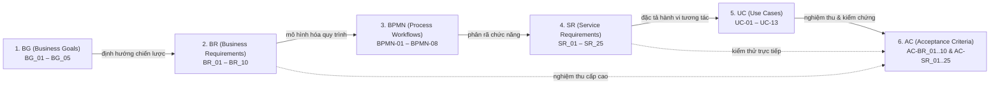

### 11.6.4. Bảng Tổng kết Mức độ Bao phủ Truy vết (Full Traceability Coverage)

| **Hạng mục (Entity)** | **Ký hiệu** | **Số lượng** | **Độ bao phủ Truy vết** | **Trạng thái** |
|:---|:---:|:---:|:---:|:---:|
| Mục tiêu Nghiệp vụ Doanh nghiệp | **BG** | 5 | 5 / 5 (100%) | ✅ Hoàn tất |
| Yêu cầu Nghiệp vụ Cốt lõi | **BR** | 10 | 10 / 10 (100%) | ✅ Hoàn tất |
| Quy trình Nghiệp vụ Chuẩn hóa | **BPMN** | 8 | 8 / 8 (100%) | ✅ Hoàn tất |
| Yêu cầu Chức năng Dịch vụ | **SR** | 25 | 25 / 25 (100%) | ✅ Hoàn tất |
| Ca Sử dụng Hệ thống | **UC** | 13 | 13 / 13 (100%) | ✅ Hoàn tất |
| Tiêu chí Chấp nhận Hoàn tất | **AC** | 35 (10 BR + 25 SR) | 35 / 35 (100%) | ✅ Hoàn tất |

> 🎯 **Kết luận:** Hệ thống đạt **100% độ bao phủ liên kết liền mạch** từ Mục tiêu chiến lược (BG) qua Yêu cầu nghiệp vụ (BR), Quy trình nghiệp vụ (BPMN), Chức năng dịch vụ (SR), Ca sử dụng (UC) cho đến Tiêu chí nghiệm thu hoàn tất (AC).

---

# CHƯƠNG 12: CÁC VẤN ĐỀ CẦN LÀM RÕ VỚI KHÁCH HÀNG (OPEN QUESTIONS)

1. **Công thức tính cước chi tiết:** Giá mở cửa, cước phí mỗi km tiếp theo, phụ phí thời gian chờ, hệ số nhân theo thời tiết và giờ cao điểm.
2. **Thuật toán điều phối:** Tiêu chí ưu tiên tài xế ngoài khoảng cách (Điểm đánh giá sao, tỷ lệ nhận chuyến, thời gian tài xế chờ cuốc).
3. **Thời gian chờ tài xế phản hồi:** Thời gian Timeout tối đa để tài xế bấm nhận chuyến trước khi chuyển cho tài xế khác (ví dụ: 15 giây).
4. **Chính sách hủy chuyến & Phí phạt:** Điều kiện hủy miễn phí và mức phí phạt nếu hủy sau khi tài xế đã di chuyển tới điểm đón.
5. **Cơ chế xử lý mất kết nối (Offline Handling):** Phương án xử lý lưu tạm và đồng bộ lại tọa độ khi tài xế/khách hàng bị rớt mạng giữa đường.
6. **Thời gian lưu trữ dữ liệu (Data Retention):** Quy định thời gian lưu trữ lịch sử GPS và nhật ký kiểm toán trước khi lưu trữ định kỳ (Archiving).

