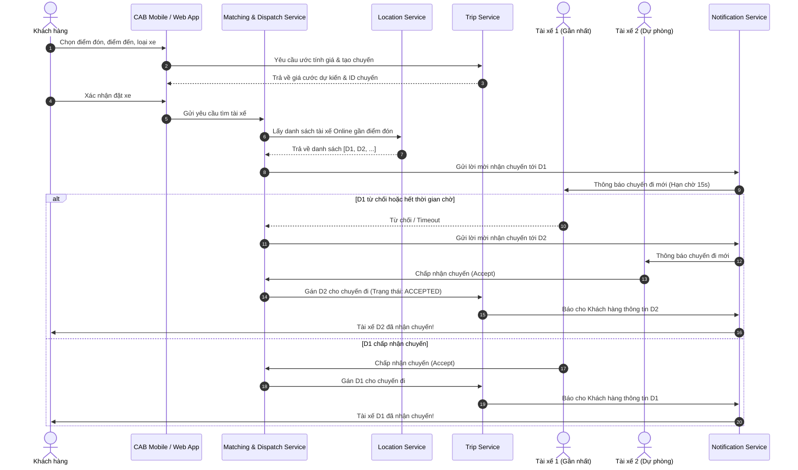
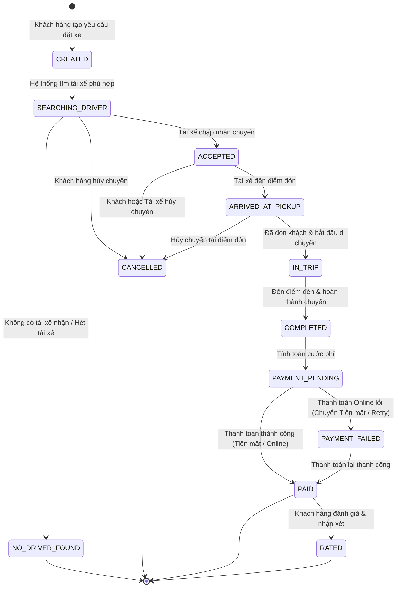
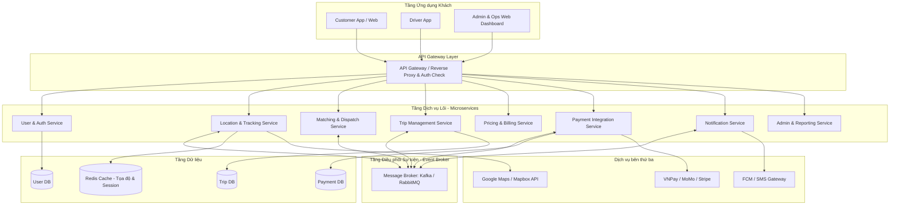
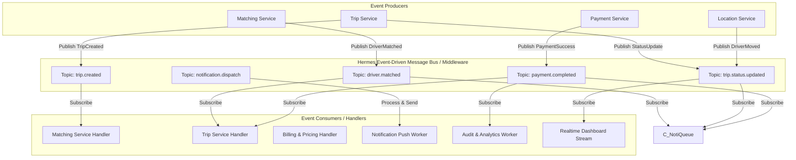
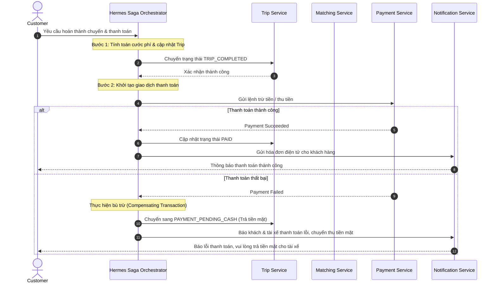

# BẢN ĐẶC TẢ YÊU CẦU PHẦN MỀM (SRS)
## HỆ THỐNG ĐẶT XE TRỰC TUYẾN - CAB SYSTEM

---

## 1. TỔNG QUAN DỰ ÁN (PROJECT OVERVIEW)

- **Tên dự án:** CAB System – Nền tảng đặt xe trực tuyến hướng dịch vụ (Service-Oriented Architecture).
- **Mục tiêu:** Xây dựng hệ thống đặt xe quy mô lớn, linh hoạt, giải quyết các hạn chế của hệ thống cũ (phân công thủ công, khó theo dõi chuyến, thanh toán phân tán, khó mở rộng).
- **Thời gian triển khai:** 7 tuần.
- **Đối tượng sử dụng chính:** Khách hàng (Customer), Tài xế (Driver), Nhân viên vận hành & Quản trị viên (Operator / Admin).

---

## 2. CÁC TÁC NHÂN TRONG HỆ THỐNG (ACTORS)

| Tác nhân (Actor) | Mô tả vai trò |
| :--- | :--- |
| **Khách hàng (Customer)** | Đăng ký, đăng nhập, tìm chuyến, xem cước phí, theo dõi tài xế thời gian thực, thanh toán và đánh giá chuyến đi. |
| **Tài xế (Driver)** | Bật/tắt trạng thái làm việc, gửi vị trí GPS, nhận/từ chối chuyến xe, cập nhật trạng thái đón và trả khách. |
| **Nhân viên vận hành (Operator)** | Giám sát các chuyến đi đang hoạt động, can thiệp xử lý sự cố, hỗ trợ điều phối và hỗ trợ khách hàng/tài xế. |
| **Quản trị viên (Admin)** | Quản lý người dùng, duyệt hồ sơ tài xế/phương tiện, phân quyền hệ thống, xem báo cáo doanh thu & hiệu suất. |
| **Hệ thống bên thứ ba (External Services)** | Cổng thanh toán (Payment Gateway), Dịch vụ bản đồ (Map API), Dịch vụ thông báo (Push/SMS Notification Provider). |

---

## 3. YÊU CẦU CHỨC NĂNG CHI TIẾT (FUNCTIONAL REQUIREMENTS)

### 3.1. Phân hệ Quản lý Tài khoản & Xác thực (Identity & User Management)
* **FR-AUTH-01 (Đăng ký tài khoản):** 
  * Khách hàng tự đăng ký tài khoản qua ứng dụng (Số điện thoại / Email / Mật khẩu).
  * Tài xế đăng ký hồ sơ hoặc được nhân viên vận hành tạo tài khoản trên hệ thống.
* **FR-AUTH-02 (Đăng nhập & Xác thực):** Xác thực an toàn đa vai trò (Customer, Driver, Operator, Admin) sử dụng cơ chế Token-based Authentication (JWT).
* **FR-AUTH-03 (Quản lý hồ sơ cá nhân):** Cho phép người dùng xem và cập nhật thông tin cá nhân (Họ tên, ảnh đại diện, số liên lạc).
* **FR-AUTH-04 (Quản lý hồ sơ tài xế & phương tiện):** Cho phép cập nhật và lưu trữ bằng lái xe, thông tin xe (biển số, hãng xe, màu xe) và phân loại xe (4 chỗ, 7 chỗ, xe máy,...).

---

### 3.2. Phân hệ Quản lý Trạng thái & Vị trí Tài xế (Driver & Location Management)
* **FR-DRV-01 (Cập nhật trạng thái làm việc):** Tài xế chuyển đổi trạng thái: *Sẵn sàng nhận chuyến (Online)*, *Đang bận (Busy)*, *Nghỉ làm (Offline)*.
* **FR-DRV-02 (Cập nhật vị trí GPS thời gian thực):** Định kỳ gửi và lưu trữ tọa độ của tài xế khi ở trạng thái Online.
* **FR-DRV-03 (Tìm kiếm tài xế lân cận):** Cung cấp khả năng tìm kiếm danh sách tài xế rảnh trong bán kính gần điểm đón của khách hàng.

---

### 3.3. Phân hệ Đặt xe & Điều phối Chuyến đi (Booking & Dispatching)
* **FR-BOOK-01 (Tạo yêu cầu đặt xe):** Khách hàng nhập điểm đón, điểm đến, lựa chọn loại dịch vụ/xe và gửi yêu cầu.
* **FR-BOOK-02 (Ước tính cước & thời gian di chuyển):** Tính toán và hiển thị giá cước dự kiến (Fare Estimate) và thời gian tài xế đến (ETA) trước khi xác nhận đặt xe.
* **FR-BOOK-03 (Tự động tìm kiếm & Đề xuất tài xế):** Thuật toán tự động tìm tài xế tối ưu nhất dựa trên vị trí gần nhất, trạng thái sẵn sàng và tiêu chí vận hành.
* **FR-BOOK-04 (Xử lý phản hồi từ tài xế):** Gửi thông báo cuốc xe tới tài xế; tài xế có thời gian quy định (Timeout) để *Chấp nhận (Accept)* hoặc *Từ chối (Reject)*.
* **FR-BOOK-05 (Tự động chuyển tiếp tìm tài xế khác):** Nếu tài xế từ chối hoặc hết giờ phản hồi, hệ thống tự động tìm và chuyển chuyến sang tài xế tiếp theo mà khách hàng không cần tạo lại yêu cầu.
* **FR-BOOK-06 (Xử lý không tìm thấy tài xế):** Thông báo rõ ràng cho khách hàng khi không có tài xế phù hợp sau thời gian tìm kiếm.
* **FR-BOOK-07 (Hủy chuyến đi):** Cho phép khách hàng hoặc tài xế hủy chuyến theo quy định và lý do hủy chuyến.

---

### 3.4. Phân hệ Quản lý Tiến trình Chuyến đi (Trip Execution & Tracking)
* **FR-TRIP-01 (Cập nhật trạng thái chuyến đi):** Tài xế cập nhật tuần tự các mốc trạng thái:
  * `Đã nhận chuyến (Accepted)`
  * `Đã đến điểm đón (Arrived at Pickup)`
  * `Đã đón khách / Đang di chuyển (In Trip / Started)`
  * `Hoàn thành chuyến (Completed)`
* **FR-TRIP-02 (Theo dõi chuyến đi trực tuyến - Live Tracking):** Khách hàng theo dõi vị trí di chuyển của tài xế trên bản đồ và thời gian dự kiến đến điểm đón/điểm đến.
* **FR-TRIP-03 (Lịch sử chuyến đi):** Cho phép khách hàng và tài xế tra cứu danh sách lịch sử các chuyến đã thực hiện (lộ trình, thời gian, chi phí, tài xế/khách hàng).

---

### 3.5. Phân hệ Tính cước & Thanh toán (Pricing & Payment)
* **FR-PAY-01 (Tính toán cước phí chính thức):** Tự động tính cước sau khi hoàn thành chuyến đi dựa trên loại dịch vụ, quãng đường thực tế, thời gian di chuyển và phụ phí phát sinh.
* **FR-PAY-02 (Thanh toán tiền mặt - Cash):** Cho phép khách hàng trả tiền mặt trực tiếp cho tài xế; tài xế bấm xác nhận đã thu tiền.
* **FR-PAY-03 (Thanh toán điện tử - Digital Payment):** Tích hợp cổng thanh toán bên thứ ba (Ví điện tử, Thẻ ngân hàng), tuân thủ nguyên tắc không lưu trữ thông tin nhạy cảm của thẻ trên CAB System.
* **FR-PAY-04 (Xử lý lỗi thanh toán):** Thông báo ngay khi giao dịch điện tử thất bại và hỗ trợ thanh toán lại (Retry) hoặc chuyển sang trả tiền mặt.

---

### 3.6. Phân hệ Đánh giá & Phản hồi (Rating & Review)
* **FR-REV-01 (Đánh giá sau chuyến đi):** Khách hàng đánh giá mức độ hài lòng (1 - 5 sao) và để lại phản hồi/nhận xét về tài xế sau khi hoàn thành chuyến.
* **FR-REV-02 (Tổng hợp điểm chất lượng):** Hệ thống tính toán điểm trung bình sao của tài xế để đánh giá mức độ uy tín.

---

### 3.7. Phân hệ Thông báo (Notification Service)
* **FR-NOTI-01 (Thông báo cho Khách hàng):** Gửi thông báo đẩy (Push notification / SMS) khi: Yêu cầu được tiếp nhận, Có tài xế nhận, Tài xế đến điểm đón, Bắt đầu chuyến, Hoàn thành và Kết quả thanh toán.
* **FR-NOTI-02 (Thông báo cho Tài xế):** Gửi thông báo khi: Có chuyến mới được phân phối, Khách hủy chuyến, Thay đổi lộ trình.
* **FR-NOTI-03 (Mở rộng đa kênh thông báo):** Thiết kế độc lập cho phép cắm thêm các nhà cung cấp thông báo khác (FCM, Twilio SMS, Email) mà không ảnh hưởng luồng nghiệp vụ.

---

### 3.8. Phân hệ Quản trị & Vận hành (Admin & Operations Portal)
* **FR-ADM-01 (Quản lý người dùng & phương tiện):** Xem danh sách, kích hoạt/khóa tài khoản khách hàng, tài xế và phê duyệt phương tiện.
* **FR-ADM-02 (Giám sát trực tiếp chuyến đi):** Theo dõi bản đồ trực quan các chuyến đi đang hoạt động và vị trí tài xế theo thời gian thực.
* **FR-ADM-03 (Xử lý sự cố chuyến đi):** Can thiệp xử lý các chuyến bị lỗi, hủy chuyến khẩn cấp, gán lại tài xế thủ công.
* **FR-ADM-04 (Đối soát giao dịch thanh toán):** Tra cứu, thống kê và đối soát lịch sử dòng tiền thanh toán.
* **FR-ADM-05 (Báo cáo & Thống kê Dashboard):** Báo cáo số lượng chuyến, doanh thu, tỷ lệ hoàn thành/hủy chuyến, năng suất tài xế theo chu kỳ thời gian.
* **FR-ADM-06 (Phân quyền & Nhật ký kiểm toán):** Phân quyền truy cập theo vai trò (RBAC) và ghi log kiểm toán (Audit Logs) cho các hành động nhạy cảm.

---

## 4. SƠ ĐỒ THIẾT KẾ MERMAID (MERMAID DIAGRAMS)

### 4.1. Sơ đồ Use Case Tổng thể (Use Case Diagram)

```mermaid
graph TD
    %% Actors
    Customer((Khách hàng))
    Driver((Tài xế))
    Operator((Nhân viên vận hành))
    Admin((Quản trị viên))
    PaymentGW[Cổng thanh toán]
    NotiService[Dịch vụ thông báo]

    %% Use cases Customer
    subgraph Customer_UC [Phân hệ Khách hàng]
        UC_RegCust[Đăng ký / Đăng nhập]
        UC_BookTrip[Đặt chuyến & Xem giá dự kiến]
        UC_TrackTrip[Theo dõi hành trình & Tài xế]
        UC_CancelTrip[Hủy chuyến]
        UC_Pay[Thanh toán Tiền mặt / Online]
        UC_Rate[Đánh giá tài xế]
    end

    %% Use cases Driver
    subgraph Driver_UC [Phân hệ Tài xế]
        UC_UpdateStatus[Bật / Tắt trạng thái Online]
        UC_UpdateLoc[Cập nhật vị trí GPS]
        UC_AcceptTrip[Nhận / Từ chối chuyến]
        UC_UpdateTripStatus[Cập nhật trạng thái chuyến]
        UC_ConfirmCash[Xác nhận thu tiền mặt]
    end

    %% Use cases Operations & Admin
    subgraph Admin_UC [Phân hệ Vận hành & Quản trị]
        UC_LiveMonitor[Giám sát chuyến đi trực tiếp]
        UC_ResolveIncident[Xử lý sự cố chuyến đi]
        UC_ManageUsers[Quản lý Người dùng & Phương tiện]
        UC_ViewReport[Xem Báo cáo Doanh thu & Vận hành]
    end

    %% Customer Connections
    Customer --> UC_RegCust
    Customer --> UC_BookTrip
    Customer --> UC_TrackTrip
    Customer --> UC_CancelTrip
    Customer --> UC_Pay
    Customer --> UC_Rate

    %% Driver Connections
    Driver --> UC_UpdateStatus
    Driver --> UC_UpdateLoc
    Driver --> UC_AcceptTrip
    Driver --> UC_UpdateTripStatus
    Driver --> UC_ConfirmCash

    %% Admin & Operator Connections
    Operator --> UC_LiveMonitor
    Operator --> UC_ResolveIncident
    Admin --> UC_ManageUsers
    Admin --> UC_ViewReport
    Admin --> UC_ResolveIncident

    %% External Connections
    UC_Pay -.-> PaymentGW
    UC_BookTrip -.-> NotiService
    UC_UpdateTripStatus -.-> NotiService
```

---

### 4.2. Sơ đồ Tuần tự Luồng Đặt xe & Điều phối Tài xế (Sequence Diagram)

---

### 4.3. Sơ đồ Trạng thái Vòng đời Chuyến đi (Trip State Machine Diagram)

---

### 4.4. Sơ đồ Kiến trúc Tổng quan Hệ thống Hướng Dịch Vụ (Service-Oriented Architecture - SOA)

## 5. MÔ HÌNH KIẾN TRÚC & QUY TRÌNH HERMES CHO ĐỒ ÁN (HERMES MODEL)

### 5.1. Mô hình Kiến trúc Hướng sự kiện Hermes (Hermes Event-Driven SOA Architecture)
Trong kiến trúc hướng dịch vụ hiện đại của CAB System, **Hermes Event-Driven Architecture** đóng vai trò là xương sống trung gian (Event Middleware / Service Bus) đảm bảo các dịch vụ hoạt động phi đồng bộ (asynchronous), chịu tải cao và tách biệt phụ thuộc (loose coupling):

---

### 5.2. Sơ đồ Điều phối Giao dịch Phân tán Hermes Saga (Hermes Saga Orchestration)
Xử lý giao dịch phân tán giữa Trip Service, Matching Service, Payment Service và Notification Service để tránh lỗi dữ liệu khi có dịch vụ bên thứ ba bị gián đoạn:

---

### 5.3. Mô hình Quản lý Vòng đời Đồ án theo Phương pháp luận HERMES (7 Tuần)
Áp dụng tiêu chuẩn quản lý dự án **HERMES Project Lifecycle** (4 giai đoạn - Milestones) để phát triển và triển khai hệ thống trong khung thời gian 7 tuần:

---

## 6. YÊU CẦU PHI CHỨC NĂNG (NON-FUNCTIONAL REQUIREMENTS)

1. **Khả năng mở rộng & Tính sẵn sàng (Scalability & Availability):**
   - Kiến trúc hướng dịch vụ (SOA/Microservices) cho phép các dịch vụ (Payment, Notification, Matching) mở rộng độc lập khi lưu lượng tăng đột biến vào giờ cao điểm.
   - Tránh điểm lỗi đơn (Single Point of Failure): Lỗi ở phân hệ thanh toán hay thông báo không làm gián đoạn luồng đặt xe chính.
2. **Bảo mật & An toàn thông tin (Security & Privacy):**
   - Xác thực người dùng qua JWT/OAuth2. Phân quyền chặt chẽ theo vai trò (RBAC).
   - Mã hóa dữ liệu nhạy cảm trên đường truyền (HTTPS/TLS) và lưu trữ.
   - Tuân thủ tiêu chuẩn bảo mật thanh toán: Tuyệt đối không lưu trữ thông tin thẻ thanh toán nhạy cảm (CVV, Số thẻ đầy đủ) trên hệ thống nội bộ.
3. **Hiệu năng & Độ trễ (Performance & Latency):**
   - Định vị và phản hồi điều phối tài xế xử lý trong thời gian thực (độ trễ dưới 2 giây).
4. **Khả năng mở rộng trong tương lai (Extensibility):**
   - Dễ dàng tích hợp thêm loại hình dịch vụ mới (giao hàng, xe điện), thêm cổng thanh toán hoặc nhà cung cấp thông báo mới.

---

## 7. CÁC VẤN ĐỀ NGHIỆP VỤ CẦN LÀM RÕ VỚI KHÁCH HÀNG (OPEN QUESTIONS)

1. **Công thức tính cước chi tiết:** Giá mở cửa, cước phí mỗi km tiếp theo, phụ phí thời gian chờ, hệ số nhân theo thời tiết và giờ cao điểm.
2. **Thuật toán điều phối:** Tiêu chí ưu tiên tài xế ngoài khoảng cách (Điểm đánh giá sao, tỷ lệ nhận chuyến, thời gian tài xế chờ cuốc).
3. **Thời gian chờ tài xế phản hồi:** Thời gian Timeout tối đa để tài xế bấm nhận chuyến trước khi chuyển cho tài xế khác (ví dụ: 15 giây).
4. **Chính sách hủy chuyến & Phí phạt:** Điều kiện hủy miễn phí và mức phí phạt nếu hủy sau khi tài xế đã di chuyển tới điểm đón.
5. **Cơ chế xử lý mất kết nối (Offline Handling):** Phương án xử lý lưu tạm và đồng bộ lại tọa độ khi tài xế/khách hàng bị rớt mạng giữa đường.
6. **Thời gian lưu trữ dữ liệu (Data Retention):** Quy định thời gian lưu trữ lịch sử GPS và nhật ký kiểm toán trước khi lưu trữ định kỳ (Archiving).

